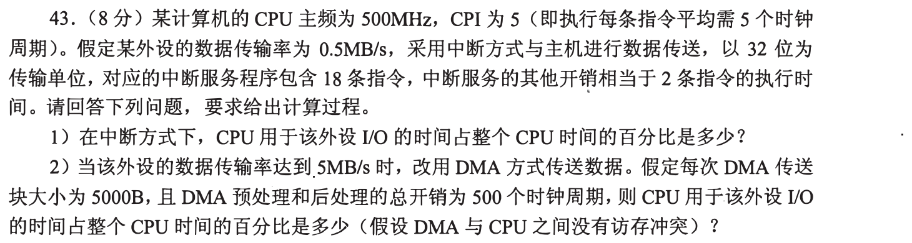
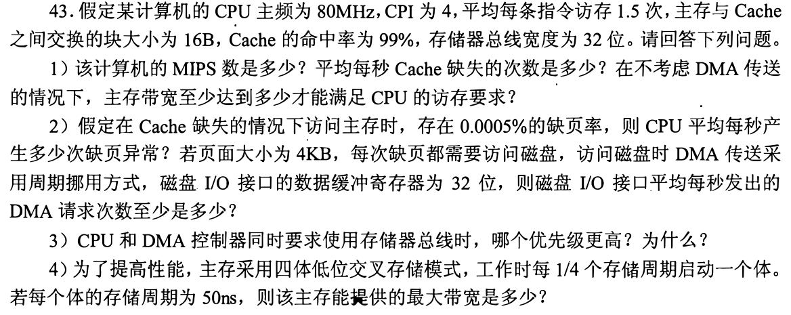
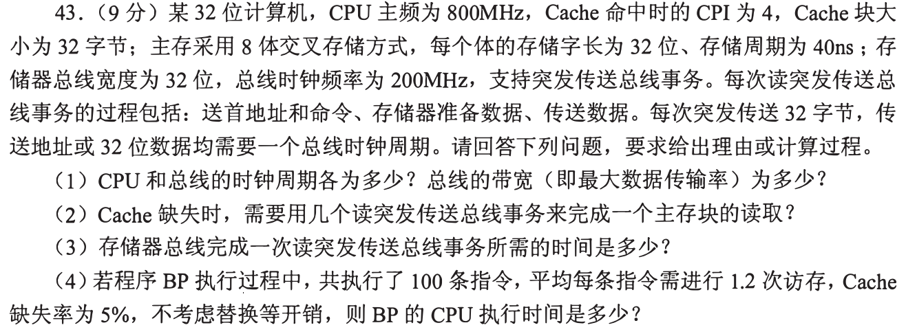
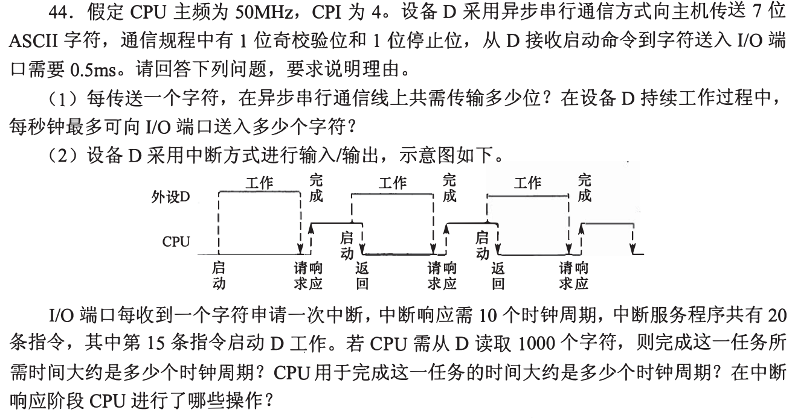
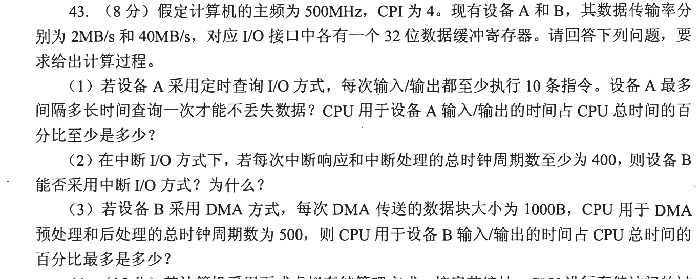

[« 0920-answer](0920-answer.md)　　[0922-answer »](0922-answer.md)

# 0921 Answer｜一秒钟究竟发生多少次传送

> [原题 5 道](0921.md) · [0920 的数据通路](0920-answer.md) · [能力账本](answer-quality/learning-ledger.md)
>
> 先把设备速率换成“每秒多少个4B字/多少次块传输”，再乘 CPU 服务成本；读懂只是第一阶段，限时独立尚未验证。

<strong>考场入口</strong>

| 题 | 先换算什么 | 结果 |
| --- | --- | --- |
| 01 | 0.5MB/s ÷4B =125000次/秒 | 中断2.5%；DMA 0.1% |
| 02 | 20M指令/s ×1.5访存 ×1% | 300000缺失/s，4.8MB/s |
| 03 | 32B块 ÷4B总线字 =8拍数据 | 一次突发85ns |
| 04 | 7数据+起始+校验+停止=10位 | 2000字符/s；CPU服务约90000拍 |
| 05 | A 50万字/s，B 1000B块4万次/s | 轮询至少4%；DMA至多4% |

## 01｜2009-43：中断按字，DMA 按块

**（1）中断。** 32位=4B，每秒 `0.5×10^6/4=125000` 次。每次中断服务18条指令加其它开销相当2条，共20条，CPI5，需100 CPU时钟；500MHz可提供5亿拍/s，I/O占 `125000×100/(5×10^8)=2.5%`。

**（2）DMA。** 速率5MB/s，一块5000B ⇒ 每秒1000次块事务；每次预后处理500拍，CPU占 `1000×500/(5×10^8)=0.1%`。题假设 DMA 与 CPU 不发生访存冲突，这里不把 DMA 搬运5000B的总线时间当 CPU 执行时间。

为何第二问速率提升十倍却 CPU 占用更低
中断由每个4B字引发一次 CPU 服务；DMA 每5000B才让 CPU 做一次块准备与收尾。分母仍是 CPU 每秒可用时钟，不把设备吞吐率当成 CPU 主频。

## 02｜2012-43：从指令数走到缺页 DMA 请求

**（1）吞吐。** `80MHz/CPI4=20 MIPS`；平均1.5次访存/指令，主存访问要求来自 Cache 的1%未命中：`20×10^6×1.5×0.01=300000` 次块读/s。每块16B，所以最低带宽 **4.8MB/s**（不计其他流量）。

**（2）缺页与 DMA。** 题给的 `0.0005%` 是 Cache 未命中后访问主存时的缺页率，换为 `5×10^−6`，故约 `300000×5×10^−6=1.5` 次缺页/s。页4KB=4096B，DMA 接口缓冲寄存器32位=4B，每页需至少1024次4B传送请求；平均 **1.5×1024=1536 次 DMA 请求/s**。先走“指令→访存→Cache 未命中→缺页”，不能把缺页率直接乘指令数。

**（3）总线优先级。** DMA 的请求更急：设备缓冲可能不能久等，延迟会丢数据；CPU 可暂时暂停/等待，故两者同时请求时 **DMA 优先**。**（4）交叉存储。** 四体、每体50ns，低位交叉可每 `50/4=12.5ns` 启动一次4B传输，理论最高 `4B/12.5ns=320MB/s`。

两个“缺失率”不在同一层
Cache 1%是在1.5次访存中统计的；缺页0.0005%是在已经走到主存的访问中统计，需连乘。若直接把一页4KB当成一个32位 DMA 请求，会漏1024倍。

## 03｜2013-43：突发传送地址、准备、数据三段

**（1）周期/带宽。** CPU周期 `1/800MHz=1.25ns`；总线周期 `1/200MHz=5ns`；宽32位=4B、每拍一字，理想总线带宽 `4B/5ns=800MB/s`。

**（2）读块事务。** Cache块32B/总线4B=8个字；支持突发传送，一次首地址和命令后连续送8个字，所以 **1次读突发事务**（其中含8个数据传送拍），不是8次独立事务。

**（3）时间。** 送地址命令5ns、主存准备40ns、8个数据字各5ns，合计 **85ns**。8体交叉使连续字可以流水出，每体周期40ns与8×5ns匹配。

**（4）程序执行。** 100条指令、命中时CPI4：基本 `100×4×1.25ns=500ns`；平均1.2次访存/指令、5%未命中，共 `100×1.2×0.05=6` 次缺失，每次85ns，额外510ns，总 **1010ns**（题要求不计替换等开销）。

将“突发一次”和“数据八拍”分清
一次突发事务不等于只用一个时钟；若把准备40ns按8个字重复算，就忽略了八体交叉与突发数据连续到来的题面信息。

## 04｜2016-44：串行字节与中断周期同时计时

**（1）一字符。** 异步串行帧有起始1位、ASCII7位、奇校验1位、停止1位，共 **10位**。设备从启动到字符进入 I/O 端口需0.5ms，持续工作最高每秒 **2000字符**，不能用7/0.5ms把传输位数当独立字符。

**（2）1000字符。** 设备产生字符的间隔0.5ms，约 `1000×0.5ms=0.5s`；50MHz CPU周期20ns，折合约 **2.5×10^7个时钟周期**。中断响应10拍，20条服务指令按CPI4为80拍，处理1000字符的 CPU 实际执行/响应时间约 `1000×(10+20×4)=90000拍`。第15条就重启设备，服务程序末五条的时间与下一字符的设备工作可重叠，故不能把90,000拍全额串行加到2.5×10^7拍上。题问“大约”，最后一次的几拍边界不影响这些量级。

中断响应阶段 CPU 保存必要断点/状态、识别请求并转到相应中断服务入口，之后服务程序读取端口、发重启命令，返回时恢复现场；“响应10拍”和“服务20条指令”是不同耗时。

为何时间账一大一小
任务总耗时主要被每字符0.5ms的设备间隔支配，CPU只在字符完成时进入服务。把 CPU 时间占用与墙上经过的总时间相加，等同假设设备服务时停工，与第15条启动下一轮的图不符。

## 05｜2018-43：轮询、中断和 DMA 的可持续边界

CPU每秒 `500MHz/CPI4=125M` 条指令。32位缓冲一字4B。

**（1）轮询 A。** 2MB/s 对应 **500000字/s**，设备每 **2μs** 可来一个新字；要不漏数据，查询最大间隔 **2μs**。每次至少10条指令，最低 `500000×10=5M` 指令/s，占125M的 **至少4%**（若轮询更频繁，只会更高）。

**（2）B 能否中断？** 40MB/s=10M字/s，每字触发中断、每次至少400 CPU拍 ⇒ `4×10^9拍/s`，远大于 CPU `5×10^8拍/s`，**不能持续用逐字中断 I/O**。即使设备快，CPU也不可能在下一个字来前服务完。

**（3）B 用 DMA。** 1000B一块，每秒 `40×10^6/1000=40000` 块；每块预后处理500拍，总 `20×10^6拍/s`，占 CPU 时钟 **至多4%**（题给处理成本作为上界；此处不把块内 DMA 搬运逐字计入 CPU）。

同一个4%为什么措辞相反
轮询“至少10条”意味着 CPU 开销有下界；DMA“预后处理总拍数为500”按题设成本算占用，若问最多则在满速40MB/s下为4%。先看“至少/至多”各修饰哪一个量，再代入。

## 复做顺序

遮住答案，先各自写“每秒事务数、每事务 CPU 工作、主频给的总预算”；再核查 03 的一次事务为何仍需八拍、04 的设备工作怎样与 CPU 收尾重叠。读过的推导尚不能代替限时计算。

[« 0920-answer](0920-answer.md)　　[0922-answer »](0922-answer.md)
