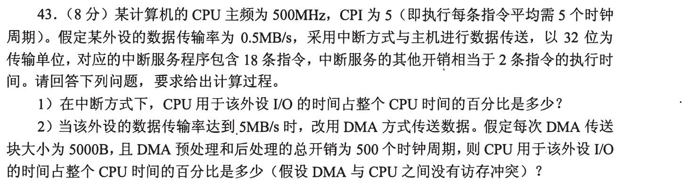
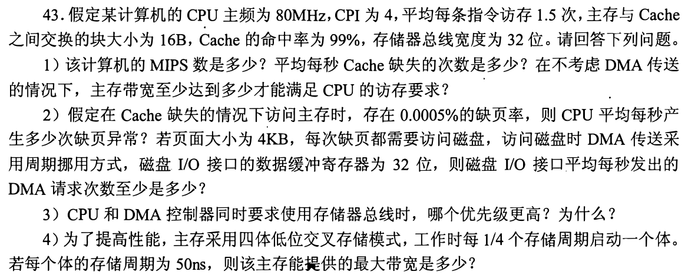
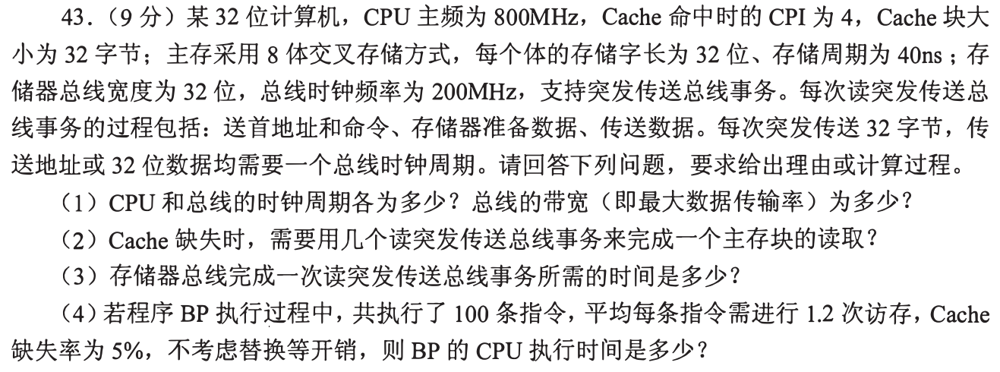
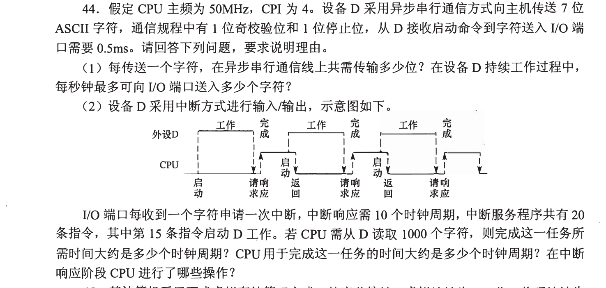
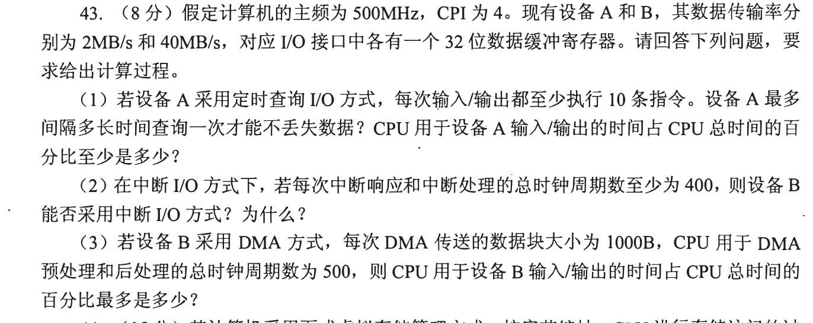

[← 0920](0920.md) · [总索引](README.md) · [0922 →](0922.md)

# 0921｜总线与 I/O：事务次数、控制交接和有效吞吐

> 大题线 `W08-io-bus-performance` · 第 08/19 个节点 · 5 道完整真题引用
>
> 选择题前置线：`22-performance`、`23-bus-time`、`24-io-path`

## 归类依据

CPU、设备、DMA 与总线之间的工作量必须分开计算。先数清一次传送包含多少事务、控制权何时交接，再用频率、宽度和等待时间合成总时间或吞吐。

这一节点以完整作答为单位。公共题干、全部小问、代码或计算过程必须在同一次作答中收口；再次出现的接口题只检查它与当前机制的连接，不重复抄题。

## 题单

### 01 · 2009-43

### 02 · 2012-43

### 03 · 2013-43

### 04 · 2016-44

### 05 · 2018-43

[← 0920](0920.md) · [总索引](README.md) · [0922 →](0922.md)
