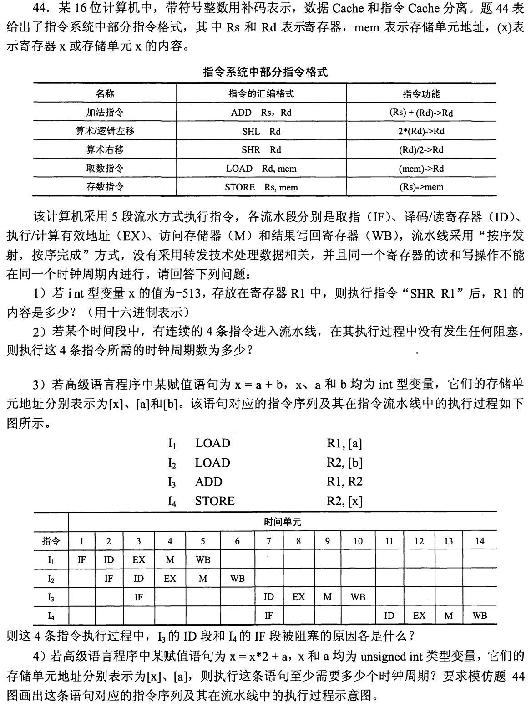
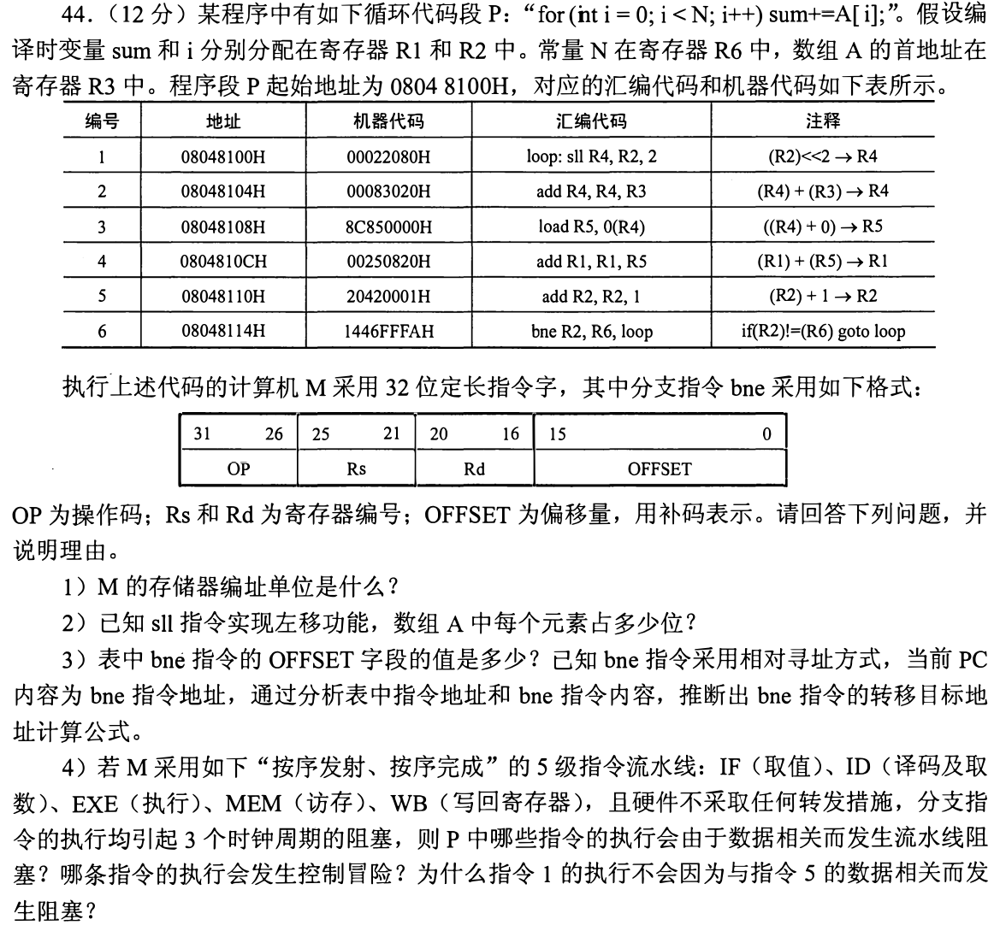
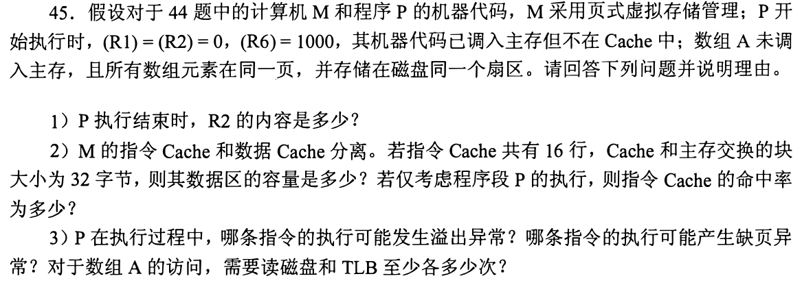

[« 0921-answer](0921-answer.md)　　[0923-answer »](0923-answer.md)

# 0922 Answer｜数据何时可用，页又何时到位

> [原题 3 道](0922.md) · [0921 的事务计数](0921-answer.md) · [能力账本](answer-quality/learning-ledger.md)
>
这组题先跟踪一条指令读、写寄存器的具体周期，再跟踪一次数组访问经过 Cache、TLB、主存、磁盘的状态。读懂推演只是第一阶段；限时独立尚未验证。

<strong>考场入口：先写结论，再检验依据</strong>

| 题 | 最短起手 | 必查数字 |
| --- | --- | --- |
| 01 | 消费者 ID 严格晚于生产者 WB；最后算末条 WB | −513 算术右移 FEFFH；4条无阻塞8拍；优化代码17拍 |
| 02 | 左移2位是字节偏移；分支从下一条算 | 4B/元素；FFFAH=−6；目标 08048100H |
| 03 | 六条共24B，首次整块装入；首次数组缺页重试 | I-Cache 512B；命中率5999/6000；磁盘1次、TLB至少1001次 |

## 01｜2012-44：没有转发时，ID 必须等到 WB 的下一拍

**（1）位模式。** 16位补码 −513 为 `FDFFH`，算术右移保留最高位1，得到 −257，即 **`FEFFH`**。负奇数的算术右移向负无穷方向取整，不能将 −513/2 的绝对值截断成 −256。

**（2）无阻塞。** 五级流水的首条需5拍，后续三条每条增加1拍，故 **8拍**。这里不是 `4×5`，那是完全不重叠的执行。

**（3）读写时刻。** 图中 I₁、I₂ 分别在第5、6拍 WB；I₃ 的 `ADD R1,R2` 必须在 ID 读到两个新值，且同一寄存器不能同拍读写，所以 ID 到 **第7拍**，这是对 I₁/I₂ 的 RAW 数据相关。I₃ 堵在 ID，顺序发射使后面的 I₄ 不能从 IF 往前走，故 I₄ 的 IF 也被阻塞；另外 I₄ 要读 I₃ 写回的 R2，在 I₃ 第10拍 WB 后才能于第11拍 ID。将前端等待与 I₄ 自身的数据依赖分开，才看得懂图中的两个空档。

**（4）给 `x=x*2+a` 排程。** 两个互不依赖的 LOAD 先发，利用第二次装载掩住第一次的一拍等待；目的寄存器必须按照题给 `ADD Rs,Rd` 的**写 Rd** 语义选定：

| 指令 | IF | ID | EX | M | WB |
| --- | ---: | ---: | ---: | ---: | ---: |
| I₁ `LOAD R1,[x]` | 1 | 2 | 3 | 4 | 5 |
| I₂ `LOAD R2,[a]` | 2 | 3 | 4 | 5 | 6 |
| I₃ `SHL R1` | 3 | 6 | 7 | 8 | 9 |
| I₄ `ADD R2,R1` | 6 | 10 | 11 | 12 | 13 |
| I₅ `STORE R1,[x]` | 10 | 14 | 15 | 16 | 17 |

结果 **至少17拍**，在第17拍结束；即便 STORE 不实质写通用寄存器，题设五级图仍按其最后一级计完成。I₃ 要等 I₁ 的 WB5 后读 R1；I₄ 要等 I₃ 的 WB9 后读 R1；I₅ 要等 I₄ 的 WB13 后读 R1。I₂ 的 R2 已在 WB6 就绪，不再增加等待。若把 `ADD R1,R2` 写成结果在 R2，则后续 STORE 也得改为 R2，不能只凭加法交换律忽略指令的目的寄存器。

从慢图压缩为三次判断
不必每次重画所有空白格。先列生产者的 WB 拍数5、6、9、13；再让使用该寄存器的 ID 至少是生产者 WB+1；最后每条后续 IF 不能越过前条被卡住的 ID。一个错误的捷径是让 LOAD 的 WB5 与 SHL 的 ID5 同拍，题面明令禁止。

## 02｜2014-44：循环的三个刻度是字节、指令、流水拍

**（1）编址。** 相邻指令地址 `08048100H → 08048104H` 差4，所以机器按**字节编址**、每条32位指令占4字节。

**（2）数组元素。** `sll R4,R2,2` 把下标 `i` 左移两位，即乘4作为相对首地址的字节偏移，A 的每个元素 **4B/32位**；这里的 `2` 是移位位数，不是元素字节数。

**（3）相对分支。** 机器码 `1446FFFAH` 的16位 OFFSET 是 `FFFAH`，符号扩展为 −6；分支在 `08048114H`，下一条地址 `08048118H`，回跳到 `08048100H`，差 −24B = −6 条指令。故目标地址公式是 **`PC+4+4×sign_extend(OFFSET)`**（本题 PC 指 bne 本身的地址）。别直接用 `PC−6`，那把“指令条数”和“字节地址”混了。

**（4）风险及等待。** 相邻的 **1→2**（R4）、**2→3**（R4）、**3→4**（R5）、**5→6**（R2）均为真数据相关；没有转发时，消费者的 ID 必须等生产者 WB 以后。第6条 `bne` 会发生**控制冒险**，题设分支执行带来3拍阻塞。第1条本轮先用当前 i，之后第5条才写 i+1；下一轮的第1条虽需更新的 R2，却要经过第6条分支和其3拍等待，这段天然间隔已使 R2 写回，不再另加数据相关阻塞。

检查跨轮依赖时别把程序顺序看反
本轮第1条读取的是尚未自增的 i，第5条才产生下一轮所需 i+1。它们之间存在跨迭代的数据依赖，但题问的是第1条为何不会因此在这条给定的流水线上再停顿；分支等待为它留出了时间。

## 03｜2014-45：第一次缺页的那次访问还要重试

**（1）终值。** R2 是 i，从0递增，执行 i=999 的循环后变为 **1000**，与 R6 相等，bne 不再回跳。不是999：那是最后一次被读取的下标。

**（2）指令 Cache。** 数据区容量 `16行×32B=512B`。六条各4B共24B，地址从 `08048100H` 起，全部落在同一个对齐的32B块内。机器码已在主存，起初不在 Cache，所以首次取第1条缺失、整块装入，后续命中。总取指 `6×1000=6000` 次，命中 **5999/6000≈99.9833%**；分离的数据 Cache 不挤掉这个指令块。

**（3）异常和次数。** 第4条 `add R1,R1,R5` 不断累加数组值，和可能超出32位有符号范围，故可能发生**溢出异常**；第3条 `load R5,0(R4)` 访问尚未调入主存的数组页，可能发生**缺页异常**。循环计数只到1000，本题不因第5条加1而溢出；移位并非该加法溢出异常的判断点。数组全在一页、同一磁盘扇区，最少**读磁盘1次**。第一次访问 A[0] 查 TLB 后发现页不在内存，缺页处理将页装入，故该条指令重启后还要查一次 TLB；其余999次数组访问各查一次：**至少读 TLB `1+1+999=1001` 次**。不要因为只读磁盘一次，就把 TLB 也算成一次；命中 TLB 仍需查询。

为什么取指的 TLB 查找没加进 1001
题问“对于数组 A 的访问”，1001 专指第3条的数组数据地址翻译；程序代码的取指地址属于另一类访问，不在这个数内。起初数组不在主存也不等于每个元素都各缺页一次，一页装入后999次可沿用。

## 复做顺序

先遮住答案：画出01的 WB→ID 依赖并算末条拍数；再用02的三个刻度推回跳地址；最后独立说清03首次 TLB 查询、缺页、重启查询的次序。能复述推导不等于能在考场1—2分钟完成，需另做限时复现。
