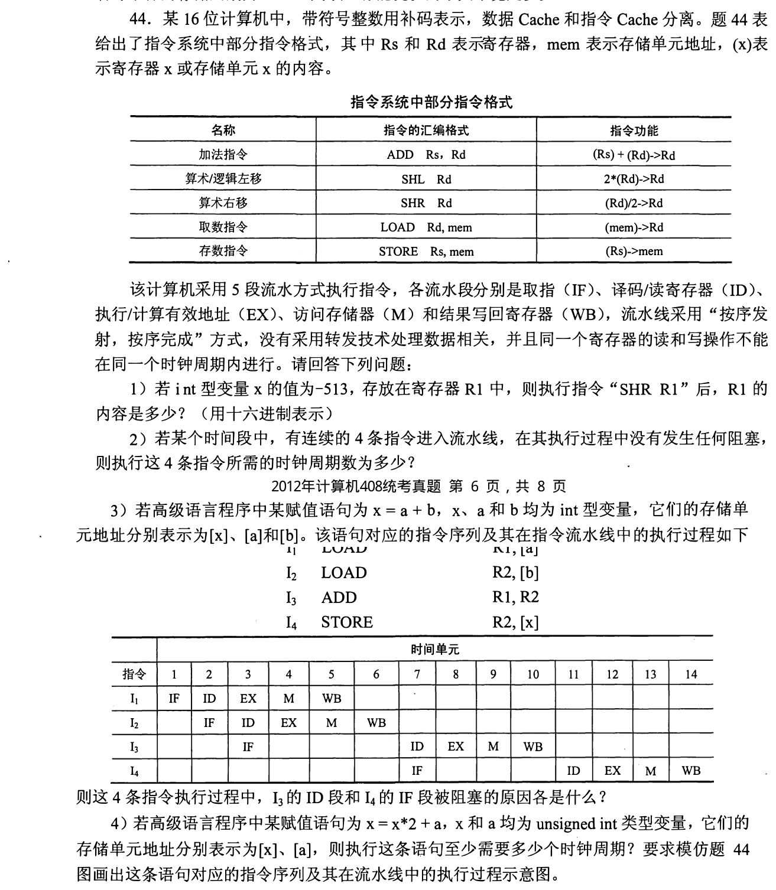
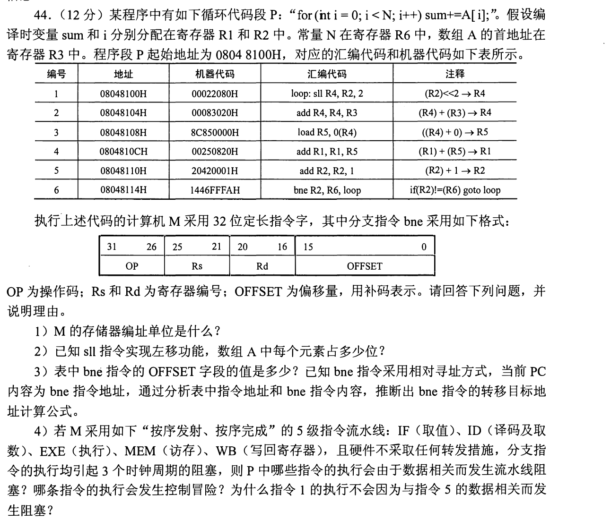
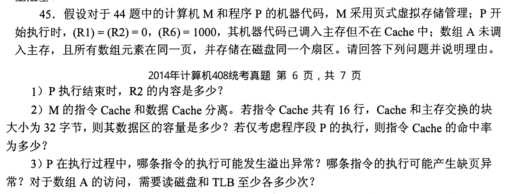

[← 0921](0921.md) · [总索引](README.md) · [0923 →](0923.md)

# 0922｜流水与异常：相关、转移和精确状态怎样收口

> 大题线 `W09-pipeline-exception` · 第 09/19 个节点 · 3 道完整真题引用
>
> 选择题前置线：`21-pipeline`、`24-io-path`

## 归类依据

流水线题不能只画时空图，还要明确数据何时可用、控制转移何时确定，以及异常发生时哪些指令已经或尚未提交，从而保证可恢复的精确机器状态。

这一节点以完整作答为单位。公共题干、全部小问、代码或计算过程必须在同一次作答中收口；再次出现的接口题只检查它与当前机制的连接，不重复抄题。

## 题单

### 01 · 2012-44

### 02 · 2014-44

### 03 · 2014-45

[← 0921](0921.md) · [总索引](README.md) · [0923 →](0923.md)
