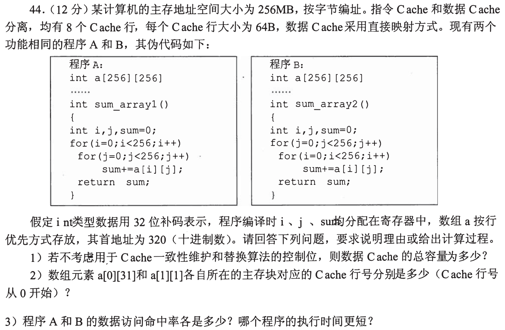
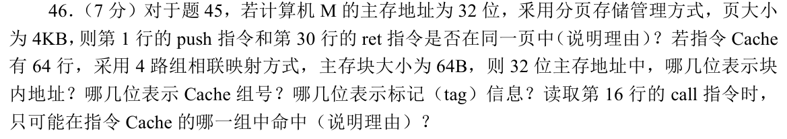
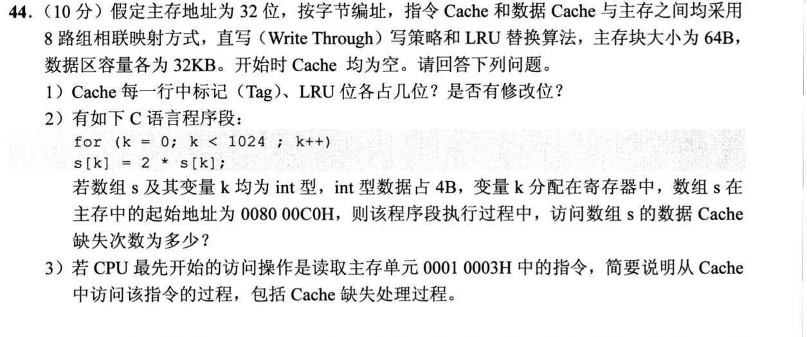
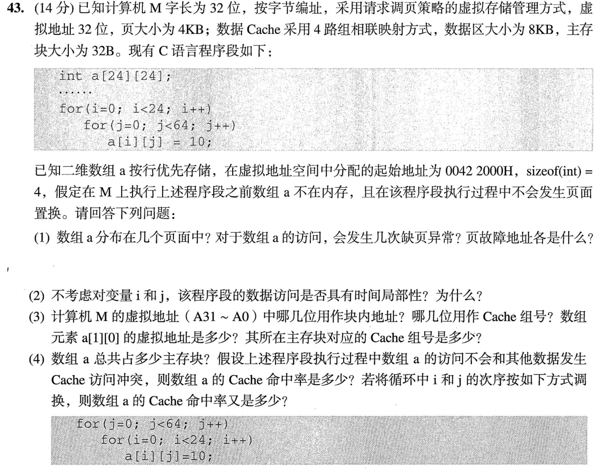
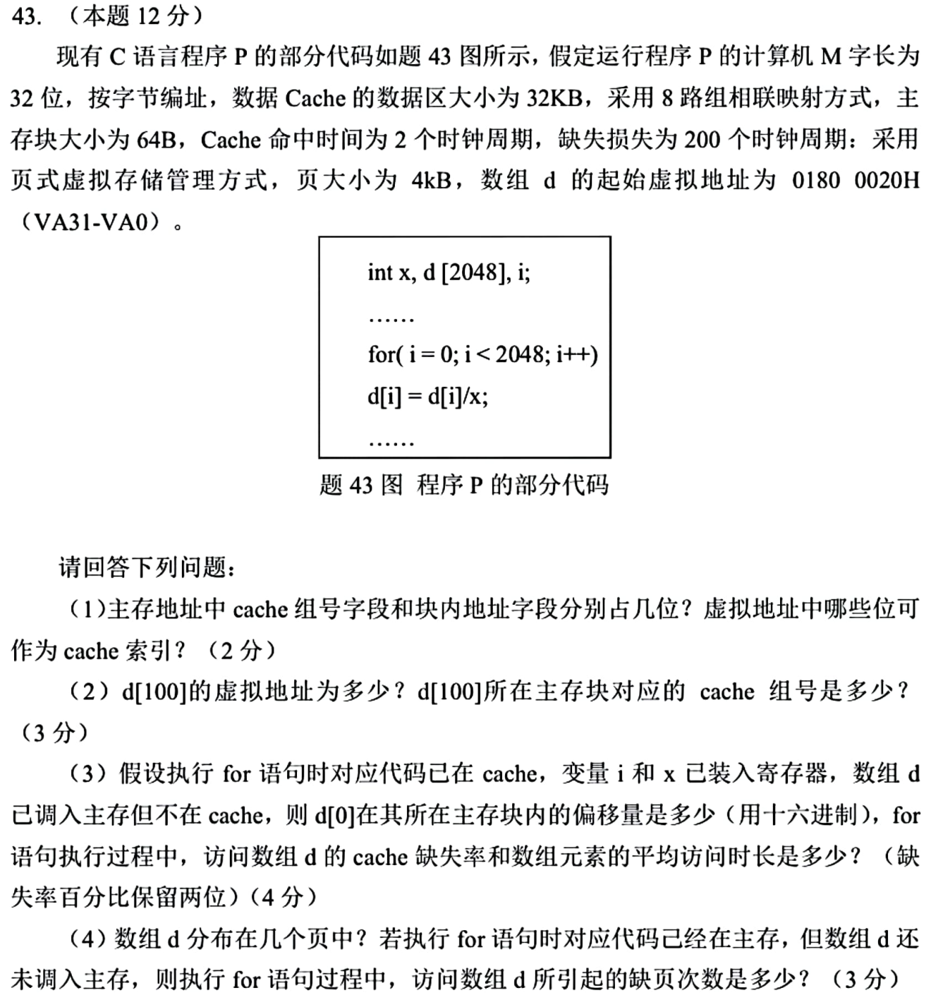

[« 0922-answer](0922-answer.md)　　[0924-answer »](0924-answer.md)

# 0923 Answer｜先求块号，再判断重用会不会被挤掉

> [原题 5 道](0923.md) · [0922 的首次装入](0922-answer.md) · [能力账本](answer-quality/learning-ledger.md)
>
贯穿动作：`字节地址 → 主存块号 → Cache 组号 → 这一拍命中/缺失`。原题 2023-43 的数组声明和循环边界彼此矛盾，讲解分别标明题面字面与常见修正；读懂尚非限时独立。

<strong>考场入口</strong>

| 题 | 先抓哪条约束 | 可核对的答案 |
| --- | --- | --- |
| 01 | 一行64B装16个int；两种循环顺序 | 532B；组号6/5；A 93.75%、B 0% |
| 02 | 代码地址先除页4KB，后除块64B | 同页；偏移6/组4/标记22位；call在第0组 |
| 03 | 32KB是数据区，8路，每块64B | 组6位、tag20位；数组缺失64次 |
| 04 | 声明 `[24][24]` 与 `j<64` 冲突 | 严格 C 越界；若校成 `[24][64]`：2页、192块、命中87.5% |
| 05 | 数组起址在块内偏32B | 129块、3页、缺失3.15%、均时约8.30拍 |

## 01｜2010-44：行优先与跨行步长

**（1）总容量。** 数据 Cache 8行，每行64B，数据区 `8×64=512B`。主存256MB按字节编址，地址28位；块内6位，直接映射的行号3位，标记19位。每行还需有效位1位，因此题设不计一致性/替换位时总容量 `8×(64×8+19+1)=4256位=532B`。这里“总容量”不能只答数据区512B。

**（2）行号。** C 行优先，`addr(a[i][j])=320+4×(256i+j)`；组号 `⌊addr/64⌋ mod 8`。`a[0][31]` 地址444、块号6、**第6行**；`a[1][1]` 地址1348、块号21、**第5行**。

**（3）两种循环。** A 按行连续走，每块16个int，1次缺失后15次命中，总65536次访问、4096次缺失，命中率 **15/16=93.75%**。B 内层改变 i，每次地址跃进一行 `256×4=1024B=16块`，直接映射行号每次都相同；256行反复冲掉同一个 Cache 行，换下个 j 时之前的块已经不在，命中率 **0%**。因此 **A 执行时间更短**（Cache 缺失代价大于命中）。

两种“空间局部性”怎样变成命中次数
行优先不是直接等于高命中；关键是内层实际地址差。A 的相邻元素差4B，最多16个共享一块；B 相邻元素差1024B，块号差16且模8余0。算出实际冲突后，才能判下一个外层循环是否还能重用原块。

## 02｜2019-46：同一段代码先按页，再按组

本题承接[2019-45 的机器代码](../bank/2019/q45.png)：第1行 `push` 地址 `00401000H`，第30行 `ret` 地址 `0040104AH`。**页大小4KB**，两地址的高20位都为 `00401H`，所以**同页**；用相差 `4AH` 直接判也可，但必须同时确认未跨页边界。

指令 Cache `64行÷4路=16组`，块64B，所以**块内偏移6位、组号4位、标记22位**。第16行 `call` 地址 `00401025H`，位于 `00401000H—0040103FH` 这个块，组号 `(00401025H >> 6) mod 16=0`，所以只可能在**第0组**命中；这里“可能”不保证它目前确实驻留。

页与 Cache 组切开的位数为什么不同
4KB 页以低12位作页内地址；64B Cache 块以低6位作块内地址，随后再取4位组号。这题的地址字段按物理主存地址切；页号是否相同仅用已给的主存代码地址判。

## 03｜2020-44：读后写同一元素，别算成两次缺失

**（1）字段。** 每个 Cache 的数据区32KB，64B/块，共512行；8路得64组，即组号6位，块内6位，32位主存地址的 tag 为 **20位**。一组有8行，若 LRU 为每行记录0—7的次序，每行至少 **3位 LRU 信息**（实现方式可异）；**没有修改位**，因为直写每次写入同时更新主存，不需靠脏位标记回写。

**（2）循环。** 数组首址 `008000C0H` 在64B边界；1024个int共4096B、连续64块。每元素先读取 `s[k]`，再写回同一地址，第一次读到新块才缺失，写时块已在 Cache。64块分别落入64组，未发生组内驱逐，所以**缺失64次**；直写可能有主存写流量，但不等于64次之外的 Cache 缺失。

**（3）首次取指。** 地址 `00010003H` 的块内偏移3、组号0、tag `00010H`。指令 Cache 初始为空，查第0组无有效且相等的标记，发生强制缺失；从主存取 `00010000H—0001003FH` 整块装入第0组一行，设有效位、标记及 LRU 状态，再由块内偏移3取指。读的是指令 Cache，不能拿第（2）问的数据 Cache 内容来判命中。

LRU 位数的表达边界
题目若问“每一行中 LRU 位占几位”，通常采用每行3位记录8路的相对次序。具体硬件还可用树形近似LRU等不同编码；解卷时按题设的 LRU 次序编码，不把整组位数误报为单行位数。

## 04｜2023-43：先发现题面数组维度与循环冲突

**必要的读题检查。** 题图以及卷面实际印着 `int a[24][24]`，内层却写 `j<64`。C 的 `a[i][24]` 起已越过该行，最后一行访问到整个数组边界之外，属于**未定义行为**；不能把 `[24][24]` 偷换成 `[24][64]`，然后声称答案直接来自题面。此题若按命题常见意图将第二维更正为64，可完成下面的 Cache 计算；两个版本的特定数值不同。

**按 `[24][64]` 修正后的（1）—（3）。** 共 `24×64×4=6144B`，起址 `00422000H` 页内偏移0，跨 **2页**，首次访问各缺页1次，故缺页 **2次**、故障地址 `00422000H` 和 `00423000H`。即使 `i,j` 不计，同一具体元素只写一次，数组访问**不具有对同一元素的时间局部性**，但相邻地址连续，具有空间局部性；同一 Cache 块的后续写入命中属于空间局部性带来的块重用。块内5位；8KB/32B/4路=64组，组号6位。`a[1][0]` 地址 `00422100H`，块号比首块多8，落在**第8组**。

**修正后的（4）。** 数组占 `6144/32=192` 个主存块，访问1536个元素各一次，初始全不在 Cache，且该连续区域在8KB数据区内，192块分布到64组每组3块，4路足够。故两种循环顺序都缺失192次，命中率均 **`(1536−192)/1536=87.5%`**；调换循环使命中发生在后续哪个时刻，却不会在本题容量/映射条件下改变总缺失数。

若坚持题面 `[24][24]`，哪些数会改
声明对象为 `24×24×4=2304B`，只占1页、72块；字面地址计算 `a[1][0]=00422060H`，组号3。实际循环按行跨度24个int而 j 走64，每一行后段与后续行重叠，线性访问索引覆盖0—615，覆盖77个32B块，并越过声明的576个元素；强行忽略 C 的越界约束且假设相邻内存可写，则对应的访问序列会有77次强制缺失、`(1536−77)/1536≈94.99%` 命中。这只是机械地址推演，**不是合法 C 程序的运行结论**。因此原题应先核对更正版本，不能混用1页与192块。

## 05｜2025-43：首址偏半块，尾端多出一块和一页

**（1）地址字段。** 数据 Cache `32KB/(8×64B)=64组`，主存地址的块内偏移**6位**、组号**6位**。页4KB=2¹²B，若 Cache 用虚拟页内不变的索引，则 VA 的 **A11—A6** 可直接用于 Cache 组索引；高位必须经过地址翻译才能可靠作物理标记。

**（2）定位元素。** `d[100]` 虚址 `01800020H+100×4=018001B0H`，其块内偏移 `30H`，组号 `(1B0H >>6) mod64=6`，即**第6组**。

**（3）缺失/均时。** `d[0]` 在块内偏移 **`20H`**，不是块首；2048个int共8192B，占用从偏移20H到偏移201FH，经过 **129个64B块**。每元素表达式先读后写，写回前该块已由读装入，故4096次数组数据 Cache 访问中强制缺失129次，缺失率 **`129/4096≈3.15%`**。题给命中2拍、缺失额外罚200拍，平均 `2+(129/4096)×200≈8.30拍/次数组访问`。若把一次循环迭代看成“一次访问”，分母会漏掉写操作。

**（4）页。** `d[0]` 页内偏移20H，末尾越过两次4KB边界，落在第三页，共**3页、3次首次缺页**（题设代码已在主存，数组未装入）。Cache 块64B与页4KB不同，129块不能被直接换算成两页。

## 复做顺序

遮住答案，先独立算01两条地址映射，再列03的64块和05的129块；最后在04先指出题面冲突、分别说出“按字面”与“按修正”能得出的内容。限时目标需要以后实测，不能从本稿的文字长度推定已熟练。
