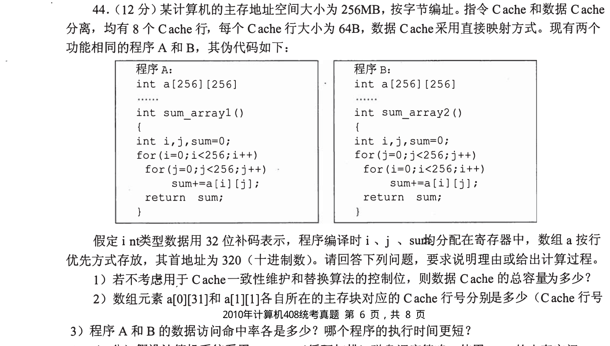
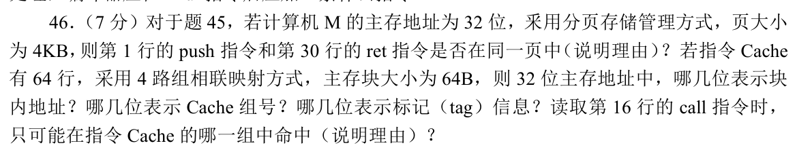
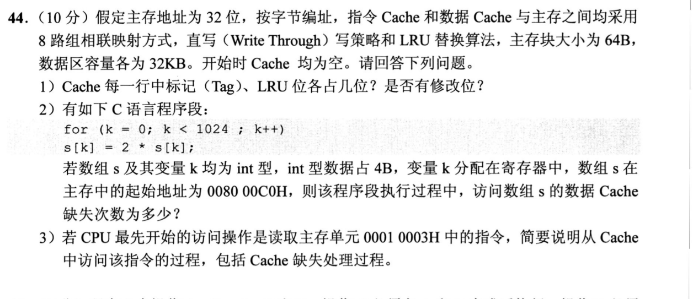
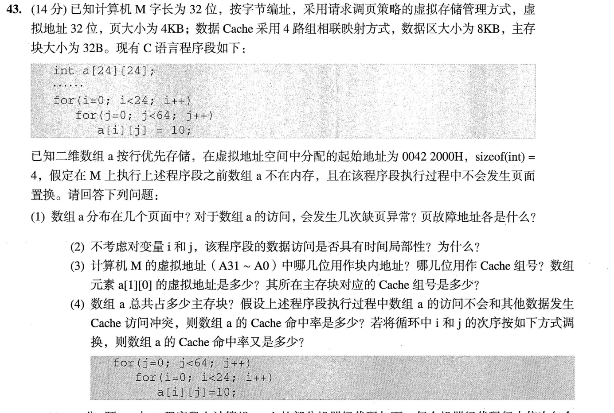
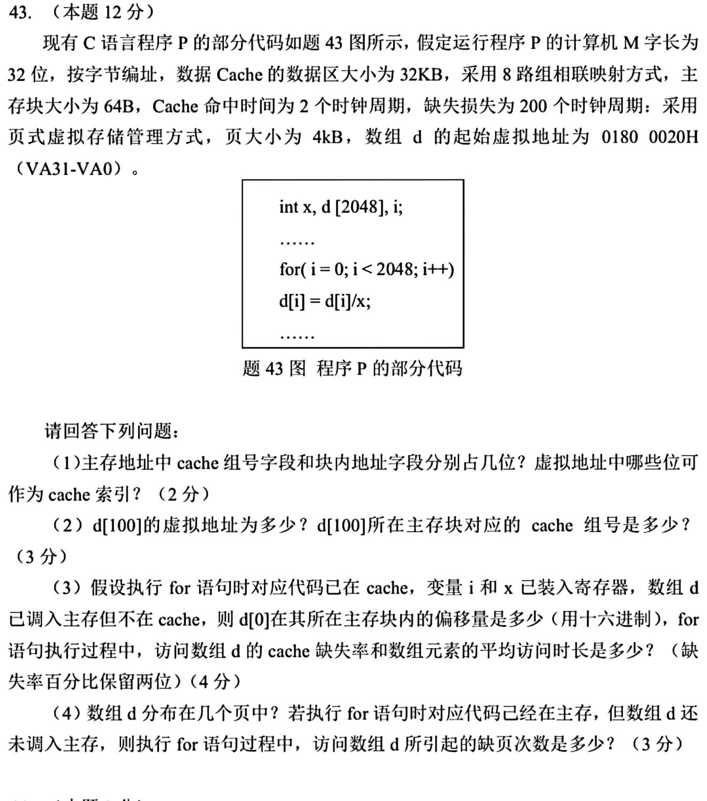

[← 0922](0922.md) · [总索引](README.md) · [0924 →](0924.md)

# 0923｜Cache 局部性：地址映射、访问序列与缺失代价

> 大题线 `W10-cache-locality` · 第 10/19 个节点 · 5 道完整真题引用
>
> 选择题前置线：`16-cache`、`22-performance`

## 归类依据

从数组循环到递归汇编，题目最终都落在访问序列。先切分地址并确定组与块，再沿时间顺序更新命中、替换和写策略，才能解释性能差异。

这一节点以完整作答为单位。公共题干、全部小问、代码或计算过程必须在同一次作答中收口；再次出现的接口题只检查它与当前机制的连接，不重复抄题。

## 题单

### 01 · 2010-44

### 02 · 2019-46

### 03 · 2020-44

### 04 · 2023-43

### 05 · 2025-43

[← 0922](0922.md) · [总索引](README.md) · [0924 →](0924.md)
