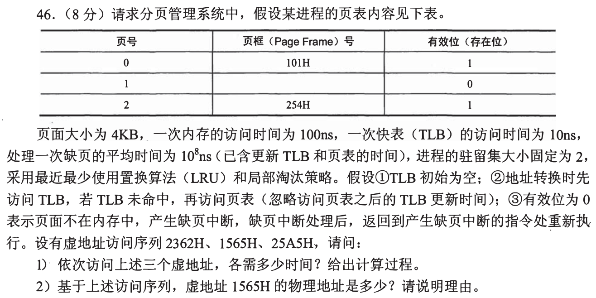
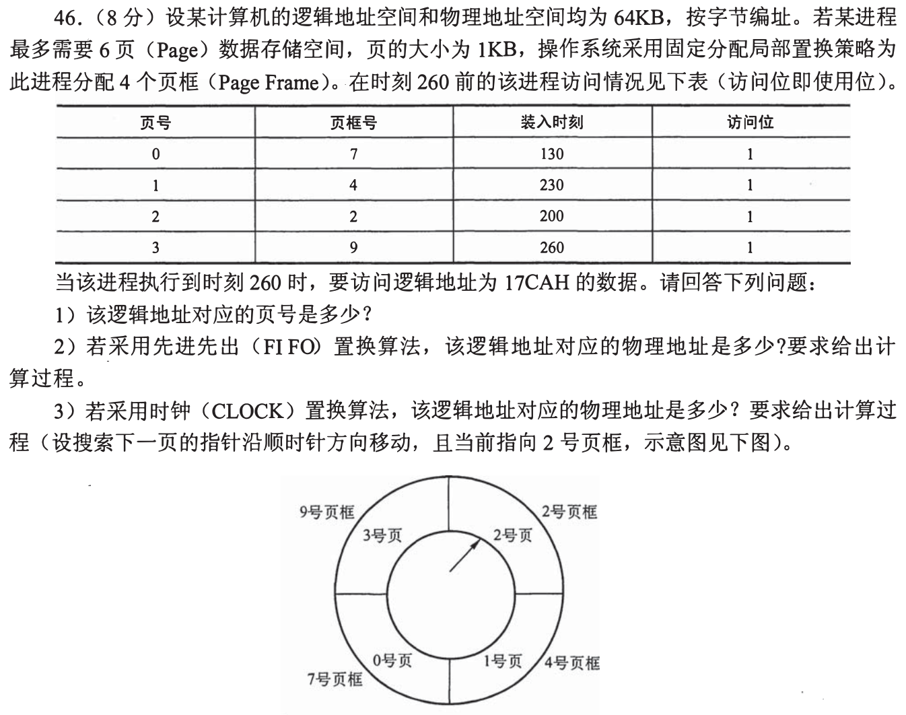
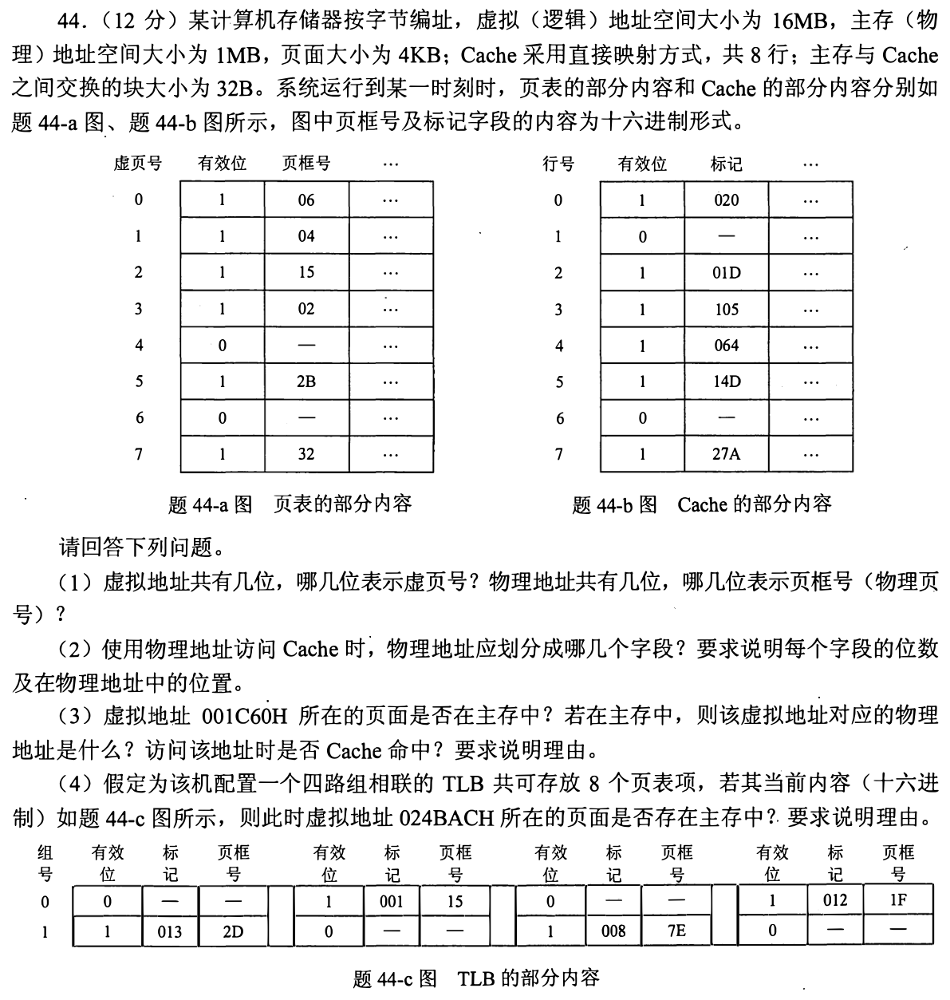
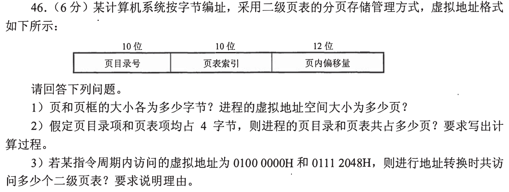
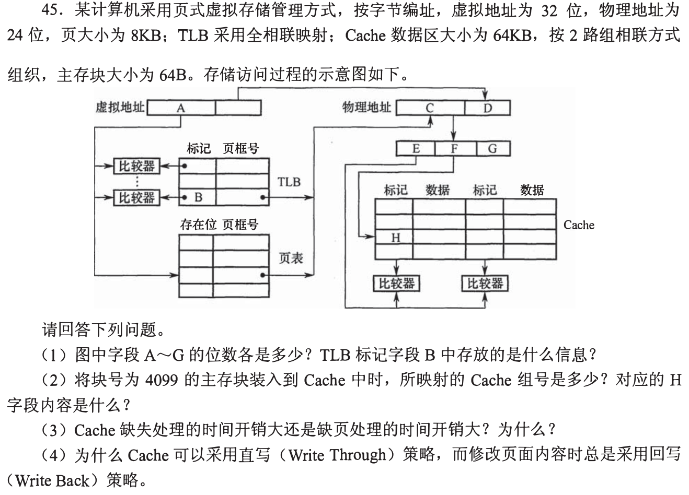
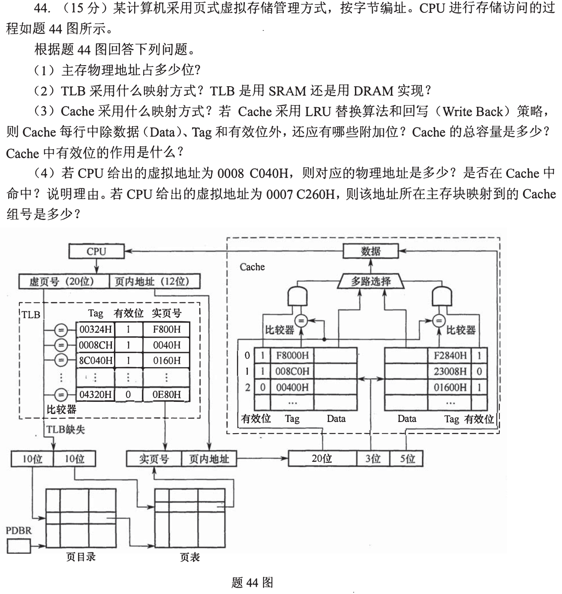
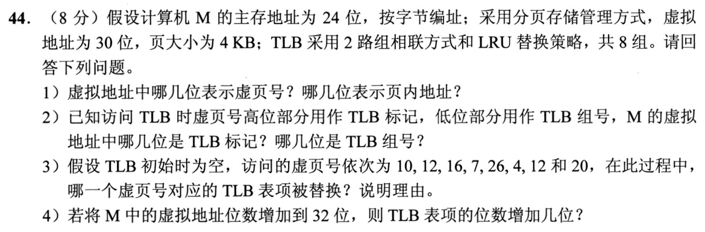
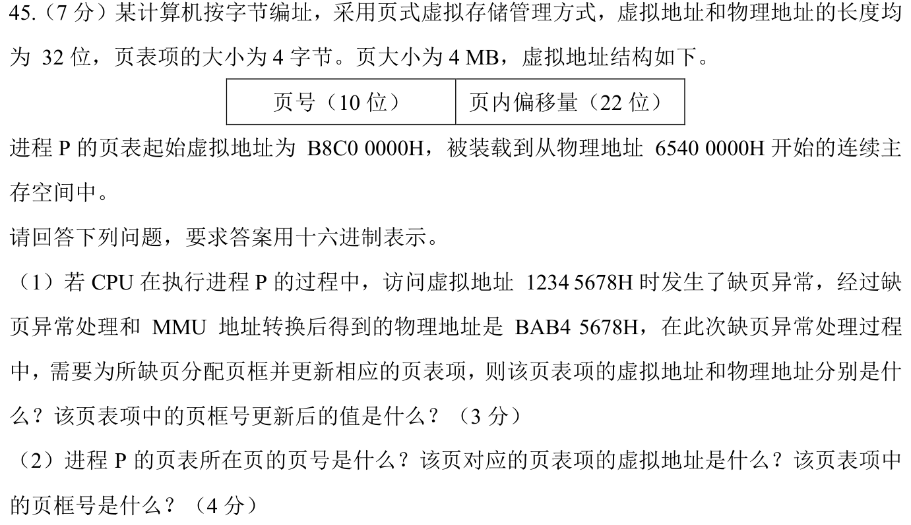

# 0924 Answer｜虚址要先找到页，再谈 Cache 行

> [原题 8 道](0924.md) · [0923 的块与组](0923-answer.md) · [能力账本](answer-quality/learning-ledger.md)
>
通用入口是 `虚页号/页内偏移 → TLB 或页表 → 页框号/原偏移 → Cache 组和标记`。遇缺页先处理并重新执行该访问；读懂尚不等于限时独立。

<strong>考场速查：本组新增判据</strong>

| 题 | 一眼找什么 | 结果 |
| --- | --- | --- |
| 01 | 缺页前查表、缺页后重试 | 210ns、100000220ns、110ns；物理101565H |
| 02 | FIFO 按装入时刻、CLOCK 按指针和访问位 | 1FCAH / 0BCAH |
| 03 | 先页表、再物理 Cache | 001C60H→04C60H，但 Cache 未命中 |
| 04 | 两地址是否共用页目录项 | 4KB页；完整页表1025页；同一二级页表 |
| 05 | 页框/组号各来自哪一段地址 | A—G：19/19/11/13/9/9/6位；4099映第3组 |
| 06 | 图上两路与组索引 | 28位物址、558B Cache；0008C040H未命中 |
| 07 | 先按8组取低3位，再在组内 LRU | 页4被换出；VPN tag随地址增长2位 |
| 08 | PTE 地址从页表基址加索引×4 | B8C00120H、65400120H、页框2EAH |

## 01｜2009-46：缺页处理完还要再访问一次

页面4KB，三个虚址的页号依次为2、1、2，偏移依次为362H、565H、5A5H。起初页2在帧254H，页0在帧101H，TLB为空。

**（1）逐次计时。** 第一次访问页2：TLB 10ns未命中，查内存页表100ns，取数据100ns，**210ns**；页2的映射进入 TLB。第二次页1：TLB 10ns、页表100ns才发现无效，缺页处理 `10^8ns`（已含更新页表/TLB），随后重新执行：TLB10ns、数据访问100ns，共 **`10+100+10^8+10+100=100000220ns`**。第三次回页2，TLB命中10ns、数据100ns，**110ns**。不把缺页处理后的重新执行漏掉，也不重复加题目说明已包含的更新开销。

**（2）物址。** 驻留集只能有2页，先使用页2，再需调入页1，LRU 淘汰未近期使用的页0，于是页1复用页0的帧101H。`1565H` 的物址为 **`101000H+565H=101565H`**。替换的是物理页框里的内容，不是把虚页号1当成帧号1。

若对缺页重试时间犹豫
把第二次访问写成事件清单：首次地址翻译→页表无效→中断、换页和更新→重新执行指令→地址翻译→读数据。题设特意声明从缺页处重新执行，且缺页代价包含更新，才能确定前后两段各该算什么。

## 02｜2010-46：同一缺页在两种替换规则下去向不同

**（1）分段。** 页1KB=`400H`，`17CAH=5×400H+3CAH`，故虚页号 **5**、页内偏移 **3CAH**；现驻留0、1、2、3，需替换。

**（2）FIFO。** 0号页装入时刻130最早，淘汰它，页5进入原7号页框，物址 **`7×400H+3CAH=1FCAH`**。访问位全是1也不能改用“最近访问”来决定 FIFO。

**（3）CLOCK。** 指针从2号页框开始，沿图中顺时针依次查2、4、7、9号框，访问位都为1则清零并跳过；回到2号框遇0，淘汰原虚页2，页5进入**2号框**，物址 **`2×400H+3CAH=0BCAH`**。这里“时钟指针指向的页框”与“虚页号2”只是恰巧同号。

两道题的 LRU/FIFO/CLOCK 不要混
0924-01 的 LRU 看近期使用；本题 FIFO 看装入先后，CLOCK 看指针与访问位。先写“替换哪个物理帧”，再拼不变的页内偏移，算法差异就不会污染地址计算。

## 03｜2011-44：页在内存，不代表 Cache 里也有这一块

**（1）位数。** 虚址空间16MB→**24位**，4KB页→偏移12位，虚页号在 **[23:12]**；主存1MB→物址**20位**，物理页框号在 **[19:12]**。

**（2）Cache 字段。** 物址20位，块32B→块内偏移 **[4:0] 5位**；直接映射8行→行号 **[7:5] 3位**；标记 **[19:8] 12位**。

**（3）一次访问。** `001C60H` 虚页号1、偏移C60H；页表显示有效、页框04H，物址 **`04C60H`**。物址的行号 `(04C60H>>5)&7=3`，标记 `04CH`；Cache 第3行有效但标记是 `105H`，故 **Cache 未命中**。

**（4）另一次先查 TLB。** `024BACH` 虚页号024H，4路组相联、共8项→2组，组号 `024H mod2=0`，TLB 标记 `024H>>1=012H`。题图第0组有有效标记012H、页框1FH，故 **该页在主存**，不必因为页表仅展示了前几项就断言缺页。

三次“命中”分别是什么
TLB 命中只是快速取得页框号；页表有效说明页在主存；Cache 命中还要检验物理块的组、标记和有效位。第三问正好是页在内存、Cache 不命中的反例。

## 04｜2015-46：一个页目录项可指向许多二级页表项

**（1）页面与空间。** 页内偏移12位，页和页框都是 **4096B**；虚页号共20位，可有 **2²⁰页**。

**（2）页表占用。** 页目录索引10位→1024个目录项，每项4B，目录占1页；每个二级页表1024项、每项4B，也占1页。若整个4GB虚拟空间均建立映射，则需要1024个二级页表，加目录 **1025页**。题目问“该进程的页目录和页表共占多少页”，若未说明实际用了哪些虚拟区，1025是按完整空间展开的上界/标准假定；稀疏使用时按需分配的二级页表可以更少。

**（3）两个地址。** `01000000H` 和 `01112048H` 的高10位目录索引都为4（均落在 `01000000H—013FFFFFH` 范围），故访问的是**同一个二级页表**，其中两个页表项的索引不同。若逐次统计访存表项次数，每次地址翻译各查一次目录项和一次二级项，共4次表项查询；“二级页表的个数”是1。

一项、一个表、一次查找
10位页目录号指定“哪个二级页表”；接下来的10位索引指定“其中哪个表项”。两虚址高10位相同不代表它们在同一虚页，更不代表整个翻译只访存一次。

## 05｜2016-45：把结构图中的字母还原成地址来源

**（1）A—G。** 8KB页→偏移13位，虚址32位→虚页号 **A=19位**；全相联 TLB 的标记存完整虚页号，**B=19位**，内容是被缓存的虚页号。物址24位→页框号 **C=11位**、同一页内偏移 **D=13位**。Cache 64KB数据区、2路、块64B→512组、组号9位、块内偏移6位，物理标记 `24−9−6=9位`，故 **E=9、F=9、G=6位**（E 是组号，F 是标记，G 是块内偏移，顺图的线路查）。

**（2）块映射。** 主存块号4099除512，商8余3，进入 **第3组**；Cache 行中的 **H=8** 是去掉组号后的物理块标记。

**（3）代价。** Cache 缺失通常由主存取一个块；缺页要由辅助存储调页、可能换出脏页并更新映射/重启指令，时间开销远大。**（4）写策略。** Cache 可直写主存，细粒度频繁写尚能接受；若页的每次修改都直写磁盘，随机写盘成本过高，故脏页先留在内存，置换或同步时回写。

H 为什么不是4099
Cache 只在被组号选定的那一组内比较标记。块号4099 = 8×512+3，余数3负责选组，商8才存在组内各路的标记字段。

## 06｜2018-44：用页内位同时定位 Cache 组

**（1）物址。** 图底部物址拆为标记20位、组3位、块内5位，共 **28位**。

**（2）TLB。** 图中所有项并行比较虚页号，为**全相联**；TLB 需要高速并行比较，通常以 **SRAM** 实现。

**（3）Cache。** 图中两列候选、按3位组号选行，为 **2路组相联、8组、16行**。32B数据/行，物理标记20位；有效位之外还需 **修改位1位**（回写用）及 **LRU位1位/行**（两路的替换状态可按组编码）。按每行1位 LRU 的常用记法，总量 `16×(32×8+20+1+1+1)=4464位=558B`；若 LRU 状态只以每组1位存储则是557B，须说明编码约定。有效位表示该行是否已装入有效块，标记相等而有效位0仍未命中。

**（4）实际访问。** `0008C040H` 的虚页号 `0008CH`，TLB 有效项给页框 `0040H`，物址 **`0040040H`**；块内偏移0，组号2，物理标记 `00400H`。第2组左路无效、右路标记 `01600H`，故 **不命中**。另一虚址 `0007C260H` 页内偏移260H，Cache 组号直接由偏移的[7:5]得到 **第3组**；即使题图没有给出该虚页的最终页框，也不妨碍组号判断。

总容量为何会出现两种 LRU 记法
二路 LRU 决定淘汰哪一路，只需每组一个状态位；有些教材将它写成每行一个 LRU/替换信息位。数据、标记、有效、脏位都可确定，额外替换位的物理实现取决于编码。答题先遵题目“每行还有哪些附加位”，再说明总位数采用的口径。

## 07｜2021-44：TLB 先分组，再谈 LRU

**（1）地址位。** 30位虚址、4KB页：虚页号 **[29:12] 18位**，页内地址 **[11:0] 12位**。

**（2）TLB 字段。** 8组需3位组号，取虚页号低3位即 VA **[14:12]**；余下15位虚页号高位为 TLB 标记，即 VA **[29:15]**。

**（3）替换。** 页号10和26均映第2组，仅占满两路；12、4、20都映第4组。先12，后4，两路满；再次访问12令12最近使用；最后20进入第4组，替换**虚页4**的 TLB 表项。中间16、7走各自组，不影响第4组 LRU。

**（4）扩址。** 虚址增至32位而页大小和8组不变，虚页号从18变20位、组号仍3位、TLB 标记从15变17位，**每表项增2位**（物理页框号等字段不因虚址增长自动变宽）。

不需要维护整个 TLB 的访问顺序
LRU 只在要放入的那一组的两路之间比较。写出 `页号 mod8` 序列 `2,4,0,7,2,4,4,4`，再只跟踪第4组的12→4→12→20即可。

## 08｜2024-45：页表本身也有虚址和物址

页4MB=`400000H`，低22位是页内偏移，虚页号高10位；页表项4B，线性页表第 n 项地址为页表基址+`4n`。

**（1）缺页项。** `12345678H` 的虚页号 **`048H`**、偏移 `345678H`，对应 PTE 虚址 **`B8C00000H+048H×4=B8C00120H`**，由于页表连续映射到物理 `65400000H`，PTE 物址 **`65400120H`**。题给新物址 `BAB45678H` 具有同一个页内偏移，分配的页框号即高10位 **`2EAH`**；不要把低22位也写进页框号。

**（2）页表页的自映射。** 页表起始虚址 `B8C00000H` 的虚页号 **`2E3H`**，因此描述它的 PTE 虚址 `B8C00000H+2E3H×4=` **`B8C00B8CH`**。该页表页装在物理 `65400000H` 起，故对应页框号 **`195H`**。页表项在虚拟地址空间中也有位置，不能把 `65400000H` 当作页表项的虚址。

用低22位自检
VA `12345678H` 与 PA `BAB45678H` 的页内偏移必须相同，均为345678H；PTE 虚/物地址也只差页表基址，两者相对于基址同为120H。两次核对能快速发现把“地址”与“页号”混用。

## 复做顺序

遮住答案，先独立推01缺页重试的时间账，02的两种受害页，03的“在主存但不在 Cache”，然后只拿位数字段做05—08。每题会解与限时熟练是两道门槛，账本目前只记录前者的讲解覆盖。
