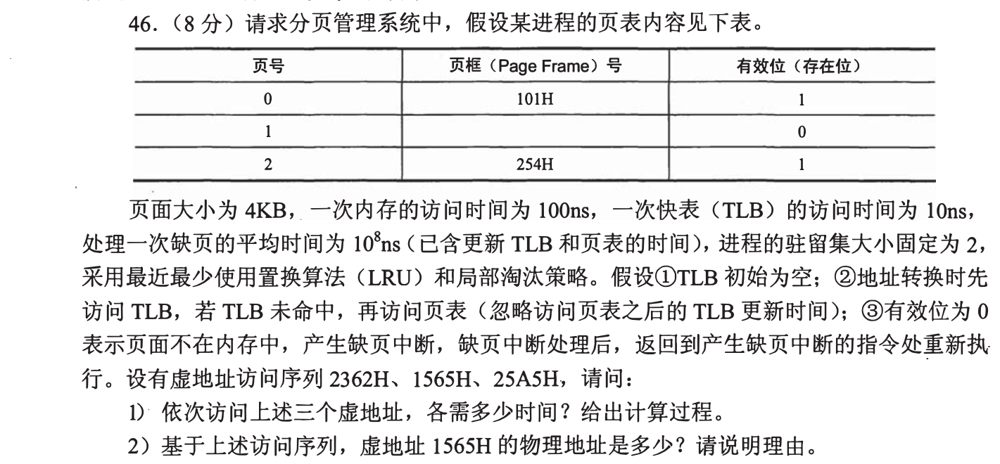
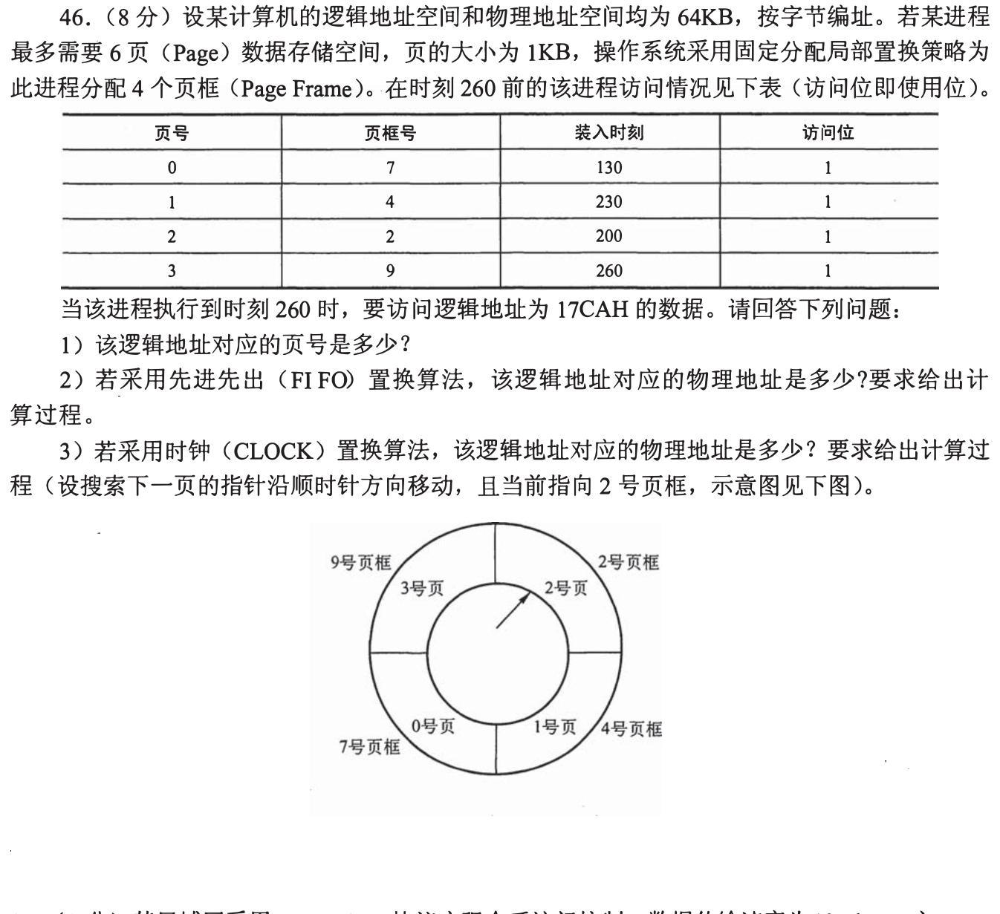
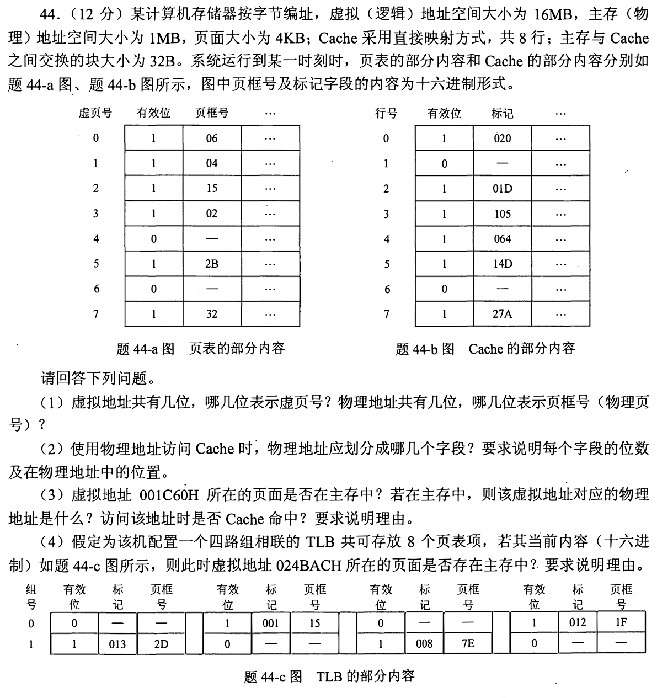
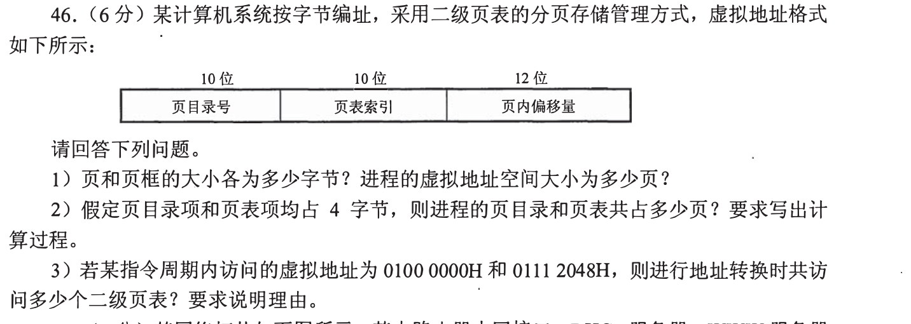
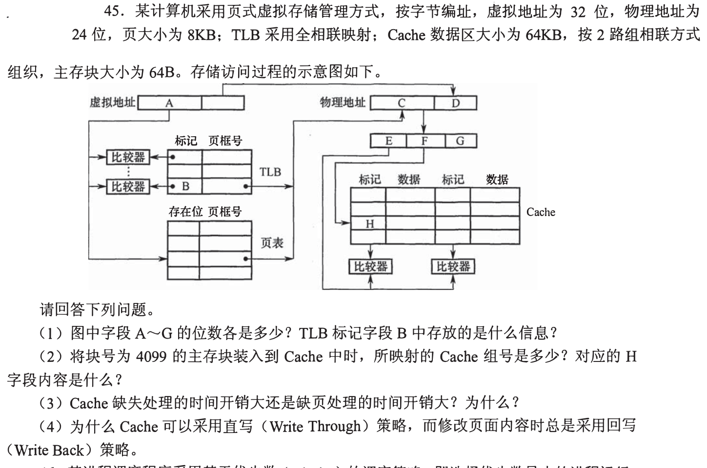
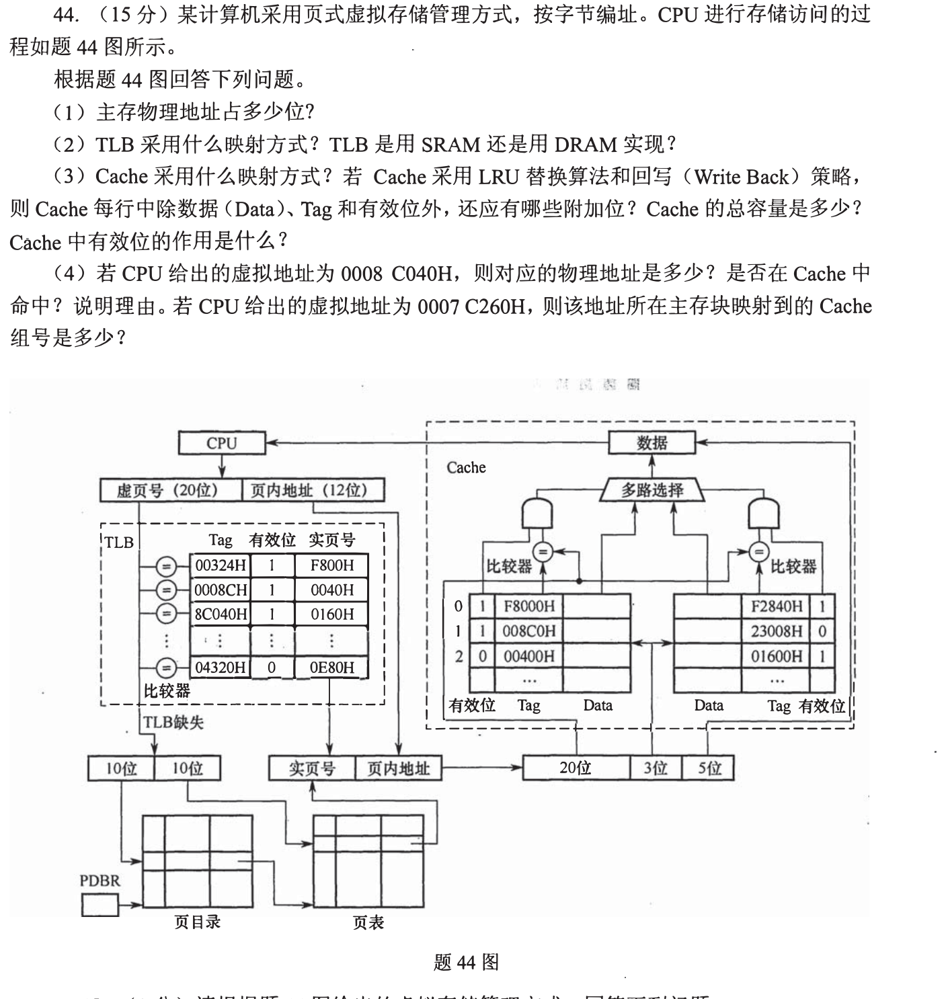
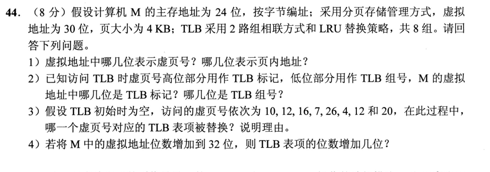
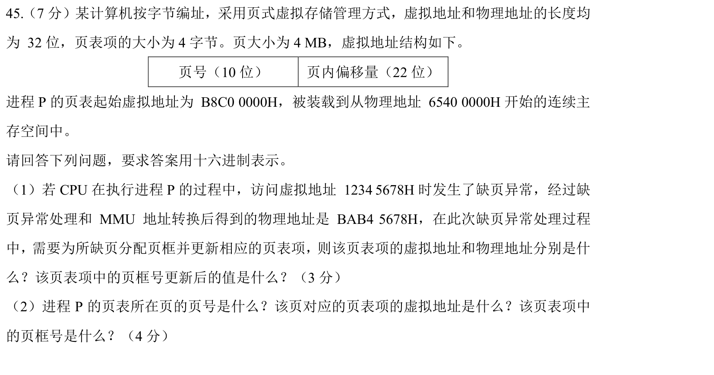

[← 0923](0923.md) · [总索引](README.md) · [0925 →](0925.md)

# 0924｜地址翻译链：TLB、页表与 Cache 的先后关系

> 大题线 `W11-address-translation` · 第 11/19 个节点 · 8 道完整真题引用
>
> 选择题前置线：`16-cache`、`17-virtual-address`、`30-page-policy`

## 归类依据

这一组把虚拟地址拆分、TLB 查询、页表访问、物理地址形成和 Cache 命中串成完整链路。不可把各部件孤立计算，必须按一次真实访问的先后次序核对每一级状态。

这一节点以完整作答为单位。公共题干、全部小问、代码或计算过程必须在同一次作答中收口；再次出现的接口题只检查它与当前机制的连接，不重复抄题。

## 题单

### 01 · 2009-46

### 02 · 2010-46

### 03 · 2011-44

### 04 · 2015-46

### 05 · 2016-45

### 06 · 2018-44

### 07 · 2021-44

### 08 · 2024-45

[← 0923](0923.md) · [总索引](README.md) · [0925 →](0925.md)
