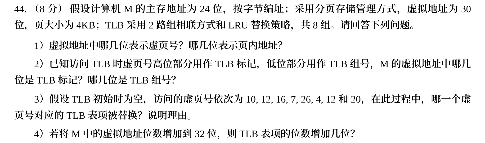
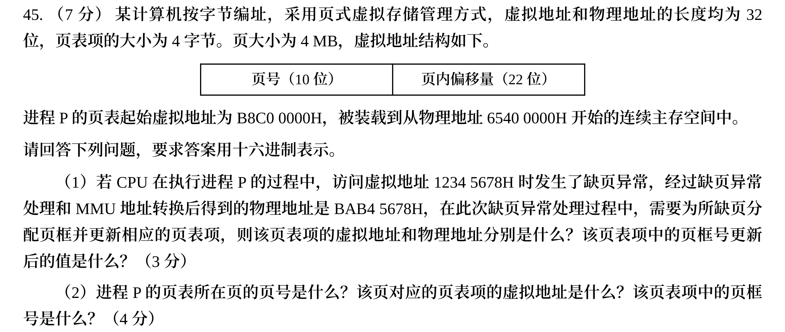
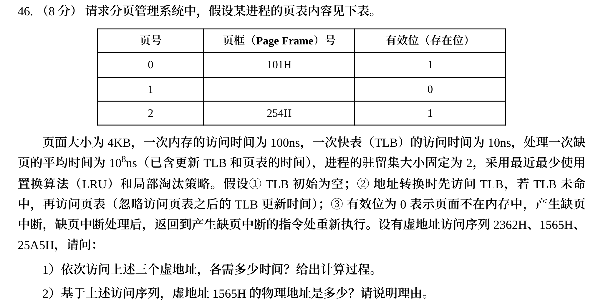
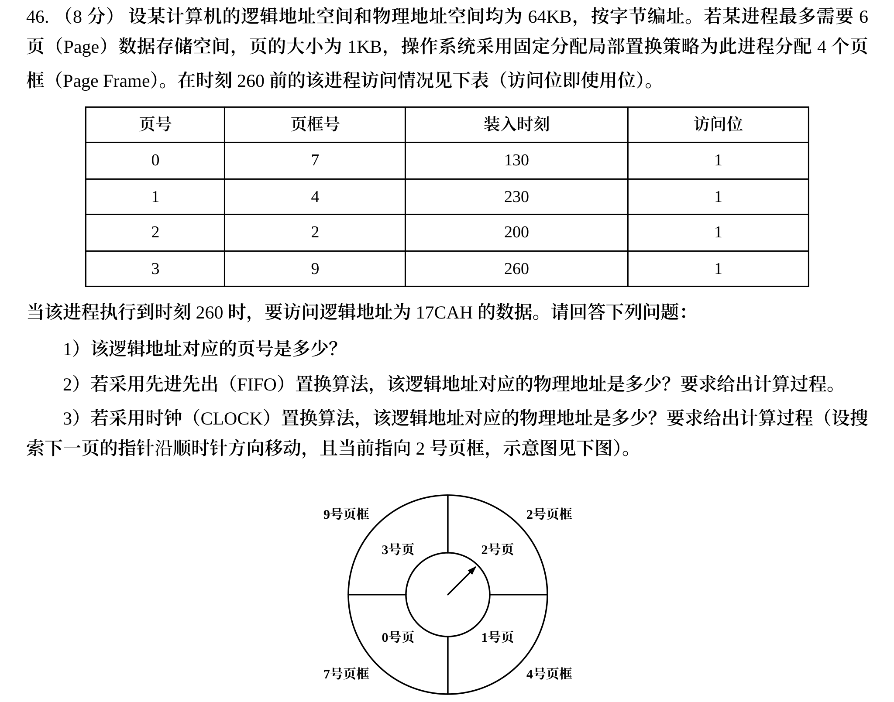
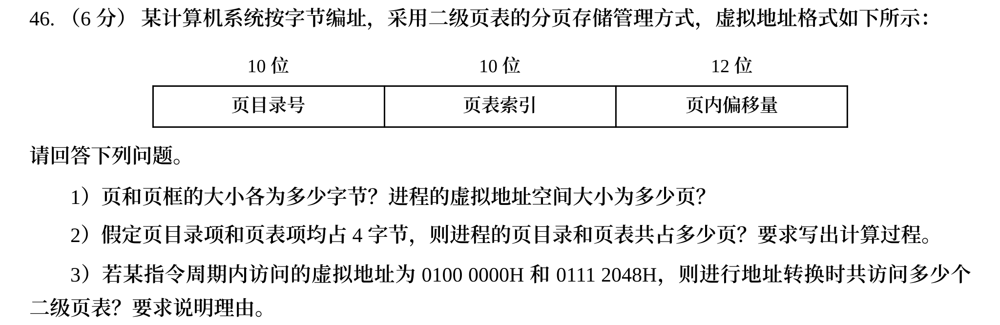
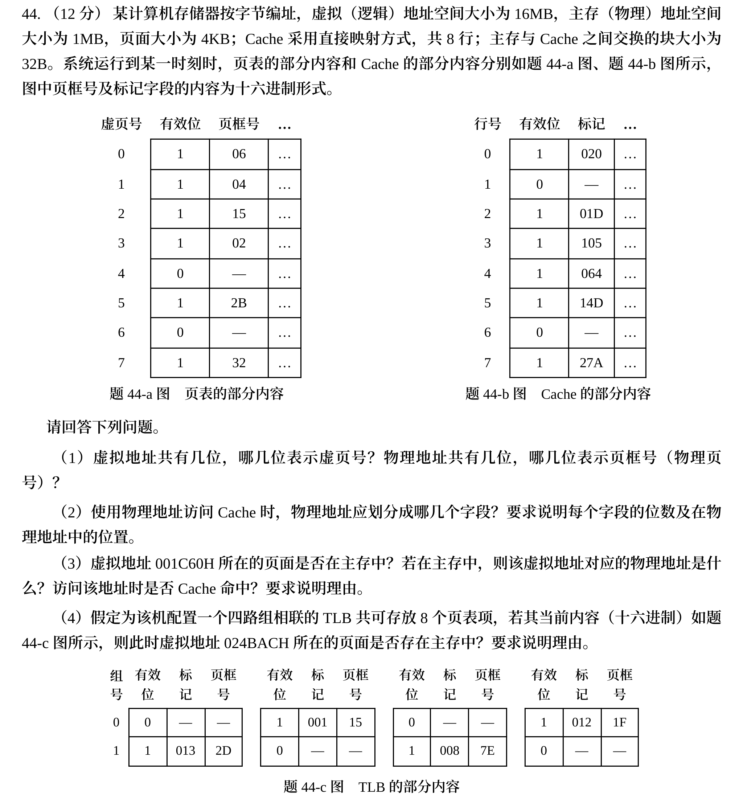
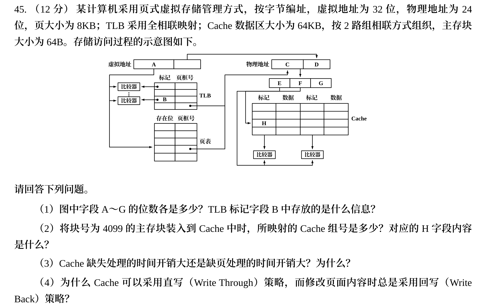
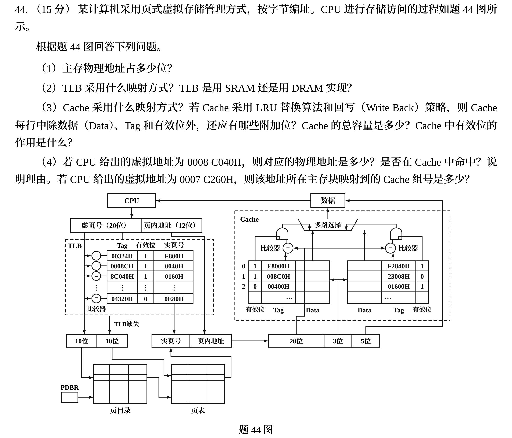

# 0924｜地址翻译链：TLB、页表与 Cache 的先后关系

> 当前显示 **2 题**（2020—2026 年）；**6 题暂缓**，原文保留在文件末尾的 HTML 注释中，未删除。

## 当前题单（2020—2026）

### 01 · 2021-44
> *2 路组相联 TLB 结合分页存储。推导虚拟地址转换为物理地址并查找 Cache 的详细步骤。*

### 02 · 2024-45
> *大页（4MB）分页系统虚拟地址格式。计算页表项数量与页表大小，概念清晰直接算。*

## 暂缓题目

以下题目仅暂时不处理；完整题目条目保留在 Markdown 源文件的 HTML 注释内，预览不显示题目。

<!-- 暂缓题：2009-46；暂时不处理，未删除。
### 01 · 2009-46
> *单级页表查表。根据虚拟地址拆出页号查页表，检查存在位并拼接物理页框号，标准套路分。*

-->

<!-- 暂缓题：2010-46；暂时不处理，未删除。
### 02 · 2010-46
> *进程页表空间与物理内存分配。计算页表自身占用几个页框，按部就班算出。*

-->

<!-- 暂缓题：2015-46；暂时不处理，未删除。
### 03 · 2015-46
> *二级页表虚拟地址切分。一级页号、二级页号与页内偏移位数计算，公式标准分。*

-->

<!-- 暂缓题：2011-44；暂时不处理，未删除。
### 05 · 2011-44
> *虚拟地址空间、主存空间与 Cache 空间综合。写出虚拟地址到物理地址再到 Cache 映射的完整三段划分。*

-->

<!-- 暂缓题：2016-45；暂时不处理，未删除。
### 06 · 2016-45
> *TLB 全相联加 Cache 组相联。全链路推演一次访存是否命中 TLB、是否缺页、是否命中 Cache。*

-->

<!-- 暂缓题：2018-44；暂时不处理，未删除。
### 07 · 2018-44
> *虚存访问全流程图填空。辨析各硬件部件的先后次序（TLB $\to$ 页表 $\to$ Cache $\to$ 主存），极高频核心考点。*

-->
