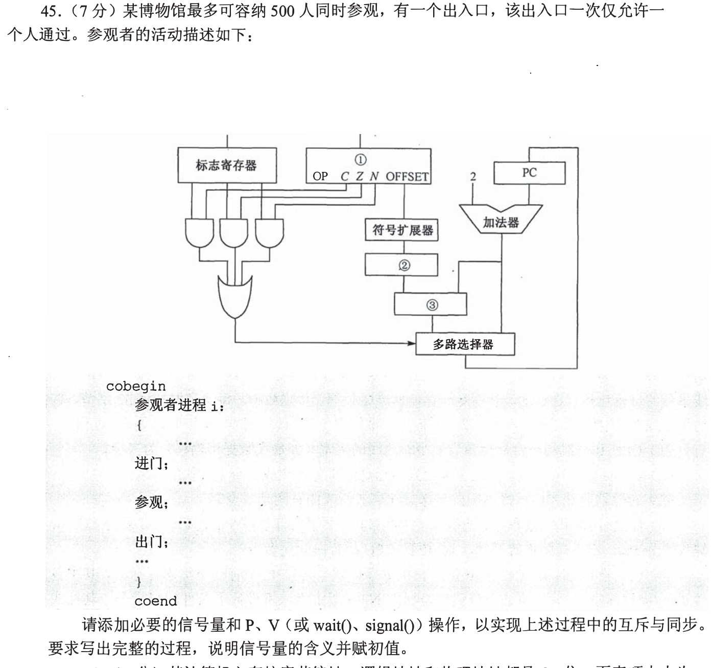

[« 0924-answer](0924-answer.md)　　[0926-answer »](0926-answer.md)

# 0925 Answer｜把“可以做”写成可兑现的许可

> [原题 13 道](0925.md) · [前置的线程交错](0825-answer.md) · [能力账本](answer-quality/learning-ledger.md)
>
先说清一个信号量代表多少个空位、多少份成品或哪一道先后门，再写 P/V。下面各段代码里的 P 是等待、V 是释放；读懂解法尚非独立限时验证。

<details><summary><strong>考场入口：每题先辨识哪种门</strong></summary>

| 题 | 最容易漏的约束 | 最短检查 |
| --- | --- | --- |
| 01 | 奇/偶各有自己的可用数量 | 消费者绝不在拿锁后等待同类产品 |
| 02 | 10座、1台取号机、1位柜员 | 被叫到者离座，服务前要与柜员会合 |
| 03—05 | 门与容量、批次、两只邮箱 | P 的顺序决定能否让退出/生产者推进 |
| 06—07 | 共享变量读写与哲学家环路 | 锁只覆盖相冲突的资源；最多同时吃 `min(m,⌊n/2⌋)` |
| 08—10 | 前驱图与 P/V 原子性 | 每条跨进程边有一次可兑现的通知 |
| 11—13 | 原子交换、单格缓冲、植树流水 | 锁的真假方向、空满初值、铁锹何时释放 |

</details>

<a id="q01"></a>
## 01｜2009-45：同一个缓冲区，两类成品计数


设 `empty=N`（空格），`odd=0`、`even=0`（已放入对应奇偶数的件数），`mutex=1`（缓冲区结构互斥）。生产者先生成 `v`，`P(empty); P(mutex); put(v); V(mutex);` 再按 `v` 的奇偶 `V(odd)` 或 `V(even)`。P₂ 循环 `P(odd); P(mutex); v=getodd(); V(mutex); V(empty); countodd(v);`；P₃ 将 `odd/getodd/countodd` 换成偶数版本。`getodd/geteven` 必须从缓冲区选出该类产品，不能简单拿队首后再判奇偶。

<details open><summary>为何要先等 odd 再锁缓冲区</summary>若先 P(mutex) 而缓冲区里暂时无奇数，P₂ 会握锁阻塞；生产者无法进入 put 投递奇数。先拿存在性许可，再独占实际移除动作，才能同时守住数量与互斥。</details>

<a id="q02"></a>
## 02｜2011-45：排号不是服务完成


定义 `seat=10`、`machine=1`、`queueMutex=1`、`waiting=0`、`arrived=0`，并为每张唯一号码 `k` 提供初值0的 `called[k]`、`done[k]`。共享 FIFO 队列存号码。

```text
顾客 i:
  P(seat); P(machine); k=取唯一号码()
  P(queueMutex); 入队(k); V(queueMutex); V(machine); V(waiting)
  P(called[k]); V(arrived); P(done[k]); 离开

柜员（循环）:
  P(waiting); P(queueMutex); k=出队(); V(queueMutex)
  V(seat); 叫号(k); V(called[k]); P(arrived)
  服务顾客 k; V(done[k])
```

顾客被叫号便离开等候座位；柜员等待这个顾客走到窗口才服务。`machine` 只限制取号机，不能被柜员握着等待顾客；`done[k]` 防止 A 顾客误收 B 顾客的完成通知。题目未要求先到先服务以外的插队规则，这里用队列落实取号顺序。

<a id="q03"></a>
## 03｜2013-45：先占容量，再穿过单人门



**配图检查。** 当前题图在博物馆题干与参观者伪代码之间混入了条件转移数据通路图（OP/C/Z/N/OFFSET、PC 等），它属于 [2013-44](0920-answer.md#q03)，与本题无关。请仅使用本题的容量、单人出入口和参观者流程；这张图的混入内容尚需从源图中清理。

令 `space=500` 表示剩余可容纳人数，`gate=1` 表示出入口同一时刻只供一人穿过：

```text
参观者 i:
  P(space); P(gate); 进门; V(gate)
  参观
  P(gate); 出门; V(gate); V(space)
```

离馆完成才还一个容量名额。若把 `P(gate)` 放在 `P(space)` 前，当馆满时某人握着门等空位，馆内的人也无法出门，立刻构成死锁；这里的顺序就是本题要挖出的隐含信息。

<a id="q04"></a>
## 04｜2014-47：每个消费者一次连续取满10件


“一个消费者连续取出10件后，其他消费者才可以取”约束的是**每次消费批次**，不能指定某人只在开始时取10件，随后永久放开。设 `empty=1000`、`full=0` 计空位和产品；`bufMutex=1` 保护缓冲读写；`batchMutex=1` 使一次10件的消费批次互斥。

```text
每个生产者（循环）：
  生产一件
  P(empty); P(bufMutex); 放入一件; V(bufMutex); V(full)

每个消费者（循环）：
  P(batchMutex)
  重复10次：
    P(full); P(bufMutex); 取出一件; V(bufMutex); V(empty)
    消费该件
  V(batchMutex)
```

同一消费者取满10件之前，其余消费者只能等 `batchMutex`。生产者不需要该锁，仍可填充缓冲；消费者等待 `full` 时不持有 `bufMutex`，不会阻止生产者送来后续产品。不能连续 P(full) 十次后才 V(empty)：缓冲剩余容量与其它等待可能使这种批量预占设计更复杂，逐件释放空位即可。

<a id="q05"></a>
## 05｜2015-45：两只邮箱各自有空位与邮件数


分别设 A 的 `fullA=x, emptyA=M−x, mutexA=1`，B 的 `fullB=y, emptyB=N−y, mutexB=1`。A 循环：`P(fullA); P(mutexA); 取A邮件; V(mutexA); V(emptyA); 回答并提出新问题; P(emptyB); P(mutexB); 放入B邮箱; V(mutexB); V(fullB)`；B 对称地 `P(fullB)` 取信，处理后 `P(emptyA)` 投递。

初始 `0<x<M, 0<y<N`，所以双方有可读信且不满。关键是**先取本箱来信、释放本箱空位，再可能等待对方箱空位**；不能握本箱的互斥锁去等另一箱，或将 A 的容量许可拿来约束 B。<details open><summary>计数与物理操作各管什么</summary>`fullA`/`emptyA` 保证不会从空箱取或向满箱放；`mutexA` 只保护 A 邮箱内部的一次读写。B 有独立一组，双方能同时读写不同邮箱。</details>

<a id="q06"></a>
## 06｜2017-46：只保护真正冲突的共享变量


`x,y,z` 是线程间共享的复数对象；每个线程的局部 `w` 与 `add` 的局部 `s` 独立。令 `my=1,mz=1` 分别保护对全局 y、z 的访问；x 只读，无须锁。线程1 `P(my); w=add(x,y); V(my)`；线程2 `P(my);P(mz); w=add(y,z); V(mz);V(my)`；线程3 先本地构造 `w=(1,1)`，随后 `P(mz); z=add(z,w); V(mz); P(my); y=add(y,w); V(my)`。

线程2同时读取 y、z，故要在读两者时保留相应锁；线程3的两次独立修改分段锁定，能让线程1读 y 与线程3更新 z 并发。所有需要双锁的地方都按 y→z 取得，避免循环等待。假如额外要求“z、y 两次更新整体不可见地完成”，题目未给这样的事务约束，才需要扩大锁范围。

<a id="q07"></a>
## 07｜2019-43：碗不消除环形拿筷子死锁


设 `bowls=m`、每根筷子 `stick[i]=1`、`admit=n−1`。哲学家 i 循环：思考；`P(admit); P(bowls); P(stick[i]); P(stick[(i+1)%n]); 吃饭; V(stick[(i+1)%n]); V(stick[i]); V(bowls); V(admit)`。

最多 n−1 人进入拿筷子阶段，至少留一个缺口，使环上的“每人持一根又等下一根”无法覆盖整圈；只限制碗数为 m，若 `m≥n` 仍可能死锁。最多同时吃饭 **`min(m,⌊n/2⌋)`**：不相邻的哲学家才可同时拿到两边筷子；n−1 的门槛不会削低这个最大值（n≥3）。

<a id="q08"></a>
## 08｜2020-45：两处“都完成”各用一个计数门


令 `ab=0, cd=0`。A 后 `V(ab)`，B 后 `V(ab)`；C 之前连续 `P(ab);P(ab)`，然后执行 C 并 `V(cd)`；D 后 `V(cd)`；E 之前连续 `P(cd);P(cd)` 再执行 E。

每个前驱只交一次令牌，C/E 各要收齐两枚，故先后关系是 `A,B→C` 与 `C,D→E`，A、B、D 都可并发。`P(ab)` 一次只表示“至少有一个前驱完成”，不能当成“两个都完成”。两个计数信号量比为每条边各设一个更简洁；这题不要求互斥操作本身。

<a id="q09"></a>
## 09｜2021-45：关中断范围内不能等待别人唤醒


**（1）互斥原因。** `while(S<=0)` 的检查与 `S=S−1` 必须作为一个不可分的获得许可动作；两个线程都看见 S=1 后各减1，会让同一许可被消费两次。`signal` 的加1也必须与 `wait` 对 S 的读改写保持一致。

**（2）两种错误。** 方法1关中断后在 `while(S<=0)` 忙等：单处理器上释放者无法获得 CPU 执行 `signal`，会卡死。方法2在确认 `S>0` 后开中断、又关中断才减1：两个等待者可能都通过检查，随后各减1，仍竞争。安全的阻塞式信号量需在受保护的原子操作中登记等待/休眠，唤醒时维护队列与计数；单纯移动开关中断位置不能修好两者。

**（3）用户态。** 用户程序不能自行执行特权的开/关中断指令，否则可任意屏蔽系统中断；互斥要通过系统提供的同步原语。<details open><summary>考场反证各举一个交错</summary>方法1取 S=0，等待者关中断后死循环，释放者无机会运行。方法2取 S=1，T1和T2先后都在开中断前看到1，再各减一次得到−1。</details>

<a id="q10"></a>
## 10｜2022-46：同一线程内的先后不用重复发信号


图给 A、B→C→D、E→F；T1 负责 A、E、F，T2 负责 B、C、D。设 `aDone=0,cDone=0`：

```text
T1: A; V(aDone); P(cDone); E; F
T2: B; P(aDone); C; V(cDone); D
```

B→C、C→D、E→F 本来就在各自线程程序顺序内；跨线程只有 A→C、C→E 两道门，需要两个初值0的信号量。T1 发出 A 已完成后才等 C；T2 完成 C 后通知，不形成循环等待。

<a id="q11"></a>
## 11｜2023-45：原子 swap 与三个赋值不同


**（1）修正。** 共享 `lock=FALSE` 表示可进入；每个线程令局部 `key=TRUE`，必须 **`while(key==TRUE) swap key,lock;`**，直到从锁交换出 FALSE 才进入临界区；离开时应 **`lock=FALSE`**。图中的 `if(key==TRUE)` 只试一次就可能带着 TRUE 闯入，`lock=TRUE` 则离开后仍锁住。自旋期间 key 的 TRUE 交换回 lock，使锁保持占用。

**（2）函数替代？** `newSwap` 用临时变量分三条赋值完成交换，两个线程可在中间交错：都读到原来的 FALSE，就都以为获得锁，或覆盖彼此写入。除非函数本身由硬件原子交换指令或等效原子机制实现，否则普通函数调用不能替代 `swap key,lock`。

<details open><summary>检验锁方向的两个极端</summary>初始 lock=FALSE，第一位应交换得到 key=FALSE 才进；若有人在内，lock=TRUE，后来者交换后仍 key=TRUE，必须反复尝试。离开必须让 lock 回到 FALSE。</details>

<a id="q12"></a>
## 12｜2024-46：一格缓冲读写与原地修改是两种约束


**（1）** 若 P1/P2 同时对同一缓冲 B 执行 C1，写入会互相覆盖或产生不确定结果，C1 的代码段访问共享资源 B，属于**临界区**。

**（2）先写后读。** B 初始空，P1 的 C1 一次、P2 的 C2 一次；仅需 `full=0`：`P1: C1; V(full)`，`P2: P(full); C2`。只有一写一读、各一次，写完后才让读发生，本题不必额外加互斥锁和 empty 信号量。

**（3）两个原地修改。** B 初始非空，P1/P2 各执行一次 C3：`mutex=1`，两进程分别 `P(mutex); C3; V(mutex)`。无需等“非空”（题设已给），但两次读改写不能交错。先后同步门 `full` 与资源互斥门 `mutex` 解决的是不同问题。

<a id="q13"></a>
## 13｜2025-45：坑容量、铁锹、树苗、水桶分开计数


设 **四个信号量**：`freePit=3`（剩余坑名额）、`dug=0`（可放苗的坑）、`planted=0`（待浇的树）、`shovel=1`（铁锹互斥）。甲 `P(freePit);P(shovel);挖坑;V(shovel);V(dug)`；乙 `P(dug);放苗;P(shovel);填土;V(shovel);V(freePit);V(planted)`；丙 `P(planted);浇水`，三人均按各自阶段循环。

甲挖前占一个坑名额，乙**填土之后**才归还：坑数量不超过3；铁锹在挖与填两个动作间可轮换，不能由甲从挖到填始终握着。水桶只有丙使用，不与他人竞争，无需额外信号量，符合“尽可能少”的要求；乙完成种植并填土才放出 `planted`，保证丙不会浇尚未栽好的树。<details open><summary>为什么归还坑名额不必等浇水</summary>容量条件限制的是尚未填好的坑，而浇水发生在填土之后。让甲等到丙浇完才可挖新坑会平白减少并发，且不对应题面的“已有坑数小于3时才可再挖”的条件。</details>

## 复做顺序

先不看代码，为01、03、04、07、13写出“计数/初值/谁 V 后谁能 P”；再给02、06、11各构造一次会出错的交错。最终才把空位、产品、互斥和先后放进代码。能理解这种推导还需要再做独立、限时的正确性检查。
