[← 0924](0924.md) · [总索引](README.md) · [0926 →](0926.md)

# 0925｜并发同步：把资源约束翻译成可证明的执行顺序

> 大题线 `W12-synchronization` · 第 12/19 个节点 · 13 道完整真题引用
>
> 选择题前置线：`27-sync`、`28-deadlock`

## 归类依据

生产者消费者、服务队列、独木桥、线程协作和前驱关系都要求同一件事：先写出容量、互斥与先后约束，再为每个信号量说明语义和初值，最后检查任意交错下都不会越界、冲突或永久等待。

这一节点以完整作答为单位。公共题干、全部小问、代码或计算过程必须在同一次作答中收口；再次出现的接口题只检查它与当前机制的连接，不重复抄题。

## 题单

[逐题讲解：信号量的初值就是题目的资源约束](0925-answer.md)

### 01 · 2009-45

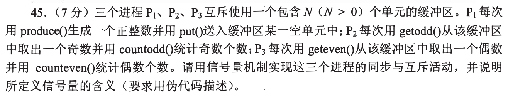

### 02 · 2011-45

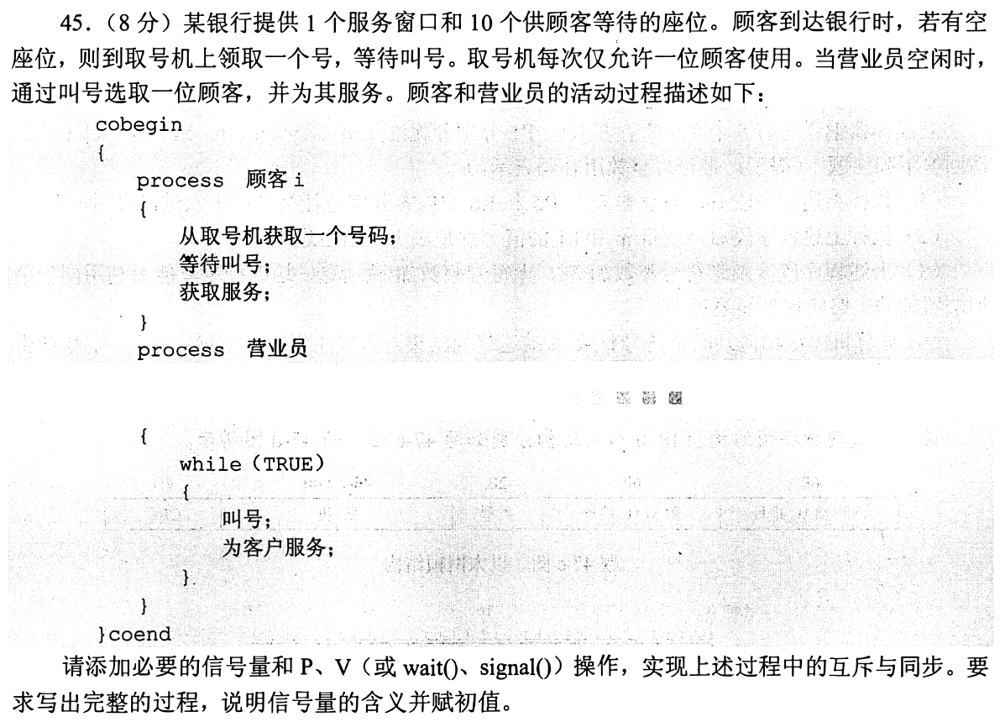

### 03 · 2013-45

**2013-45 原题（7 分，按题图核对转写）**

某博物馆最多可容纳 500 人同时参观，有一个出入口，该出入口一次仅允许一个人通过。参观者的活动描述如下：

```text
cobegin
  参观者进程 i:
  {
    ……
    进门;
    ……
    参观;
    ……
    出门;
    ……
  }
coend
```

请添加必要的信号量和 P、V（或 wait()、signal()）操作，实现上述过程中的互斥与同步。要求写出完整的过程，说明信号量的含义并赋初值。

[查看保留的原始题图](../bank/2013/q45.png)（原图混入了 2013-44 的条件转移数据通路图，正文不展示这张无关图。）

### 04 · 2014-47

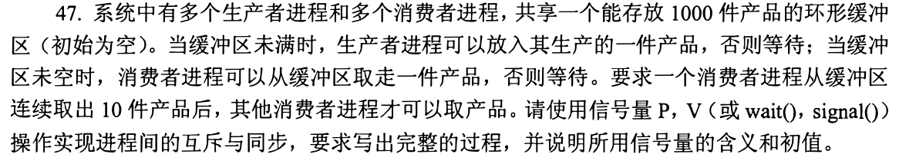

### 05 · 2015-45

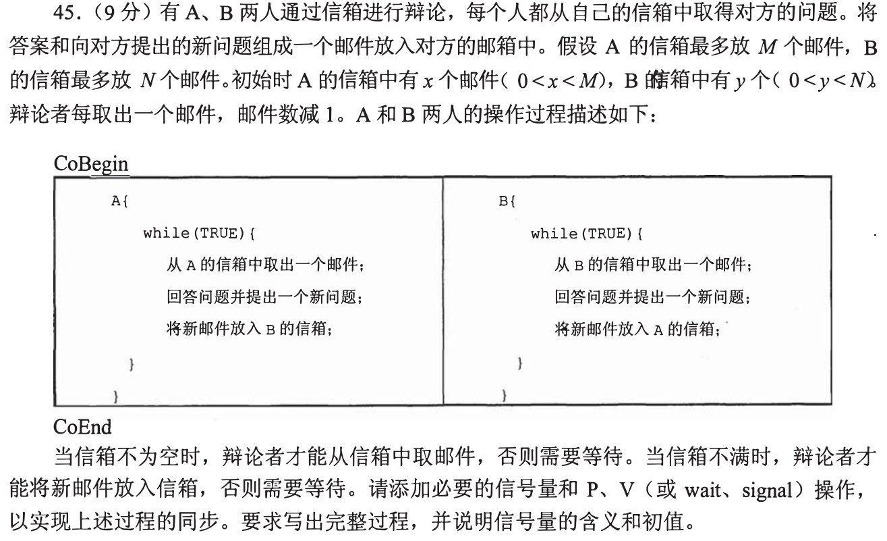

### 06 · 2017-46

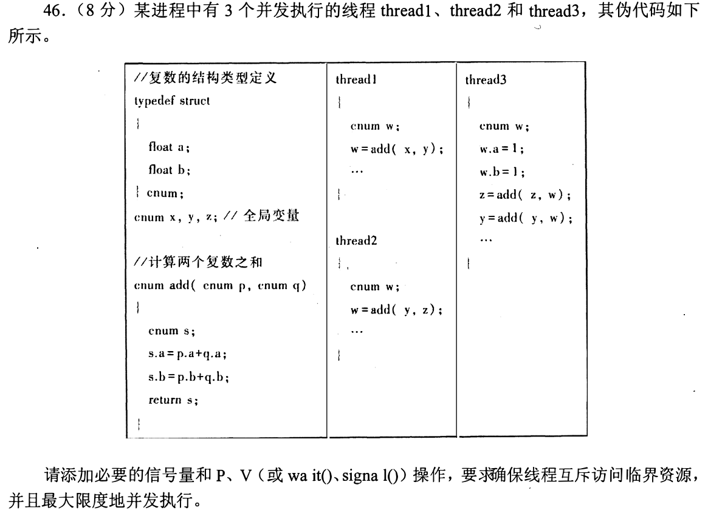

### 07 · 2019-43

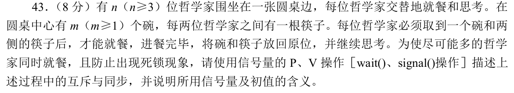

### 08 · 2020-45

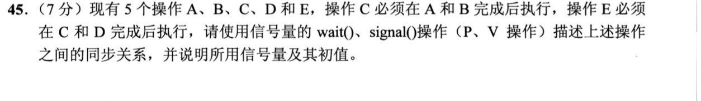

### 09 · 2021-45

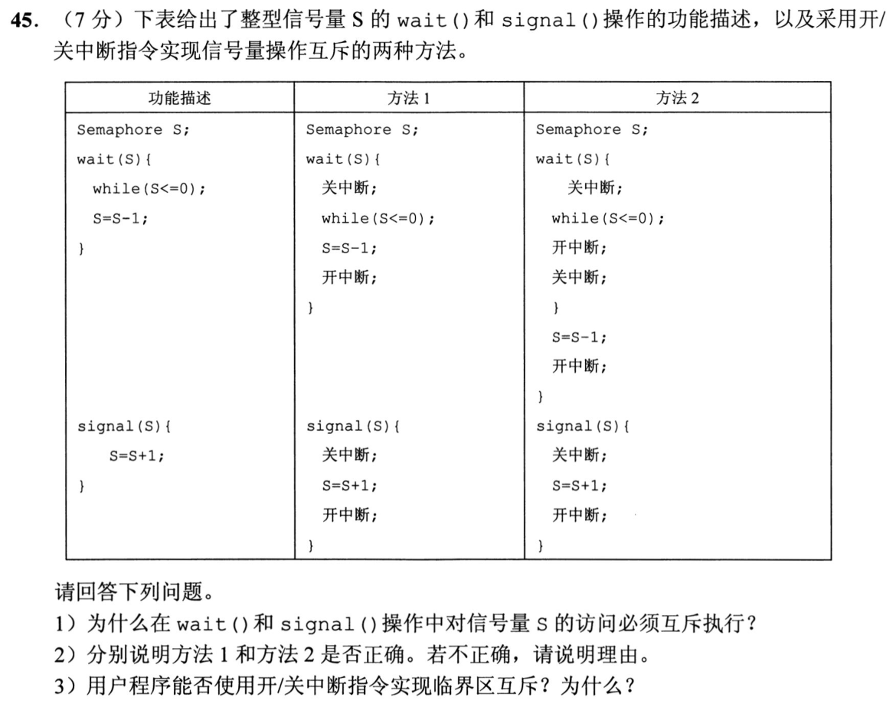

### 10 · 2022-46

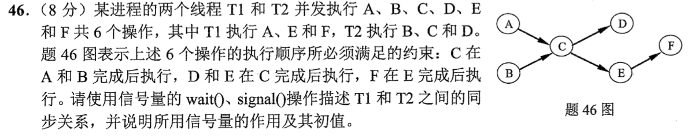

### 11 · 2023-45

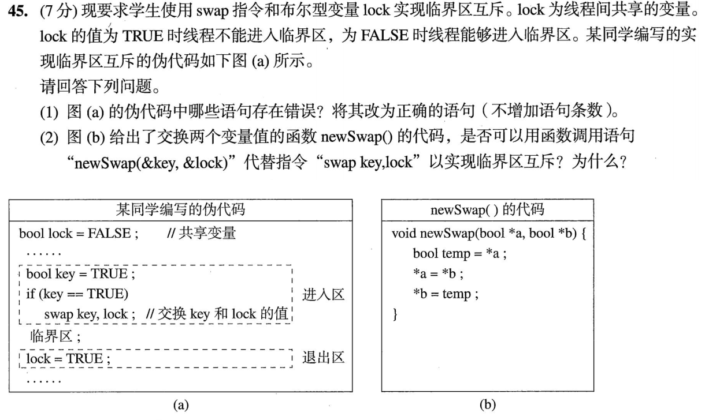

### 12 · 2024-46

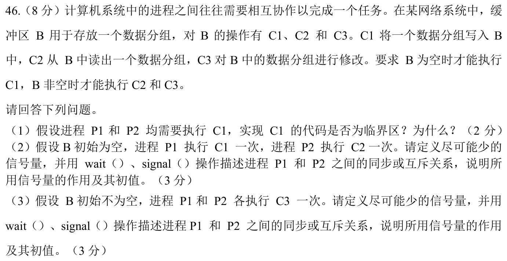

### 13 · 2025-45

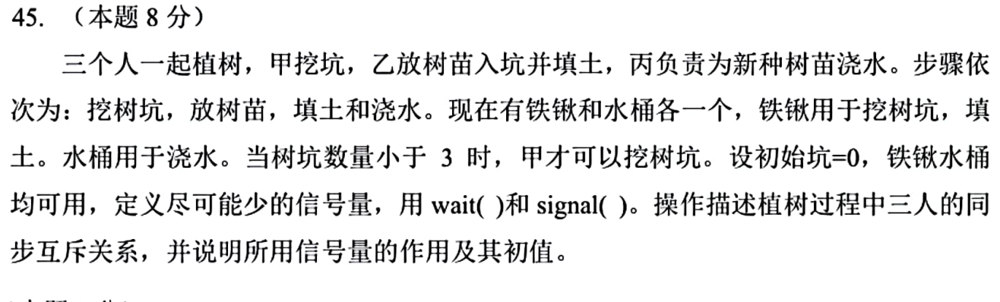

[← 0924](0924.md) · [总索引](README.md) · [0926 →](0926.md)
