# 0925｜并发同步：PV 操作大题

> 当前显示 **7 题**（2020—2026 年）；**7 题暂缓**，原文保留在文件末尾的 HTML 注释中，未删除。

## 当前题单（2020—2026）

### 01 · 2020-45
> *多工序流水协作，按前后依赖设单向通知信号量，逻辑简单直接。*
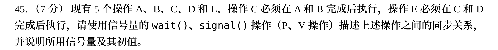

### 02 · 2021-45
> *多资源非对称申请与死锁规避。*
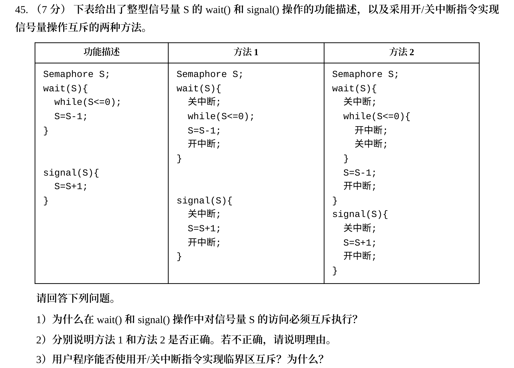

### 03 · 2022-46
> *现代缓冲区多条件状态机同步，注意唤醒条件不能漏。*
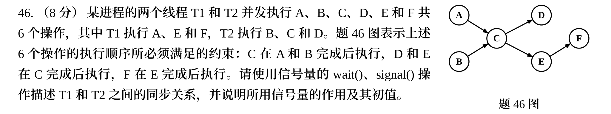

### 04 · 2023-45
> *进站检票与闸机通行，闸机互斥加站内容量限制。*
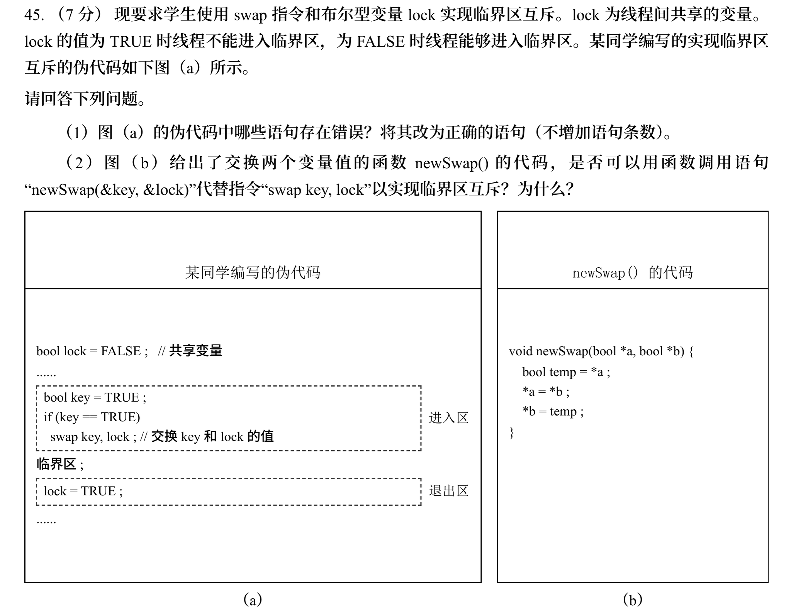

### 05 · 2024-46
> *并发调度与事件通知，注意互斥范围别扩得太大。*
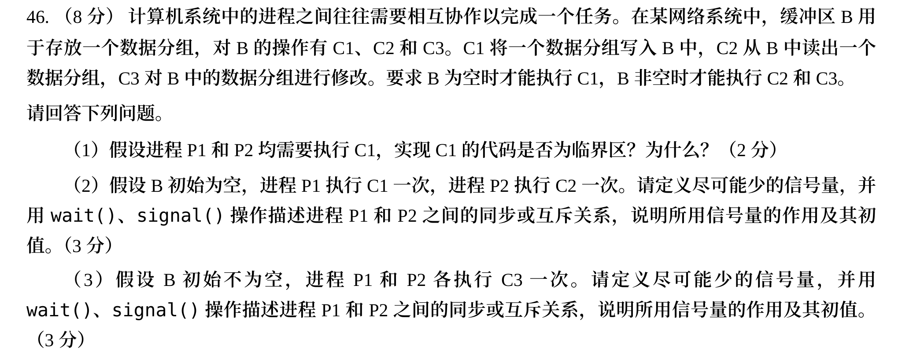

### 06 · 2025-45
> *最新压轴。情境综合较深，先保住核心资源的互斥与基本同步，别在细节分支上卡死。*
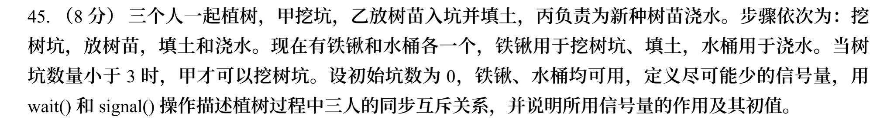

### 07 · 2026-45
> *时间片轮转（RR）调度过程推演。结合时钟中断触发时机，沿时间轴列出就绪队列变迁，计算各进程首次响应时间与总调度次数。*
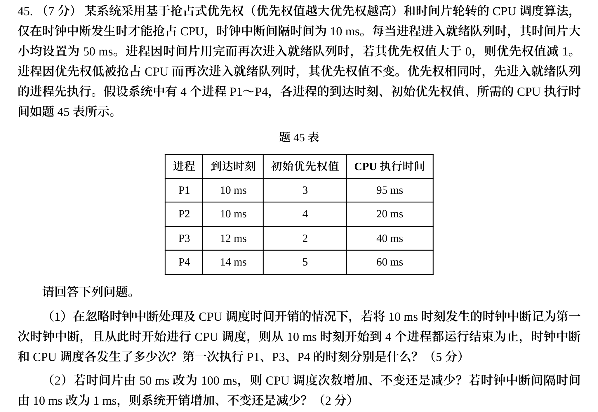

## 暂缓题目

以下题目仅暂时不处理；完整题目条目保留在 Markdown 源文件的 HTML 注释内，预览不显示题目。

<!-- 暂缓题：2009-45；暂时不处理，未删除。
### 01 · 2009-45
> *标准生产者-消费者，一个缓冲区一把锁，空位与满位两组同步，母题基本盘。*
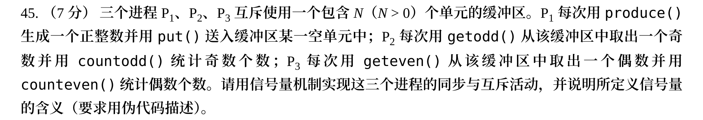
-->

<!-- 暂缓题：2011-45；暂时不处理，未删除。
### 02 · 2011-45
> *银行排队叫号。顾客取号互斥、通知营业员同步，营业员服务完毕同步，角色界限清楚。*
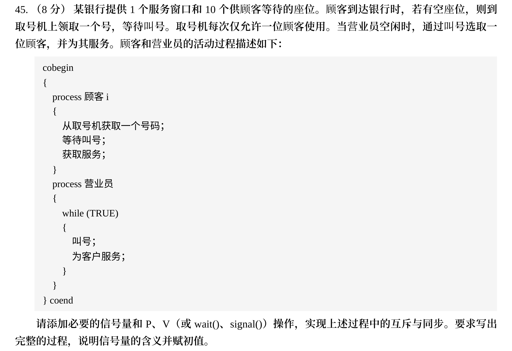
-->

<!-- 暂缓题：2013-45；暂时不处理，未删除。
### 03 · 2013-45
> *博物馆进出门。一共 500 个名额，大门一次过 1 人。进门查名额拿钥匙，出门交钥匙放名额。*
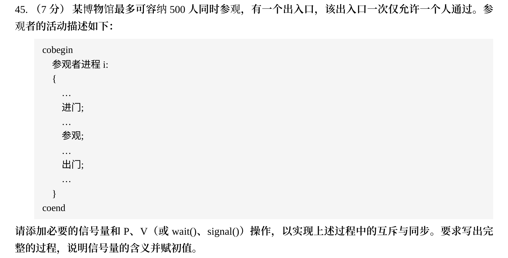
-->

<!-- 暂缓题：2015-45；暂时不处理，未删除。
### 04 · 2015-45
> *多进程资源排队申请，主调与工作线程对应。*
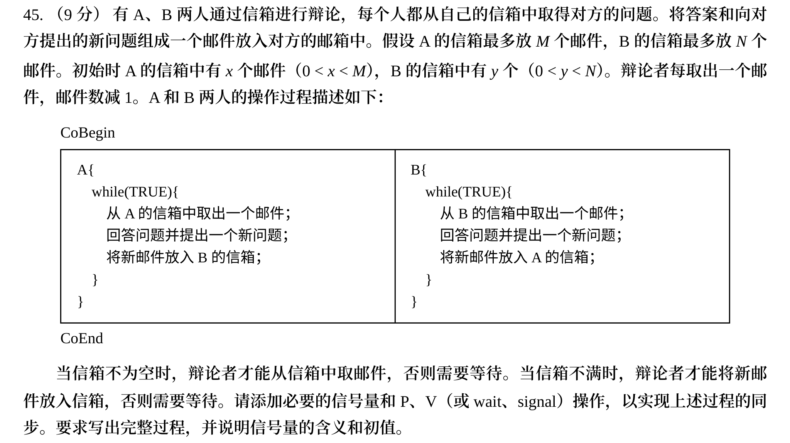
-->

<!-- 暂缓题：2014-47；暂时不处理，未删除。
### 07 · 2014-47
> *车间多零件货架装配。货架总容量、A零件上限、B零件上限三层约束，装配工要同时集齐才开工。*
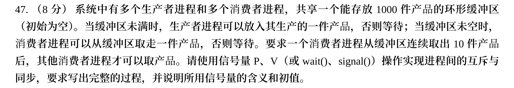
-->

<!-- 暂缓题：2017-46；暂时不处理，未删除。
### 08 · 2017-46
> *独木桥双向通行（读者-写者变式）。同向可以连续过，对面来车就互斥。首车抢桥、尾车放桥，计数器必加专门的锁保护。*
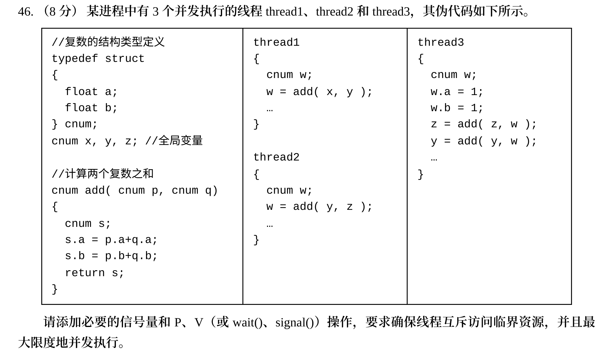
-->

<!-- 暂缓题：2019-43；暂时不处理，未删除。
### 09 · 2019-43
> *独木桥防饥饿。在 2017 题基础上加了个“防止一边连续不断把另一边憋死”，必须额外加一把排队锁。*
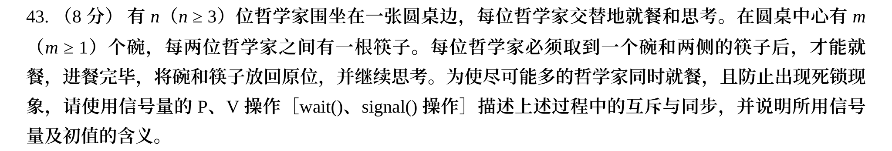
-->
