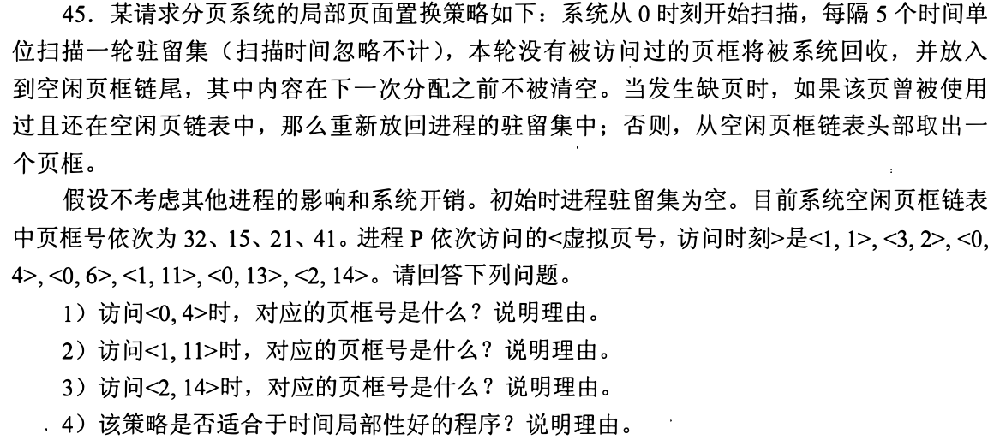
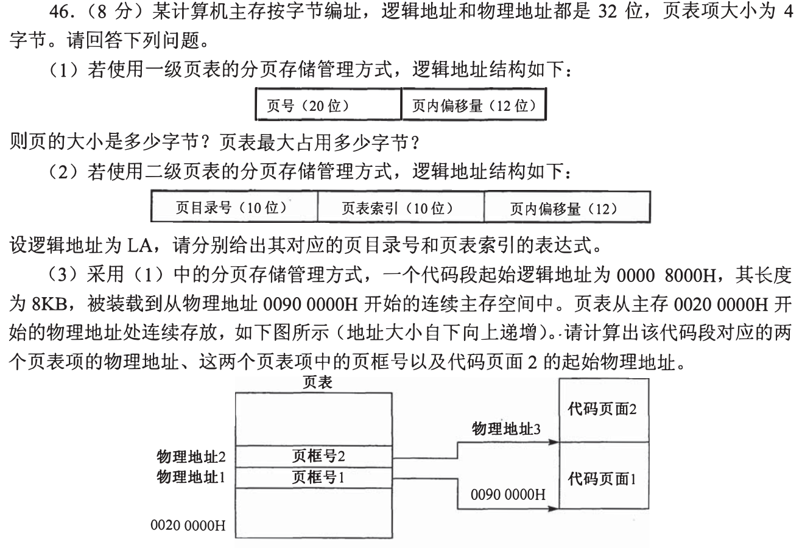
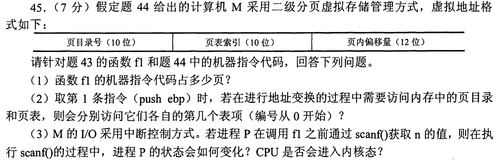
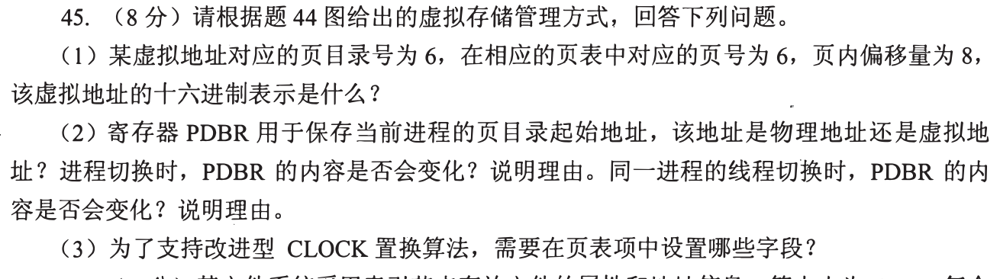
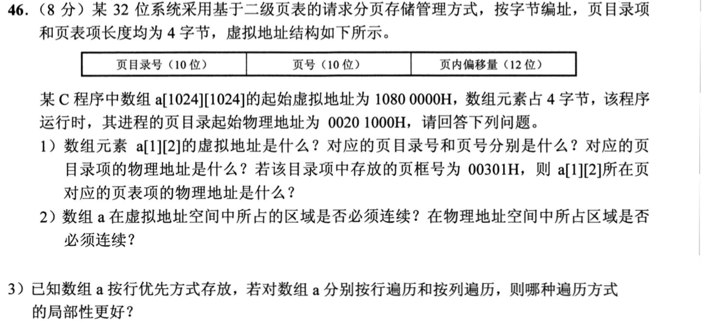

[« 0925-answer](0925-answer.md)　　[0927-answer »](0927-answer.md)

# 0926 Answer｜页框被回收后，内容未必立刻消失

> [原题 5 道](0926.md) · [0924 的地址翻译](0924-answer.md) · [能力账本](answer-quality/learning-ledger.md)
>
先区分虚拟页、页框、驻留集与空闲链；随后沿时间或地址逐步更新。读懂本稿还须限时独立复做。

<strong>考场入口</strong>

| 题 | 快速判断 | 答案锚点 |
| --- | --- | --- |
| 01 | 每5拍扫描最近一轮，回收帧放空闲链尾 | 0页21；1页11时复用32；2页14时41 |
| 02 | 先算页号再乘4定位表项 | 4KB页、一级表最多4MB；两PTE在00200020H/24H |
| 03 | 取指地址前后之差与页号两级拆分 | f1 96B/1页；目录项1、二级表项1 |
| 04 | 目录6、表6、偏移8拼位，不是十进制拼接 | 01806008H；改进CLOCK需要R/M位 |
| 05 | 行优先下 `[1][2]` 索引是1026 | 10801008H；目录42H/表1；物理不必连续 |

## 01｜2012-45：扫描回收并不立即清除旧内容

起初空闲链 `32→15→21→41`。时刻1访问页1，取帧32；时刻2页3取帧15；时刻4页0取帧21。因此 **`⟨0,4⟩` 的页框是21**。时刻5扫描上一轮，三页都被访问，仍驻留；时刻6再访页0，作为下一轮的近期使用。

时刻10扫描时，页1、页3在5—10间均未被访问，回收到空闲链尾；页0时刻6使用过，留在驻留集。此时空闲链按序为 `41→32(原页1)→15(原页3)`。时刻11访页1发生缺页，但它曾用的帧32仍在链中且内容未被下一次分配清除，于是**直接复用帧32**，不必从磁盘重新读；故 **`⟨1,11⟩` 对应32**。时刻13页0仍驻留；时刻14首次访页2，从空闲链头取 **41**，故 **`⟨2,14⟩` 对应41**。

**（4）适配性。** 每轮保留近期访问页、回收长时间未用页，能利用“近期使用的页更可能再用”的时间局部性；若程序的复访间隔频繁超过5拍，也可能被过早回收，效果依赖扫描间隔与实际工作集。题设额外保留空闲帧旧内容，使短暂离开驻留集的页还有第二次机会。

复用和分配为什么不遵循同一个队头
普通缺页若没有自己的旧帧，取空闲链头41；“曾使用且旧帧仍在空闲链”是题目单独给出的优先规则，可以从链中找到32并摘下。漏看这一句就会把时刻11错算成41，连带时刻14也错。

## 02｜2013-46：页表项地址与内容是两件事

**（1）一级表。** 偏移12位→页 **4096B**；页号20位、PTE4B，完整一级表最多 `2²⁰×4=2²²B=4MB`。这不是进程当下占用4MB物理页框的意思。

**（2）二级拆分。** 页目录号 **`LA>>22`**；二级页表索引 **`(LA>>12)&3FFH`**，余下12位是页内偏移。

**（3）代码段。** 起始虚址 `00008000H`、长度8KB，占连续虚页8、9；页表基址 `00200000H`，两 PTE 的**物址**是 `00200000H+8×4=00200020H`、`00200000H+9×4=00200024H`。代码加载在物理 `00900000H` 起的两页，页框号分别为 **`900H`**、**`901H`**；第二代码页起始物址 **`00901000H`**。PTE 里存页框号，不能把 PTE 的物址00200020H 填成页框号。

## 03｜2017-45：取指跨页和 scanf 阻塞是两种状态

本题依赖前题的 [f1 机器代码](../bank/2017/q44.png)：首条 `push ebp` 在 `00401020H`，末条 `ret` 在 `0040107FH`。**（1）** 总字节数 `0040107F−00401020+1=60H=96B`，这段地址在同一4KB页，故 **1页**。

**（2）** 首条虚页号 `00401020H>>12=401H`，两级页表各索引10位，目录号 `401H>>10=1`，二级页表索引 `401H&3FFH=1`。从0编号，分别访问**第1个目录项和该表第1个页表项**。

**（3）** `scanf` 要等待输入时，进程从运行态经系统调用进入内核，若输入尚未就绪转**阻塞态**；设备完成时发中断，内核唤醒进程转**就绪态**，等调度后再运行。执行系统调用/处理中断期间 CPU 会进入**内核态**，不能把“进程阻塞”误说成“CPU 永久停在用户态”。

为何 96B 仍只占一页
看首末地址的高位页号是否相同，不看长度是否小于4KB就直接下结论：若起始地址靠近页尾，几十字节也可能跨页。本题 020H—07FH 离页界尚远。

## 04｜2018-45：页目录基址属于当前进程

**（1）拼地址。** 沿前题两级地址格式，目录号6在 [31:22]、二级页号6在 [21:12]、偏移8在 [11:0]，因此 `6×2²²+6×2¹²+8=` **`01806008H`**。

**（2）PDBR。** 页目录基址寄存器保存当前进程页目录在**物理内存**的起始地址，地址翻译要据此读取目录。换到另一进程，其地址空间/页目录通常不同，**PDBR要切换**；同一进程的线程共享地址空间，线程互换时 **PDBR不变**（若无特意切换映射）。

**（3）改进 CLOCK。** 页表项需记录**访问/引用位 R** 和**修改/脏位 M**，以优先换出近期未访问且未修改的页；只给访问位只能做基本 CLOCK，不能识别回写代价。

进程与线程不是两份页表
“当前执行者”变化不必然意味着地址空间变化：进程切换通常更换 PDBR，同进程线程切换共享同一页目录。

## 05｜2020-46：同一数组在虚址上连续，在页框上可分散

**（1）定位。** C 行优先，`a[1][2]` 之前有 `1×1024+2=1026` 个int，字节偏移 `1026×4=1008H`；虚址 **`10801008H`**。目录号 `10801008H>>22=42H`，二级页号1、页内偏移008H。页目录基址物址 `00201000H`，目录项物址 **`00201000H+42H×4=00201108H`**。若该目录项的页框号为 `00301H`，二级页表基址是 `00301000H`，索引1的 PTE 物址 **`00301004H`**。

**（2）连续性。** 这个 C 数组的元素在**虚拟地址空间连续**，程序才能按基址加线性索引读写；页式映射可将各虚页放到不同物理页框，**物理地址不必连续**。

**（3）遍历。** 行优先存储使同一行相邻元素地址只差4B，**按行遍历局部性更好**；按列遍历相邻元素跨1024个int（4096B，一页），更易损失 Cache/TLB 空间重用。这里无需假定具体 Cache 容量才可比较地址步长。

## 复做顺序

先用01画两次扫描后的“驻留/空闲链”两列；再用02、05写 `索引×4` 的表项地址；最后口述03、04何时改变进程状态或页目录基址。独立限时表现仍待记录。
