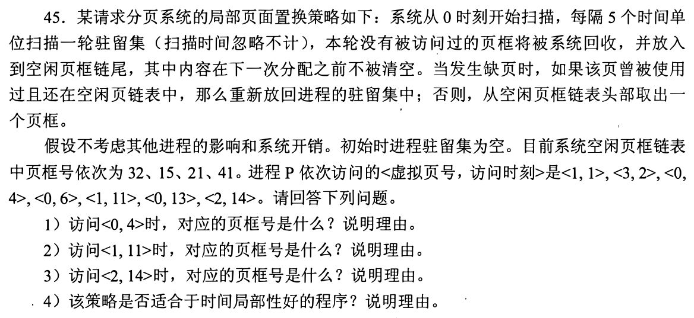
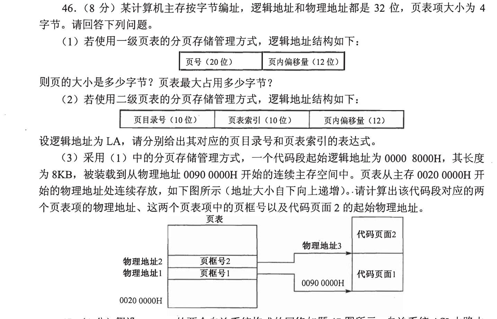
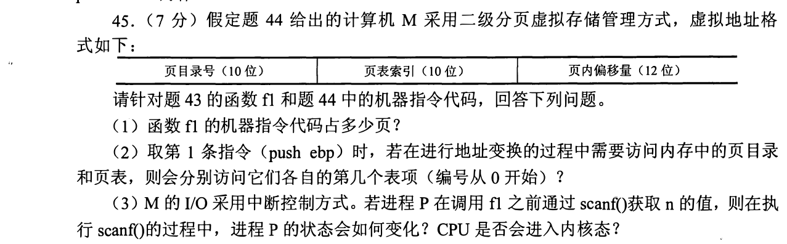
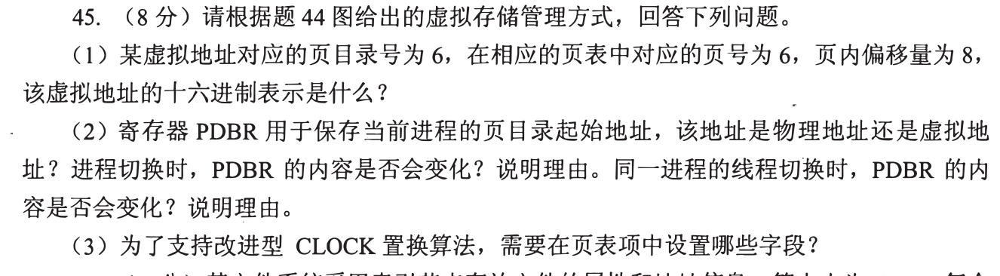
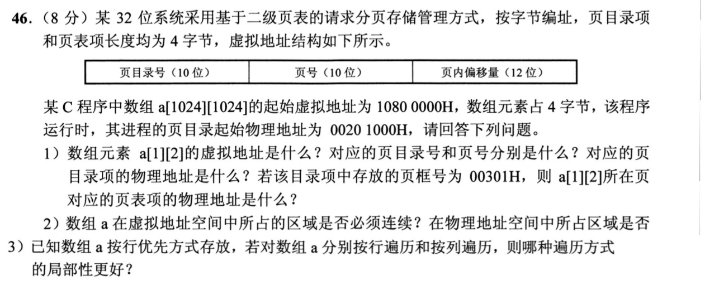

[← 0925](0925.md) · [总索引](README.md) · [0927 →](0927.md)

# 0926｜页面驻留：分配、置换与缺页过程

> 大题线 `W13-page-residency` · 第 13/19 个节点 · 5 道完整真题引用
>
> 选择题前置线：`29-memory-allocation`、`30-page-policy`

## 归类依据

给定页框和访问串后，需要逐步维护驻留集合、引用位与替换指针；若题目同时涉及分配，还要区分虚拟空间、页表规模和实际驻留页框，不能混用容量概念。

这一节点以完整作答为单位。公共题干、全部小问、代码或计算过程必须在同一次作答中收口；再次出现的接口题只检查它与当前机制的连接，不重复抄题。

## 题单

### 01 · 2012-45

### 02 · 2013-46

### 03 · 2017-45

### 04 · 2018-45

### 05 · 2020-46

[← 0925](0925.md) · [总索引](README.md) · [0927 →](0927.md)
