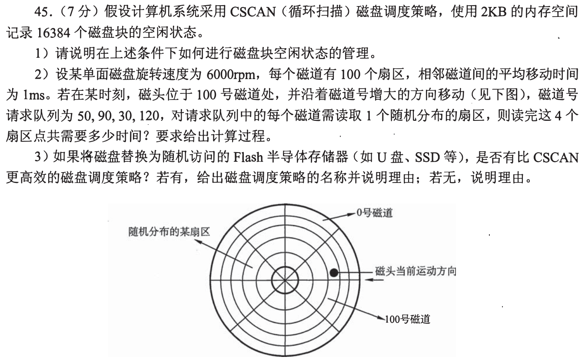
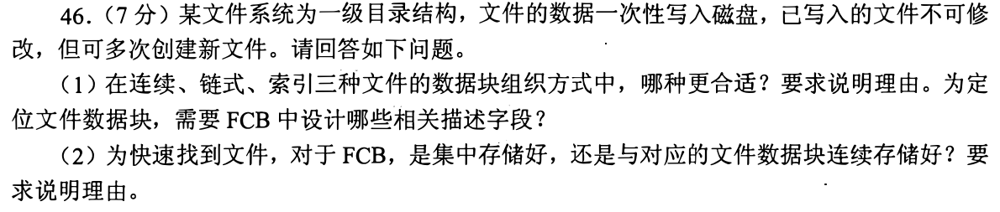
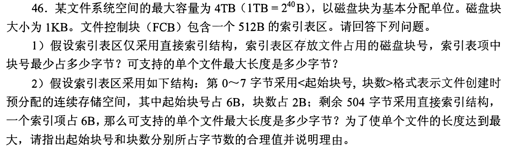
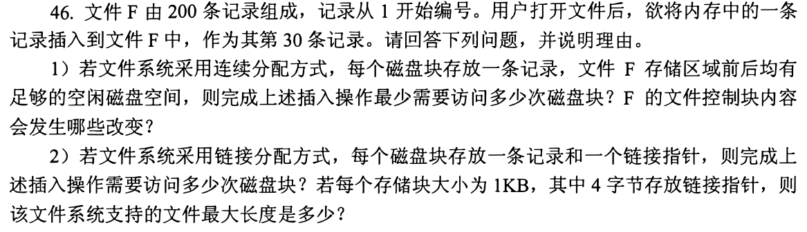
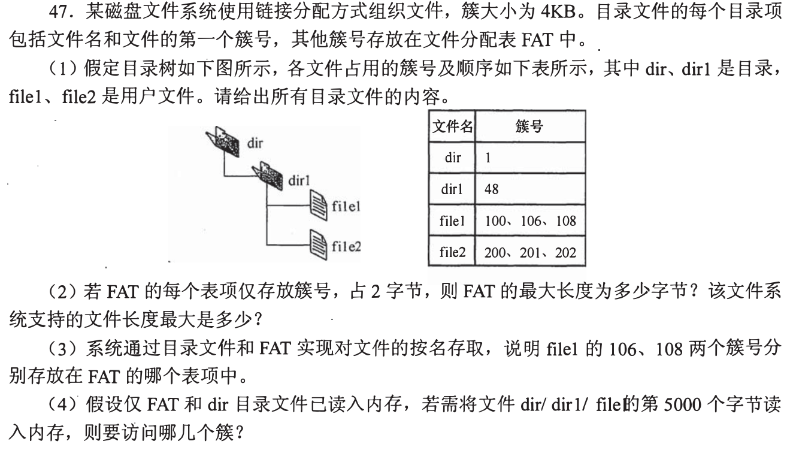
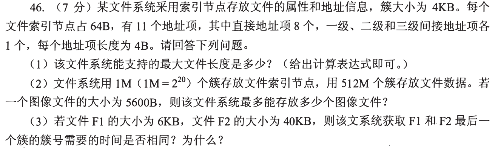
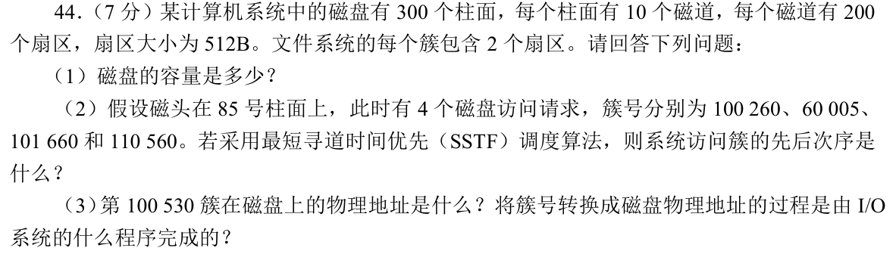
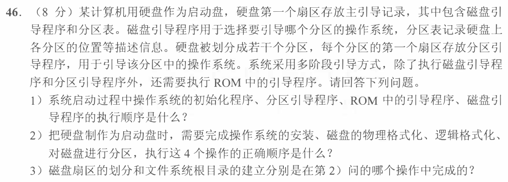
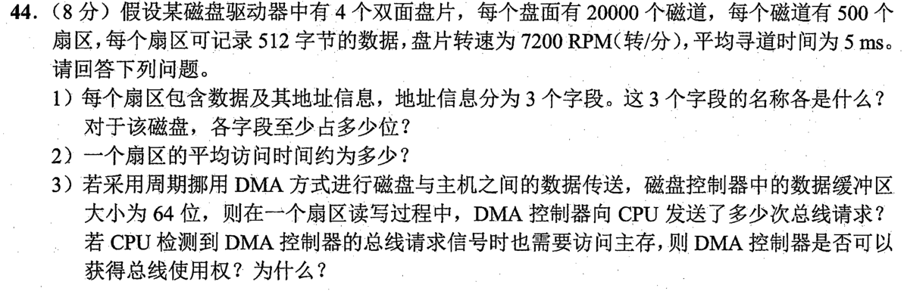
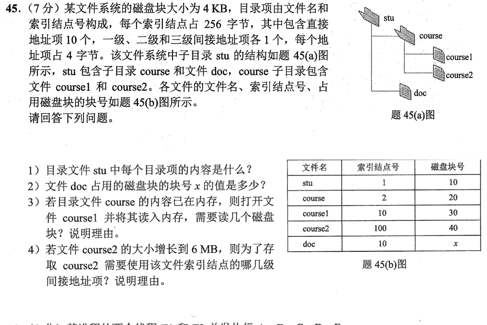

[« 0926-answer](0926-answer.md)　　[0928-answer »](0928-answer.md)

# 0927 Answer｜文件名最后要落到哪一个块

> [原题 10 道](0927.md) · [0926 的页与块区别](0926-answer.md) · [能力账本](answer-quality/learning-ledger.md)
>
本组把“目录项→FCB/inode/FAT→数据簇→磁盘位置”逐层串起来。先辨清逻辑块、物理扇区与索引块，再计访问次数；读懂不等于限时熟练。

<strong>考场入口</strong>

| 题 | 最快的第一笔 | 结果锚点 |
| --- | --- | --- |
| 01 | 位图1位/块；每转10ms | 2KB位图；按所请求磁道循环处理约190.4ms |
| 02—04 | 按文件是否扩展/插入选组织 | 连续分配/集中FCB；插入第30条的最少59块访问 |
| 05—06 | FAT项的下标是当前簇，inode索引层次按容量递增 | file1第2簇106；6KB直达、40KB需一级间接 |
| 07 | 每柱面1000簇 | SSTF 100260→101660→110560→60005 |
| 08 | ROM→主引导→分区引导→OS | 格式化/分区/安装次序另算 |
| 09 | 磁头/柱面/扇区各取上界位数 | 3/15/9位；约9.18ms；64次DMA请求 |
| 10 | 相同inode号表示相同文件 | doc 的 x=30；course2的6MB需二级间接 |

## 01｜2010-45：位图是分配状态，C-SCAN 是寻道顺序

**（1）空闲块。** 16384块各对应位图一位，`16384/8=2048B=2KB`。位图中的一位表示某块空闲/已分配，申请时找空闲位、改为已分配，释放时复位；题给的2KB刚好容纳整张位图。

**（2）调度与时间。** 磁头在100向增大方向，先服务120，再循环到较小请求30、50、90；请求服务顺序是 **120→30→50→90**。若以“到已请求的最大磁道后折返到待处理的最小磁道”计寻道，移动 `|120−100|+|120−30|+|50−30|+|90−50|=170`道，即170ms。6000rpm每转10ms、随机扇区平均旋转等待5ms、每道100扇区传1扇区0.1ms，四次共 `4×5.1=20.4ms`，得 **190.4ms**。题目未给磁盘总磁道数与回卷边界；若教材定义 C-SCAN 必须先走到物理末端再回0，额外寻道距离无法由本题数据唯一算出，这里明确采用请求范围的回卷口径。

**（3）Flash。** SSD 随机访问没有机械磁头寻道和旋转等待，按柱面位置排序的 C-SCAN 无由改善这些机械延迟；调度仍可合并/排队 I/O，但不能说存在更优的“磁道寻道算法”而套到无磁道的设备上。

## 02｜2011-46：一次写入且不可改，适合连续分配

**（1）组织与元数据。** 数据**一次性写入**，写完不修改，新建时可按该文件长度分配完整区域，之后无需动态增长。三种方式里**连续分配**适合：顺序读与随机定位都快，FCB 至少记录**起始盘块号、所占盘块数/文件长度**，逻辑块 k 直接映到 `起始块+k`。代价是要找足够长的连续空区，会有外部碎片；若实际应用不能在创建时确定长度，索引分配才是更灵活的替代。

**（2）FCB 放置。** 将 FCB 随目录**集中存储**，目录查名时能连续读取元数据，快速找到文件；若每个 FCB 与其文件数据块相邻，找名字得跳到分散区域，不能靠数据相邻来替代目录搜索。

为什么“多次新建”不等于“原文件不断扩展”
每次创建的是另一份文件，并非追加旧文件。一次性写入给连续区预分配提供条件；已写入不可修改，消除了旧文件长大后相邻空区不足的主要问题。FCB 集中服务按名查找，数据块连续服务定位和读取。

## 03｜2012-46：地址字段能表示多少，不等于盘上真有多少

磁盘块1KB，文件系统最大4TB=`2^42B`，最多 `2^32` 个块，块号最少 **4B**。

**（1）全直接。** 512B索引区能放 `512/4=128` 个块号，最大文件 `128×1KB=128KB`。

**（2）前8B为连续区，后504B直接索引。** 若每索引项题定占6B，则有 `504/6=84` 个直接块。为尽可能表示大的连续块数，起始块号用 **4B** 已可标识整盘块，块数用剩余 **4B**，字段可表示最多 `2^32−1` 块；结合84个直接块，抽象索引上界为 `(2^32−1+84)×1KB`。但全系统只有 `2^32` 个块，一个实际文件的上界仍被**整盘4TB**约束，且文件系统元数据占块使现实可用值更少。若起始号用6B、块数只留2B，则连续区最多65535块，明显不是最大文件长度的合理分配。

为何不能把索引项6B说成每个块号必须6B
题目只固定“一个直接索引项占6B”；全盘2³²块只需4B块号，余2B可作该项的其他信息或保留位。前8B的两个字段单独设计，才能在相同格式下让连续预分配容量最大。

## 04｜2014-46：插入第30条，移动较短的前缀

**（1）连续分配。** 200条各占一块；向文件前方空区移动原第1—29条共29条，使其各左移1块，原第30条位置腾出给新记录。数据块需29次读、29次写和1次写新记录，最少 **59次块访问**（若题目把 FCB 落盘另计，再加其元数据写入）。FCB 的文件**起始块号与长度**改变：起始提前1块，总长201块；不能只从后端挪原30—200条，那会移动171条。

**（2）链式分配。** 从文件头沿链读到原第29块，需29次读；新块写记录1次，修改第29块的后继指针并写回1次，共 **31次块访问**。原第29块指向新块，新块指向原第30块，原30以后的内容不挪。每块1KB中4B给指针，数据1020B，4B块号最多编址 `2^32` 块，单文件理论最大 **`2^32×1020B=4080GiB`**（实际元数据会占一部分磁盘）。

插入前缀/后缀的判据
连续存储可以向两边的空闲区移动，比较前缀29条与后缀171条，选短者；链式只修改前驱和新块的指针，但访问第29块前必须沿链逐块找到它。

## 05｜2016-47：FAT 表项的下标就是“当前簇号”

**（1）目录内容。** `dir` 首簇1，其目录项含子目录 `dir1→48`；`dir1` 首簇48，其目录项含 `file1→100`、`file2→200`。用户文件的完整簇链由 FAT 追踪：file1 `100→106→108→结束`，file2 `200→201→202→结束`。目录项只存第一个簇号，不必重复存整条链。

**（2）上界。** FAT 项2B，可编址至多 `2^16` 个簇，FAT 最大 `2^16×2B=128KiB`；4KB/簇，单文件理论最大 **`2^16×4KB=256MiB`**（实际保留簇/FAT 元数据会减小可用值）。**（3）** FAT[100]存106、FAT[106]存108；106、108不是顺次存于 FAT[101]/[102]。

**（4）5000字节。** 偏移以0计4999，已越过第一簇4096，位于 file1 第二簇 **106**。只有 FAT 和 `dir` 在内存，还要读 `dir1` 的簇48以找到 file1，再读数据簇106，共**2次磁盘簇访问**（若 file1 的目录项另已缓存则只剩1次；题设未给此缓存）。

## 06｜2018-46：先算索引扇出，再选直接/间接层

簇4KB、地址项4B，所以每个间接索引簇容 `4096/4=1024` 项。

**（1）单文件最大** `4KB×(8+1024+1024²+1024³)`：8个直接、一级指向1024数据簇、二级指向1024²、三级指向1024³，索引簇本身不是数据长度。

**（2）文件数量。** 1M簇供 inode，每簇能放 `4096/64=64` 个 inode，共 **64M个文件名额**；512M数据簇，每张5600B图需2簇，最多256M张受数据限制。瓶颈是 inode，因此最多 **64M张图**（还需忽略目录/索引等额外开销）。

**（3）最后一簇。** F1 6KB占2簇，最后一簇通过直接项；F2 40KB占10簇，前8簇直接，第9、10簇通过一级间接项，故若相关索引尚未缓存，F2 需多读一级索引簇，**用时不相同**。不能因两者都只“取最后一簇”便认为查址工作相同。

## 07｜2019-44：簇号先转柱面，SSTF 才能比较距离

题图同时给出“4个双面盘片”（按常理是8盘面）与“每个柱面10个磁道”，物理几何彼此不吻合。下面按**明确给出的每柱面10磁道**完成后续换算，并让这个口径贯穿全题。**（1）容量** `300柱面×10磁道/柱面×200扇区/磁道×512B=307,200,000B`；每簇2扇区，故每柱面 **`10×200/2=1000`簇**。

**（2）SSTF。** 簇号除每柱面1000簇，100260→柱面100，60005→60，101660→101，110560→110；从85出发最近是100，随后101、110，最后60，顺序 **100260→101660→110560→60005**。

**（3）物理位置。** 簇100530从扇区线性号 `100530×2=201060` 起，除每柱面2000扇区得柱面100、余1060；按每磁道200扇区，磁头/盘面序号 **5**，该磁道内扇区序号 **60、61**（均从0编号；从1编号为61、62）。把文件逻辑簇号映成柱面/磁头/扇区的工作由**设备驱动程序**完成。

先核对题面数字再套公式
本题原图实际是“300个柱面，每柱面10个磁道”；“4个双面盘片”给8盘面与10磁道/柱面不相容，容量和簇到柱面的换算应使用明示的“每柱面10磁道”。

## 08｜2021-46：启动执行顺序与安装准备顺序

**（1）启动。** 先执行 **ROM 引导程序**，读取硬盘主引导记录并执行**磁盘引导程序**；它查分区表选择启动分区，再执行该分区首扇区的**分区引导程序**，最后装入并执行**操作系统初始化程序**。

**（2）制作启动盘。** **物理格式化→分区→逻辑格式化→安装操作系统**。物理格式化建立可读写扇区，分区给各区域边界，逻辑格式化在分区内创建文件系统，安装再放入操作系统文件及引导组件。

**（3）发生在哪步。** 扇区划分属于**物理格式化**；文件系统根目录创建属于**逻辑格式化**。二者不是“安装操作系统”时才临时生成。

## 09｜2022-44：寻道、旋转、传送各算一笔

**（1）地址位。** 4双面盘片=8盘面，磁头号至少3位；每盘面20000磁道→柱面号至少15位；每磁道500扇区→扇区号至少9位。注意这里**没有另给每柱面10磁道**，与2019-44分别取各自题面。

**（2）平均一次扇区访问。** 寻道5ms；7200rpm一转 `60/7200s≈8.333ms`，平均半转≈4.167ms；传一个扇区 `8.333/500≈0.0167ms`，合计 **约9.18ms**。

**（3）DMA。** 控制器缓冲64位=8B，一个512B扇区按8B向主存传，需 **64次总线请求**。即使 CPU 同时需要访问主存，DMA 请求仍可通过总线仲裁得到使用权；只是 CPU 的一次访存可能延后，不能把“同时请求”当作 DMA 永远无法工作。

## 10｜2022-45：目录给名字，inode 给数据块

**（1）`stu` 目录内容。** 两个目录项分别是 `course→inode 2`、`doc→inode 10`；目录项存名字和 inode 号，数据盘块号在 inode 里。

**（2）硬链接。** `course1` 与 `doc` 都指向 inode10，同一文件的起始数据块已给为30，故表中的 **`x=30`**。名字不同不代表数据块不同。

**（3）打开并读 course1。** `course` 的目录内容已在内存，可查到 course1→inode10；还需从磁盘读 **inode10所在块** 与 **数据块30**，共 **2块**（题未说 inode 已缓存）。

**（4）6MB的 course2。** `6MB/4KB=1536` 个数据块，10个直接地址加一级间接1024个只覆盖1034块，还需进入**二级间接地址项**。这里一级索引簇大小 `4KB/4B=1024` 项；不要误把“inode 占256B”当成间接索引块的大小。

## 复做顺序

遮住答案，先把05和10的名字→首簇/inode→数据簇链画出来；再用03、06、10的索引项容量选层；最后计01、07、09的机械时间和地理位置。准确率与限时速度仍需要独立复做验证。
