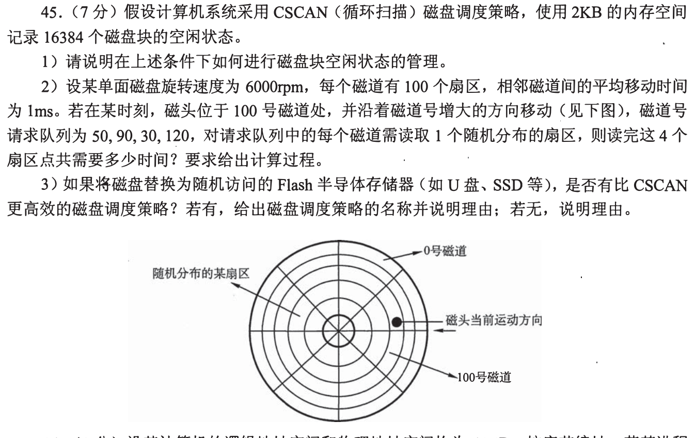
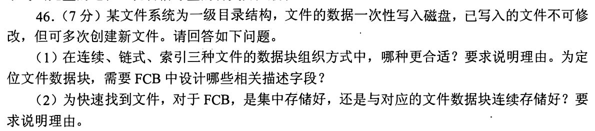
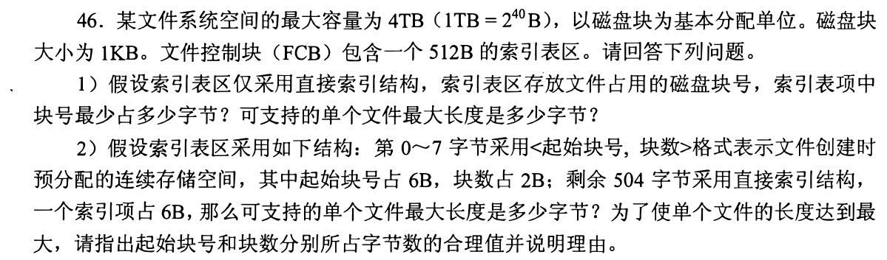
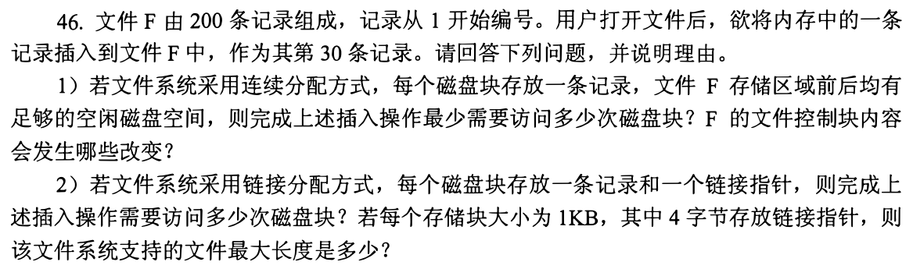
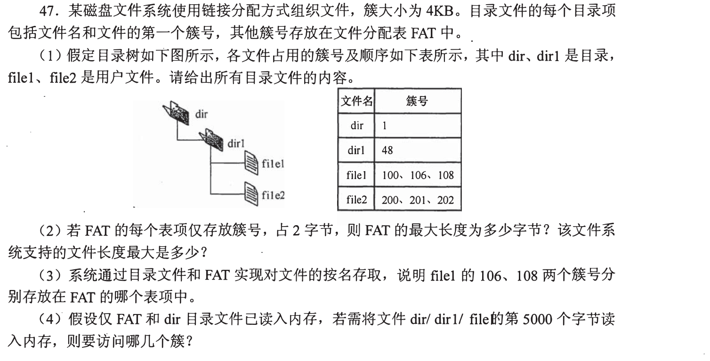
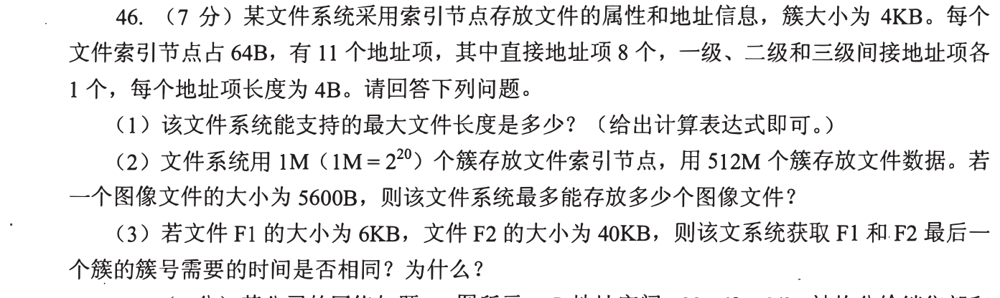
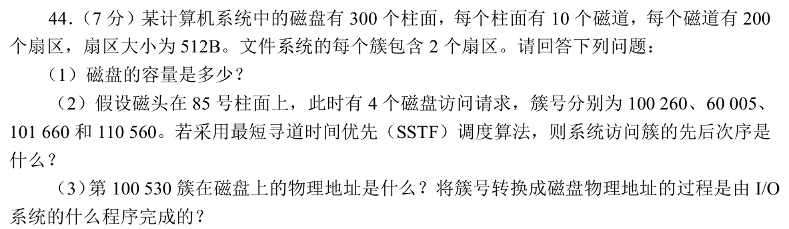
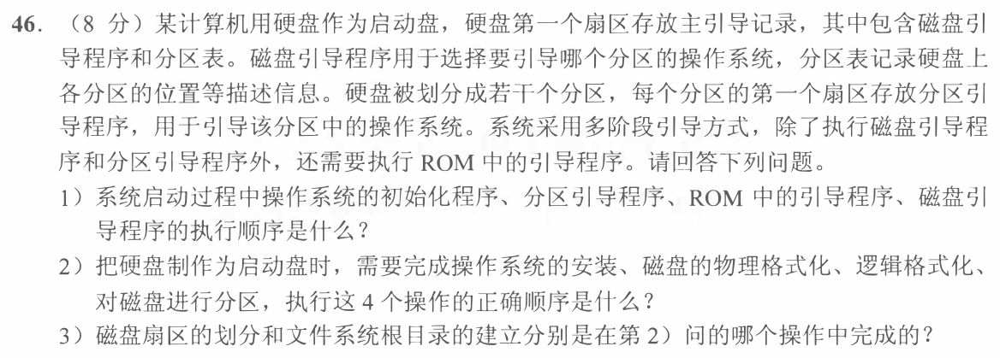
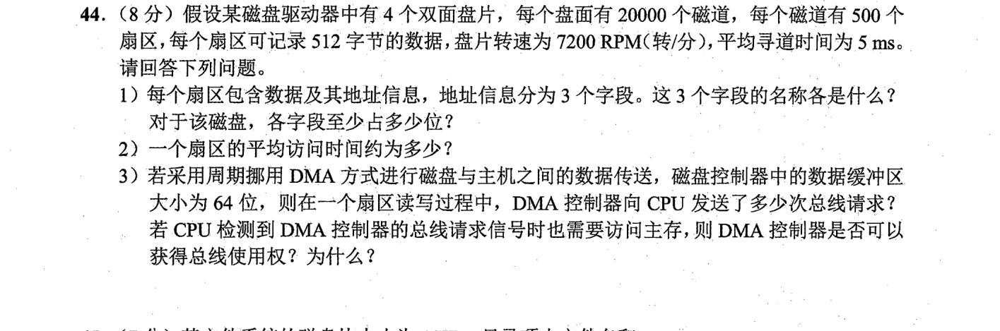
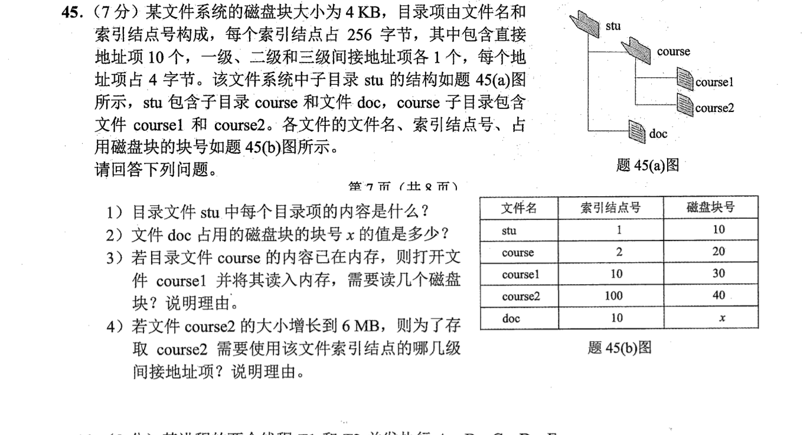

[← 0926](0926.md) · [总索引](README.md) · [0928 →](0928.md)

# 0927｜文件与磁盘：名字、索引和物理块怎样连接

> 大题线 `W14-file-disk` · 第 14/19 个节点 · 10 道完整真题引用
>
> 选择题前置线：`31-file`、`32-device`

## 归类依据

文件题从目录名出发，最终都要落到索引项、FAT、inode 或磁盘块。这里同时训练分配方式、最大文件长度、目录访问次数、磁盘调度和系统初始化时各层元数据的作用。

这一节点以完整作答为单位。公共题干、全部小问、代码或计算过程必须在同一次作答中收口；再次出现的接口题只检查它与当前机制的连接，不重复抄题。

## 题单

### 01 · 2010-45

### 02 · 2011-46

### 03 · 2012-46

### 04 · 2014-46

### 05 · 2016-47

### 06 · 2018-46

### 07 · 2019-44

### 08 · 2021-46

### 09 · 2022-44

### 10 · 2022-45

[← 0926](0926.md) · [总索引](README.md) · [0928 →](0928.md)
