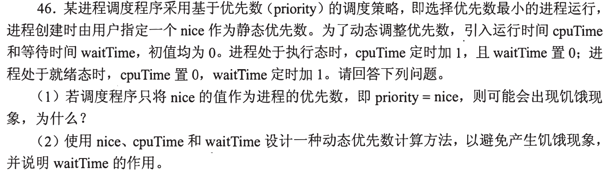
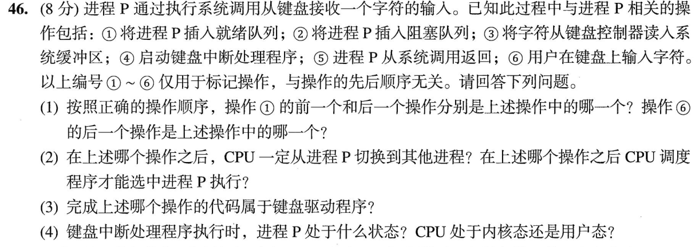
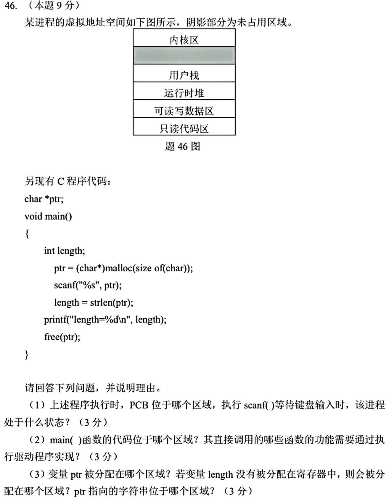

[« 0927-answer](0927-answer.md)　　[0929-answer »](0929-answer.md)

# 0928 Answer｜谁在运行、谁在等待、谁进入内核

> [原题 3 道](0928.md) · [0926 的 scanf/内核态](0926-answer.md) · [能力账本](answer-quality/learning-ledger.md)
>
先沿事件发生顺序标注进程状态；再区分数据所在的地址区与处理该事件的执行主体。读懂尚非限时独立。

<strong>考场入口</strong>

| 题 | 先找信息 | 答案锚点 |
| --- | --- | --- |
| 01 | 数值越小越先调度 | `nice+cpuTime−waitTime` 是一种抗饥饿动态优先级 |
| 02 | 阻塞→键盘输入→中断→读缓冲→就绪→返回 | ②⑥④③①⑤；驱动负责③ |
| 03 | 声明位置与 malloc 返回的指向位置不同 | PCB内核、main代码、ptr数据、length栈、字符串堆 |

## 01｜2016-46：等待时间要让优先级数值下降

**（1）静态优先级。** 若 `priority=nice`，一直有更小 nice 的就绪进程，新来的/低优先级者始终得不到 CPU，便可能**饥饿**；可抢占调度也不能自动保证它执行。

**（2）动态式。** 例如 **`priority=nice+cpuTime−waitTime`**（越小越优先）。运行者 cpuTime 逐渐增加，优先数值变大；就绪而未运行者 waitTime 逐渐增加，优先数值变小，久等者终会与对手竞争。`waitTime` 是**老化**项，必须用减号而非加号；题设在运行时将 waitTime 置0、在就绪时将 cpuTime 置0，防止把很久以前的历史无限叠加。

用两个进程检验符号
设 A 连续运行、B 一直就绪。过 k 拍后 A 的优先数值相对升 k，B 相对降 k；两者差每拍缩小2，有限初始 nice 差终会被克服。若把 waitTime 也加上，只会让久等者越来越不易被选中。

## 02｜2023-46：字符到来不等于进程马上返回

**（1）事件序列。** P 发出读字符系统调用，暂无输入而被插入**阻塞队列②**；用户随后按键**⑥**；键盘中断启动处理**④**；驱动把字符从控制器读入系统缓冲**③**；等待条件满足，P 移入**就绪队列①**；被调度继续执行读操作并由系统调用返回**⑤**。所以①的前一项是**③**、后一项是**⑤**；⑥之后是**④**。编号只是标签，不能按1到6排序。

**（2）状态与调度。** ②之后 P 阻塞、不可能继续占用 CPU，CPU 必须切给其它可运行进程（或空闲进程）；①之后 P 才成为候选，**调度程序**可选它执行，但就绪不等于马上运行。

**（3）驱动。** 将字符从**键盘控制器读入系统缓冲的③**属于键盘驱动的工作；中断处理的入口④使驱动得到执行机会，不能把用户按键⑥或用户程序返回⑤算成驱动代码。

**（4）中断时。** 若输入刚到时 P 仍在等这个字符，它处于**阻塞态**；CPU 响应中断时进入**内核态**，中断处理后才使 P 就绪。把“CPU 在内核态”错说成“P 已在运行态”会混淆两个不同主体。

三道状态门
系统调用等待使运行→阻塞；中断搬数据后使阻塞→就绪；调度选中才使就绪→运行。图中①是第二道门，⑤位于第三道门之后。

## 03｜2025-46：指针变量和它指向的对象不在一处

**（1）** 进程控制块 PCB 是操作系统管理的对象，在**内核区**；`scanf` 等键盘输入等待时进程是**阻塞态**。

**（2）** `main` 的机器代码在**只读代码区**。直接调用的 `scanf` 要读取键盘，`printf` 要输出到终端，其 I/O 功能最终通过相应设备**驱动程序**完成；`strlen` 只是字符串计算，`malloc/free` 管理动态内存，不因这些调用本身就必然启动设备驱动。

**（3）** 全局 `char *ptr` 这个**指针变量本身**在可读写数据区；未分配到寄存器的局部 `length` 在**用户栈**；`malloc` 返回指向的字符存储在**运行时堆**。原码只 `malloc(sizeof(char))` 分配1字节，却用 `%s` 无长度限制读字符串，连非空字符串的结尾 `\0` 都容不下，实际执行有越界风险；这些区域判断只说明程序意图，不能保证这段输入代码安全执行。

一眼定位三种东西
看声明位置决定 `ptr` 变量存放处；看 `malloc` 决定它指向的对象存放处；看 `main` 的局部声明决定 `length`。同一行 `ptr=malloc(...)` 并不会把 `ptr` 变量搬到堆里。

## 复做顺序

先遮住答案，仅写01式子的正负号并用两进程验算；再默写02事件序列和三个状态门；最后在03逐个指出“变量/对象/代码”所在区域。尚需限时复做才可验证熟练度。

[« 0927-answer](0927-answer.md)　　[0929-answer »](0929-answer.md)
