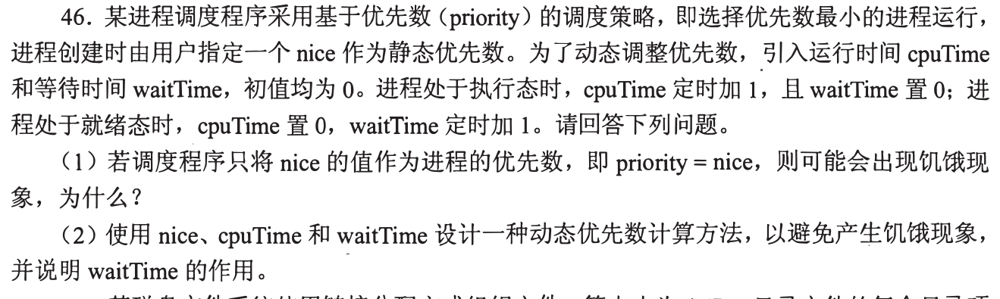
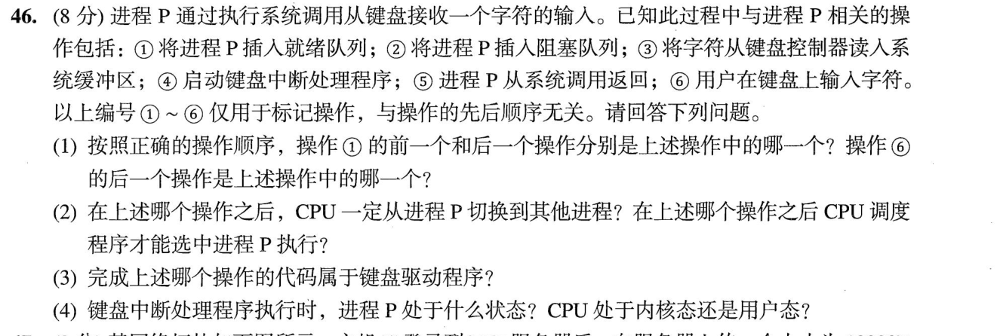
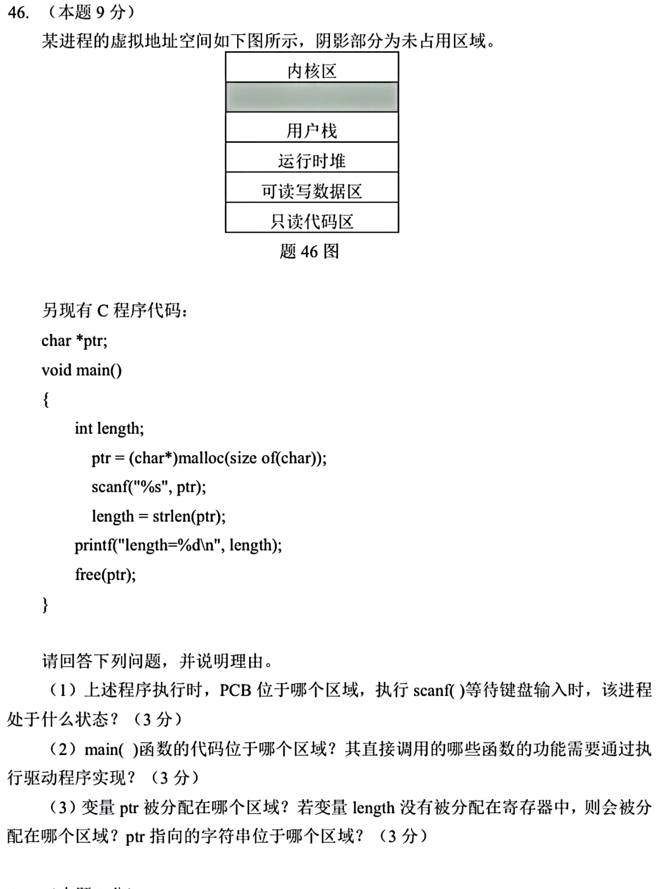

[← 0927](0927.md) · [总索引](README.md) · [0929 →](0929.md)

# 0928｜进程生命线：调度、管道与用户—内核边界

> 大题线 `W15-process-lifecycle` · 第 15/19 个节点 · 3 道完整真题引用
>
> 选择题前置线：`25-os-boundary`、`26-process`、`29-memory-allocation`

## 归类依据

优先级变化、FIFO 管道和动态内存调用都跨越进程状态与系统边界。解题时要沿时间顺序说明阻塞、唤醒、数据复制和地址空间变化，而不是只背接口名称。

这一节点以完整作答为单位。公共题干、全部小问、代码或计算过程必须在同一次作答中收口；再次出现的接口题只检查它与当前机制的连接，不重复抄题。

## 题单

### 01 · 2016-46

### 02 · 2023-46

### 03 · 2025-46

[← 0927](0927.md) · [总索引](README.md) · [0929 →](0929.md)
