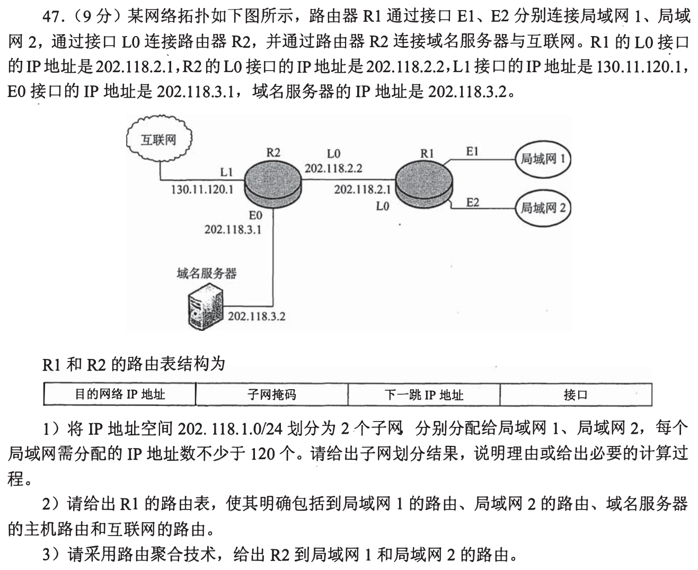
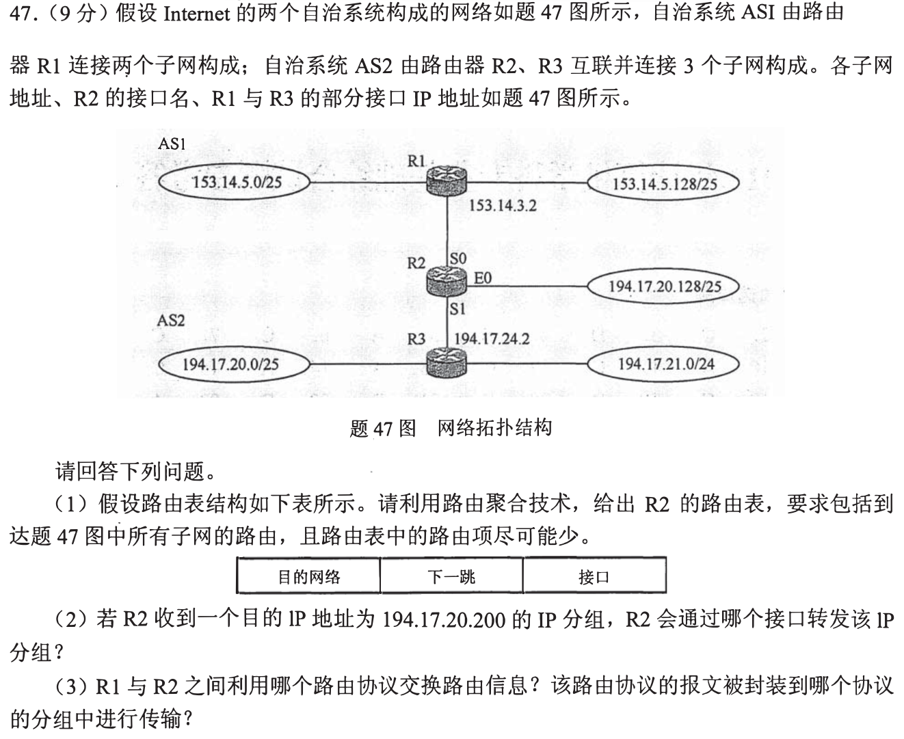
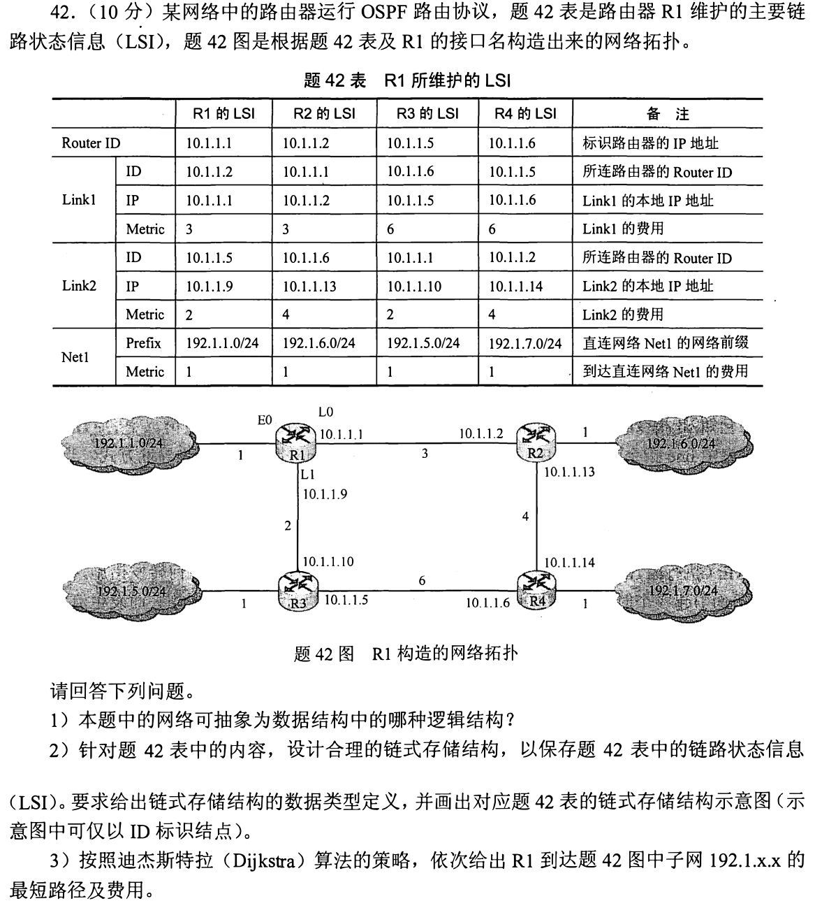
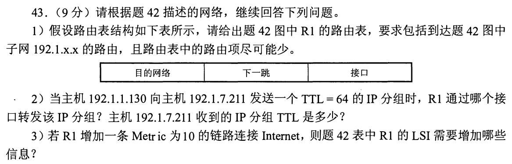
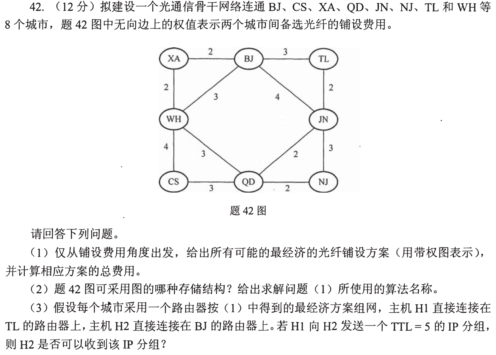
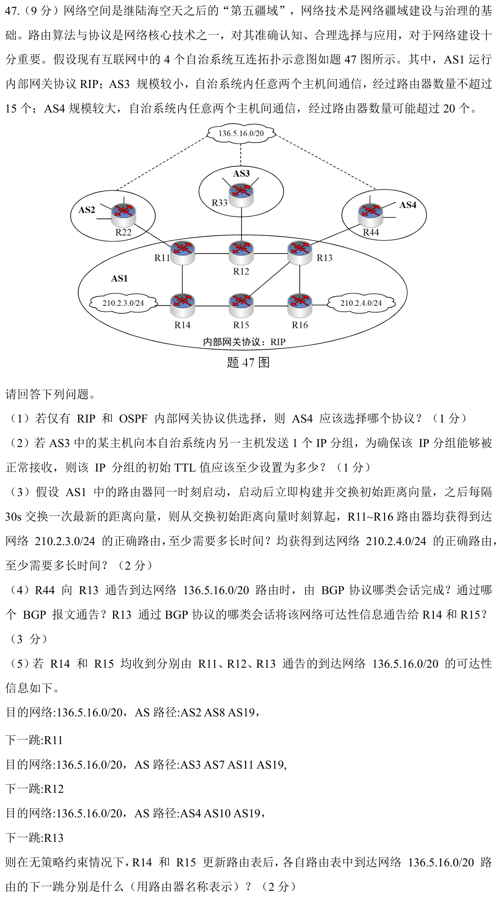

[« 0928-answer](0928-answer.md)　　[0930-answer »](0930-answer.md)

# 0929 Answer｜目的地址匹配哪一行，信息又怎样传到这一行

> [原题 6 道](0929.md) · [图算法的前置台阶](0806-answer.md) · [能力账本](answer-quality/learning-ledger.md)
>
先把地址范围画清，再决定下一跳；图论题分清最短路径与最小生成树；协议题再数信息交换的轮次。读懂尚需限时复做。

<strong>考场入口</strong>

| 题 | 先做什么 | 结果锚点 |
| --- | --- | --- |
| 01 | 每网≥120地址 → `/25`，再写R1/R2路由 | 202.118.1.0/25、.128/25；R2汇总/24 |
| 02 | 本地/聚合远端前缀分开 | 20.200走 E0；跨 AS 用 BGP/TCP |
| 03—04 | R1 的 Dijkstra 与路由表是两步 | 网1/5/6/7费用1/3/4/8，目的网7走 L0 |
| 05 | 枚举所有最小生成树，不只找到一棵 | 两棵各16，TTL=5一棵能到另一棵不能 |
| 06 | RIP 每轮只能把已知信息推进一跳 | AS4 OSPF；TTL≥16；收敛60s/90s |

## 01｜2009-47：地址够120台，要把 /24 平分为两个 /25

**（1）子网。** 主机位至少7位，`2⁷−2=126≥120`，掩码 **255.255.255.128 (/25)**。局域网1得 **202.118.1.0/25**，可用 .1—.126；局域网2得 **202.118.1.128/25**，可用 .129—.254。具体哪片给哪网可对调；两片不能继续拆到/26（仅62台）。

**（2）R1 路由表的目标行。**

| 目的 | 掩码 | 下一跳 | 出口 |
| --- | --- | --- | --- |
| 202.118.1.0 | /25 | 直连 | E1 |
| 202.118.1.128 | /25 | 直连 | E2 |
| 202.118.3.2 | /32 | 202.118.2.2 | L0 |
| 0.0.0.0 | /0 | 202.118.2.2 | L0 |

到 DNS 的单主机路由匹配 `/32`，去 Internet 的其它地址走默认路由；R1 到 R2 的 202.118.2.0 网段自身直连 L0，若要求列出全部直连网络还应加一行。**（3）R2 可聚合**两片局域网为 **202.118.1.0/24→下一跳202.118.2.1、出口L0**，不用为每个/25各存一行。

为何 DNS 主机路由不被默认路由覆盖
最长前缀优先：到202.118.3.2时/32比/0具体，走专门主机路由；其它未列地址才由/0接住。R2 聚合的/24覆盖两片/25，并不覆盖DNS所在的202.118.3.0段。

## 02｜2013-47：聚合远端网，也要保留本地更长前缀

**（1）R2 的最少关键条目。** AS1 的两个 `153.14.5.0/25` 和 `.128/25` 合成 **153.14.5.0/24→R1(153.14.3.2), S0**。AS2 的远端 `194.17.20.0/25` 与 `194.17.21.0/24` 可用 **194.17.20.0/23→R3(194.17.24.2), S1** 作概括，但此/23也覆盖 R2 自己直连的 **194.17.20.128/25→直连,E0**；保留本地更具体的/25，最长前缀会正确接管其地址。到 R1/R3 的两段点对点直连网还需相应直连路由，图未给掩码时可写“R1—R2 链路直连S0”“R2—R3链路直连S1”，不凭两端IP臆定前缀长度。

**（2）目的 `194.17.20.200`** 落在 `.128—.255/25`，尽管也匹配/23，较长的本地/25获胜，走 **E0**。**（3）R1 与 R2 在不同自治系统，交换路由用 BGP（eBGP），BGP 报文由 **TCP** 连接传送。

聚合后为什么还需一条本地例外
/23 包含 194.17.20.0—194.17.21.255，远端与本地都被涵盖；本地/25的优先匹配保证只把其它地址交给R3。若只写/23，20.200会绕错方向。

## 03｜2014-42：从 R1 跑最短路，再加到网络的末端费用

**（1）结构。** 四个路由器与其链路构成带权**图**，链路状态表的 Link1/Link2 是相邻顶点及费用，直连 Net1 是挂在顶点上的网络信息。

**（2）链式存储。** 可给每个路由器一个顶点记录 `{routerID, netPrefix, netMetric, firstEdge}`，每条邻接边记录 `{neighborID, localIP, metric, next}`；无第二条链路时 `next=NULL`。邻接关系分别为 `R1: R2(3),R3(2)`；`R2: R1(3),R4(4)`；`R3: R1(2),R4(6)`；`R4: R2(4),R3(6)`。R1/R2/R3/R4 的直连网络分别是 `192.1.1/6/5/7.0/24`，各自末端费用1。每一端本地IP按原表对应保留，不能误用对端接口IP作为本地字段。

把原表完全还原的邻接记录
`R1: (R2,10.1.1.1,3),(R3,10.1.1.9,2)`；`R2: (R1,10.1.1.2,3),(R4,10.1.1.13,4)`；`R3: (R4,10.1.1.5,6),(R1,10.1.1.10,2)`；`R4: (R3,10.1.1.6,6),(R2,10.1.1.14,4)`。网络前缀及费用在各顶点保存。

**（3）Dijkstra。** 从R1到自身0，到R3为2，到R2为3，到R4取 R1→R2→R4 的 `3+4=7`，小于经R3的`2+6=8`；再各加末端网络1，得：

| 子网 | 最短路 | 总费用 |
| --- | --- | ---: |
| 192.1.1.0/24 | R1→直连 | 1 |
| 192.1.5.0/24 | R1→R3→直连 | 3 |
| 192.1.6.0/24 | R1→R2→直连 | 4 |
| 192.1.7.0/24 | R1→R2→R4→直连 | 8 |

## 04｜2014-43：最短路化为接口，TTL 按每跳递减

沿上一题的最短路，R1 到四网的路由为：

| 目的网络 | 下一跳 | 接口 |
| --- | --- | --- |
| 192.1.1.0/24 | 直连 | E0 |
| 192.1.5.0/24 | R3 的10.1.1.10 | L1 |
| 192.1.6.0/24 | R2 的10.1.1.2 | L0 |
| 192.1.7.0/24 | R2 的10.1.1.2 | L0 |

源主机192.1.1.130发往192.1.7.211，R1 从 **L0** 转出，之后经 R2、R4 到目标网，三个路由器各减1，主机收到的 TTL 是 **64−3=61**。若 R1 添一条费用10的 Internet 链路，LSI 至少要增加**该邻接/外部可达信息的标识、R1本地接口IP与Metric10**；若通告默认出口，还应给出 **0.0.0.0/0** 的可达前缀及代价。题图没提供对端 Router ID 和新接口IP，不能编造其具体数值。

## 05｜2018-42：费用相同的两棵树，TTL 结论可以不同

**（1）所有最小方案。** 用 Kruskal 先收不成环的费用2边：XA—BJ、XA—WH、TL—JN、JN—QD、QD—NJ；余下要把 BJ 和 CS 接入。CS 必用 QD—CS(3)，BJ 可用 BJ—TL(3) 或 WH—QD(3) 来连起两大连通分量。故仅有两棵，费用都为 `5×2+2×3=16`：

| 方案 | 七条边（括号为费用） | TL 到 BJ 的路径 |
| --- | --- | --- |
| A | XA—BJ(2)、XA—WH(2)、BJ—TL(3)、TL—JN(2)、JN—QD(2)、QD—NJ(2)、QD—CS(3) | TL→BJ |
| B | XA—BJ(2)、XA—WH(2)、WH—QD(3)、TL—JN(2)、JN—QD(2)、QD—NJ(2)、QD—CS(3) | TL→JN→QD→WH→XA→BJ |

**（2）** 题图是图的**邻接矩阵或邻接表**均可存储，求最小生成树用 **Kruskal 或 Prim**。**（3）** 方案A从TL到BJ经2个路由器转发，TTL5到主机时为3，**可达**。方案B经 TL、JN、QD、WH、XA、BJ 共6个路由器，TTL在到达BJ之前归零，**不可达**。题目问“所有可能方案”，所以第三问不能只回答一个无条件的是/否。

最小生成树与最短路的判据不同
树的总费用16最小，不表示任意两点之间路径最短。方案B让TL到BJ绕五条边，恰好构造出“建设成本同样最小但业务转发跳数不同”的对照。

## 06｜2024-47：RIP 传播轮次、BGP 路径选择逐层判断

**（1）—（2）规模与 TTL。** AS4 内可能超过20跳，RIP 将16跳视为不可达，选**OSPF**；AS3 最多经过15台路由器，要确保最后一台还能转发给目的主机，初始 TTL 至少 **16**。

**（3）RIP 同步传播。** 初始时直接连210.2.3.0/24的是R14；要让六台都正确知道此网，最远的R12/R13/R16距离R14最多2条路由器间链路，初始向量后按30秒一轮推进，至少 **60s**。210.2.4.0/24连R16，最远R11可走 R16→R13→R12→R11 或 R16→R15→R14→R11，距离3，至少 **90s**。每轮依赖上一轮已知信息，不能在同一轮瞬间跨多跳。

**（4）BGP。** R44 向 R13 通过 **eBGP 的 UPDATE** 通告 `136.5.16.0/20`；R13 在 AS1 内通过 **iBGP UPDATE** 向 R14、R15 传播该可达性（遵守相应会话建立和分发条件）。**（5）选择。** R14看到 R11 的 AS 路径长3、R12长4、R13长3；R15同样。无策略约束先淘汰较长的R12路径，在两条长3的路里按最近出口选：R14离 R11 一跳、离 R13 更远，下一跳 **R11**；R15直连 R13、离 R11 更远，下一跳 **R13**。

先 AS_PATH，再热土豆出口
不能仅凭“R15离R13近”就跳过路径长度判定；本题恰好R11与R13的路径同为3，才轮到自治系统内到下一跳的距离。BGP的完整策略还可能比较其它属性，题设明确无策略约束，按给定信息作此判断。

## 复做顺序

遮住答案，先逐地址验证01、02最长前缀；用03算最短路，再把结果写成04的接口；最后分别证明05为什么恰好两棵树、06的60/90秒从哪条最远路径来。限时独立表现仍待记录。
