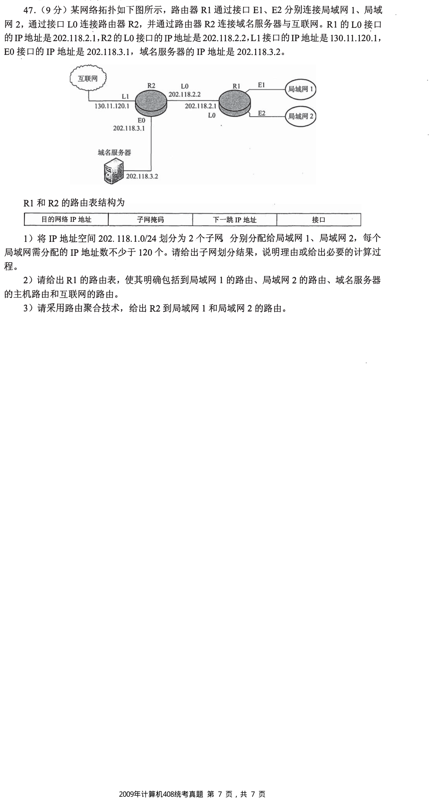
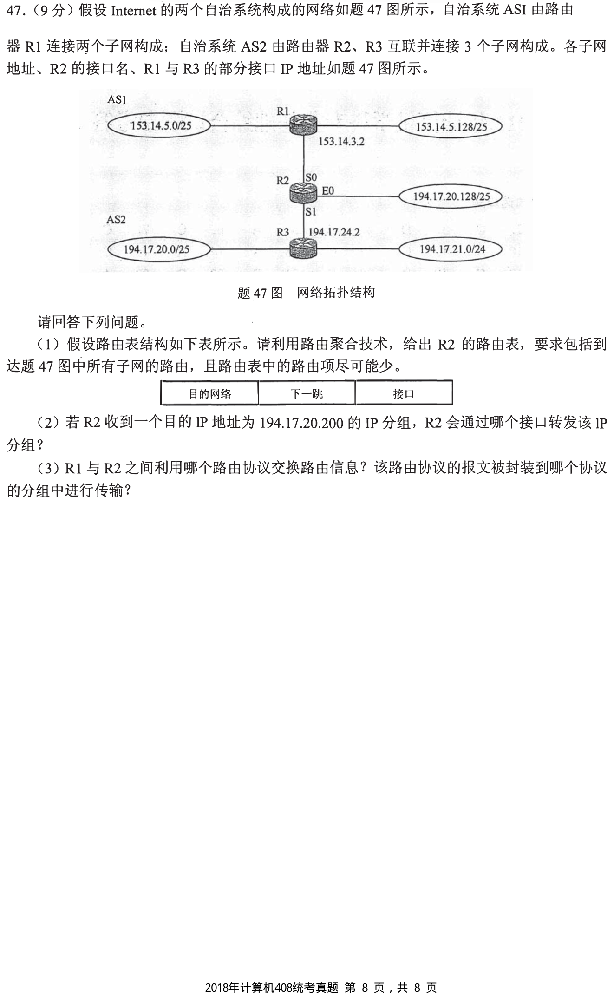
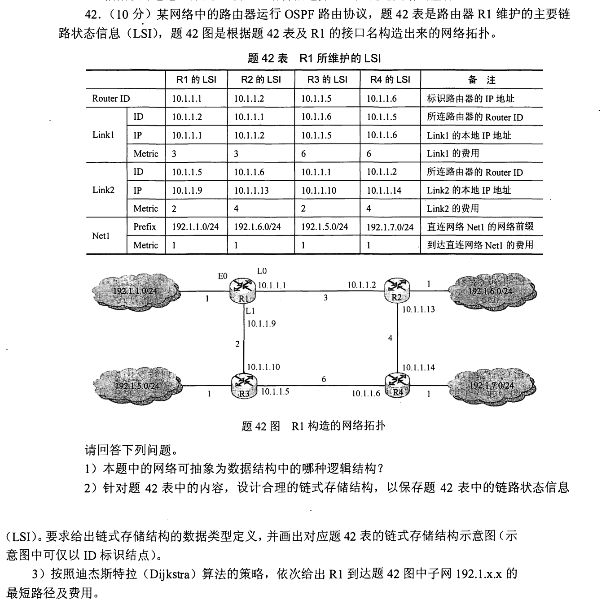
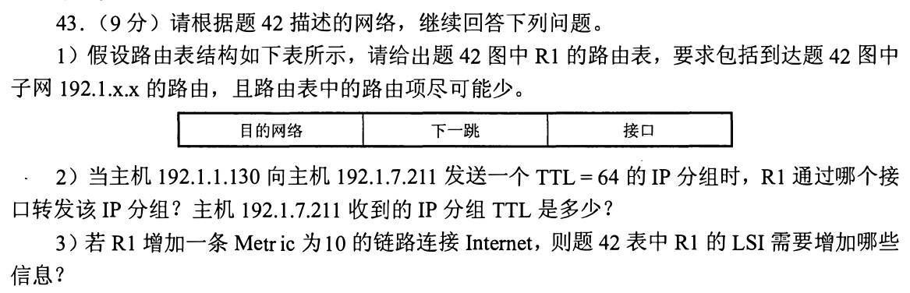
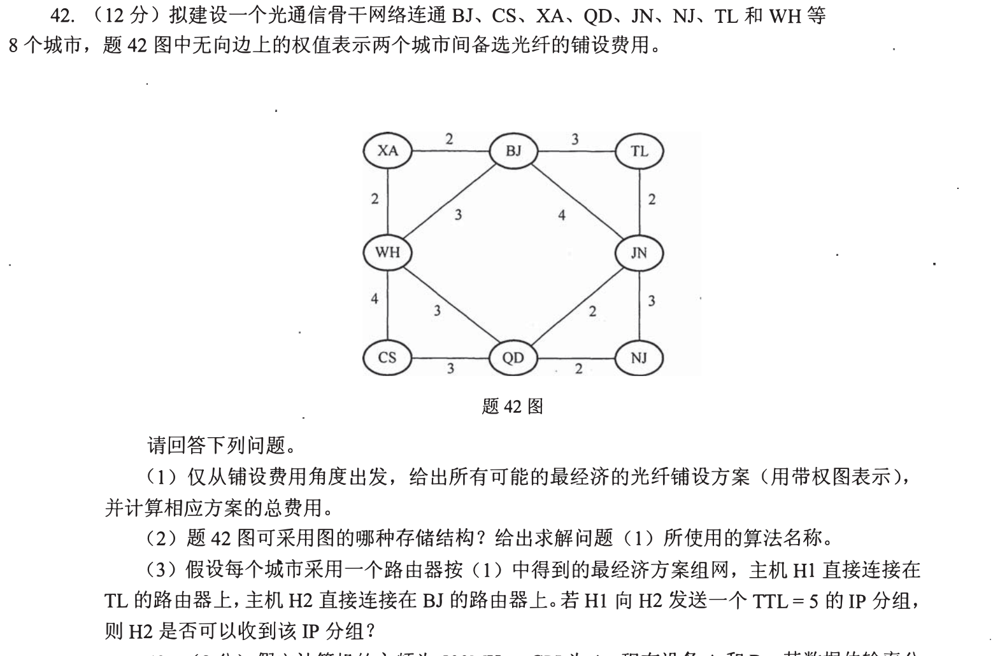
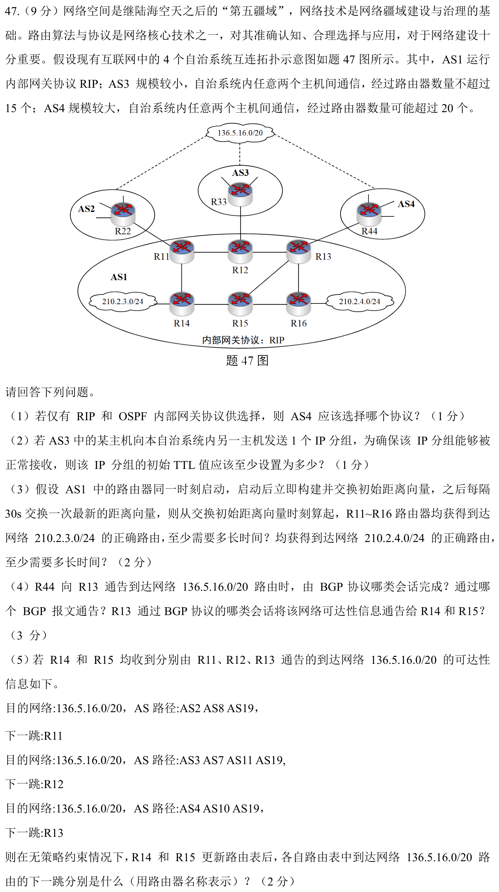

[← 0928](0928.md) · [总索引](README.md) · [0930 →](0930.md)

# 0929｜寻址与路由：从前缀匹配到路由协议收敛

> 大题线 `W16-routing-addressing` · 第 16/19 个节点 · 6 道完整真题引用
>
> 选择题前置线：`37-ip-address`、`38-routing`

## 归类依据

这组沿网络层完成闭环：先由地址与掩码确定可达范围，再用最长前缀和下一跳转发；若涉及 RIP、OSPF 或 BGP，还要说明路由信息如何形成、传播与收敛。

这一节点以完整作答为单位。公共题干、全部小问、代码或计算过程必须在同一次作答中收口；再次出现的接口题只检查它与当前机制的连接，不重复抄题。

## 题单

### 01 · 2009-47

### 02 · 2013-47

### 03 · 2014-42

### 04 · 2014-43

### 05 · 2018-42

### 06 · 2024-47

[← 0928](0928.md) · [总索引](README.md) · [0930 →](0930.md)
