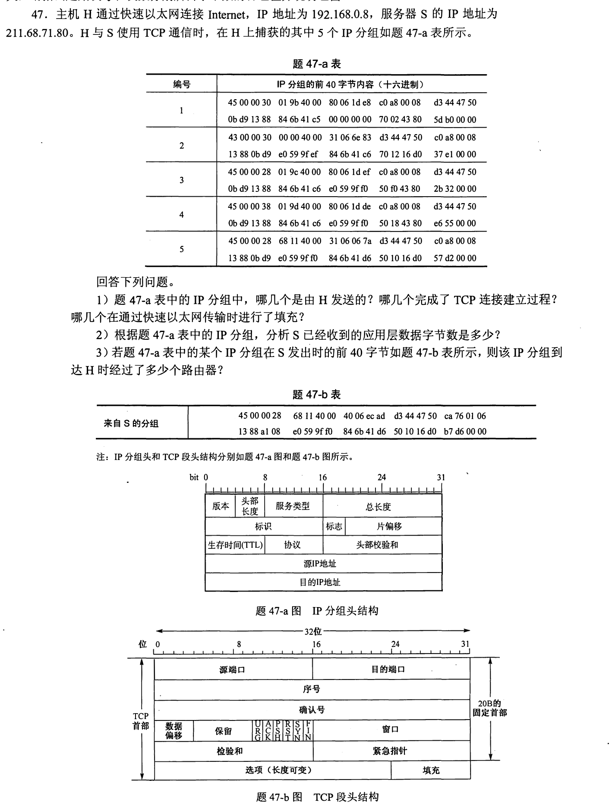
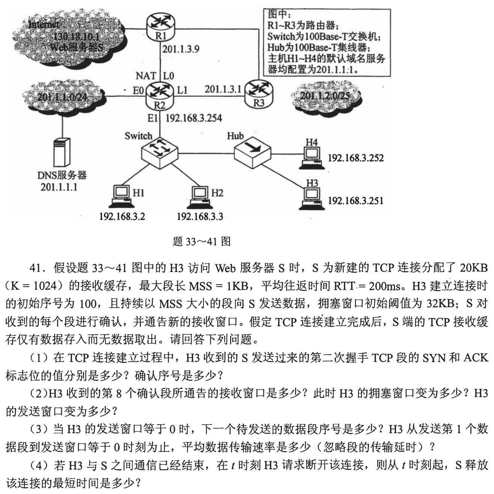
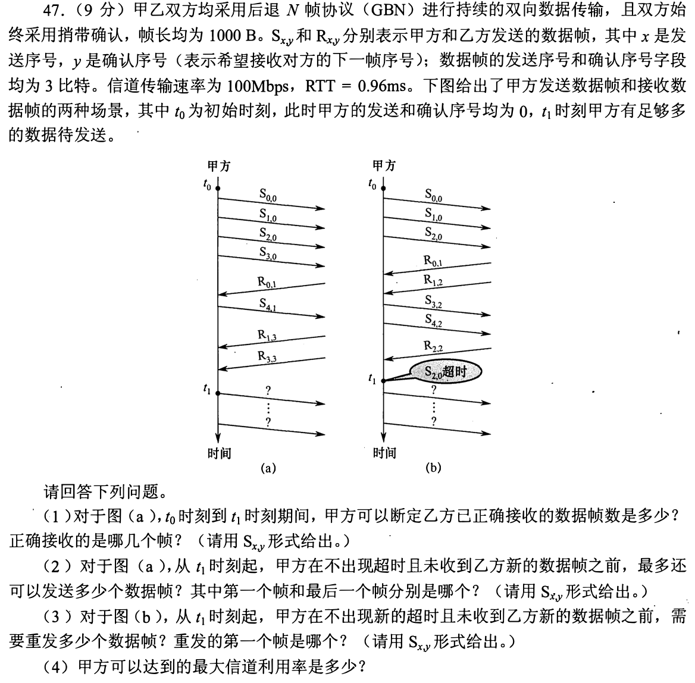
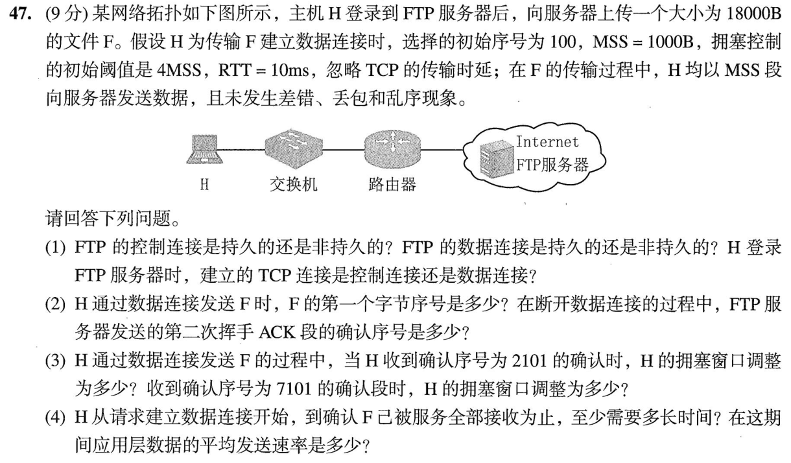
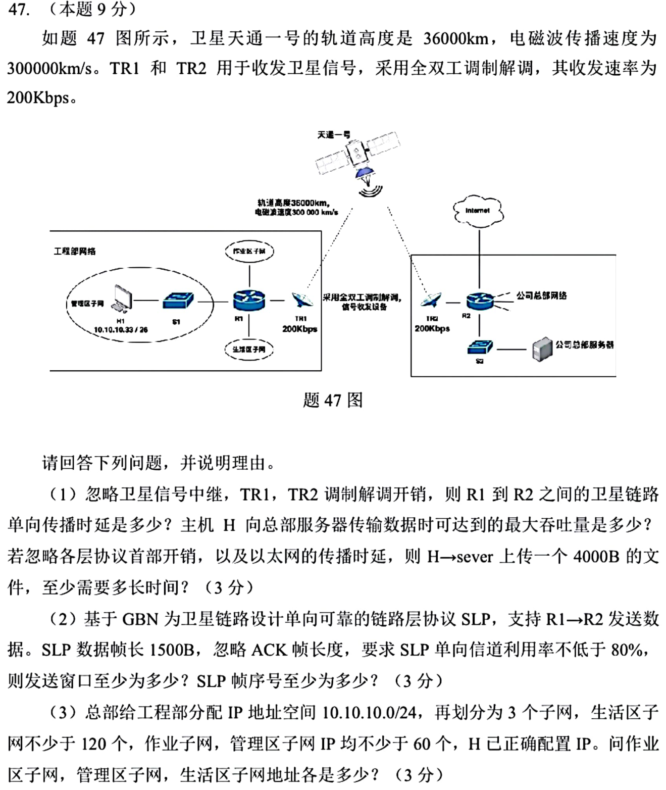

[« 0929-answer](0929-answer.md)　　[1001-answer »](1001-answer.md)

# 0930 Answer｜确认的是“下一份想要的数据”

> [原题 5 道](0930.md) · [0929 的转发跳数](0929-answer.md) · [能力账本](answer-quality/learning-ledger.md)
>
TCP 数字是字节序号，GBN 数字是帧序号；TCP 的 ACK 是下一期待字节；本组2017-47题给的 GBN 确认号也采用下一期待帧的约定，其他题须先读清 ACK 定义。随后才用窗口、往返时延算还能发多少。读懂尚非限时独立。

<strong>考场入口</strong>

| 题 | 第一步 | 答案锚点 |
| --- | --- | --- |
| 01 | IP 源/目的、TCP flags 和总长分三层读 | H发1/3/4；握手1/2/3；数据16B；TTL差15跳 |
| 02 | 缓冲20KB不断被占，慢启动1/2/4/8/5 | 第8 ACK rwnd12KB/cwnd9KB；20KB填满用5 RTT |
| 03 | 3位序号，GBN 窗口至多7 | 图a还能发5帧；图b超时重传2/3/4；利用率53.85% |
| 04 | SYN 占1字节，FIN 也占1；阈值4MSS | 首数据101；FIN ACK18102；最早60ms |
| 05 | 地—星—地两段传播各120ms | 单向240ms、吞吐200kbps、4000B最短400ms |

## 01｜2012-47：抓包从 IP 地址定方向，再看 TCP 标志

**（1）方向与握手。** H 的源IP `C0 A8 00 08`，S 的源IP `D3 44 47 50`，故 H 发 **1、3、4**，S 发 **2、5**。第1包 TCP flags `02` 为 SYN，第2包 `12` 为 SYN+ACK，第3包 `10` 为 ACK，三者完成三次握手。第1/2包 TCP 首部长度字段7，长28B，比固定20B多8B选项/填充；其余捕获包的首部长度字段5，为20B，没有这8B的 TCP 扩展。第2包 IP 首字节图印作 `43` 与标准 IPv4 IHL 至少5不合，判断方向与 TCP flags 用给定地址和 TCP 字段，不依赖这个异常首字节。

**（2）S 已收应用数据。** H 的第4包 IP 总长 `0038H=56B`，IPv4首部20B、TCP首部20B，有 **16B** TCP负载；第1包虽总长48B，但28B TCP首部，负载0；第3包总长40B、两个20B首部，负载0。故 **S 已收到16B**。

**（3）跳数。** 给定 S 发出包的 TTL 是 `40H=64`，H 捕获时同一数据包的 TTL 为 `31H=49`（用标识等字段配对），每经过一台路由器减1，经过 **15台路由器**。不能把 TCP 窗口字段当 TTL。

先减首部再计字节
报文第4行第5包 ACK 号增长的是已经确认的字节，但问“收到应用数据”时直接用承载负载的 H→S 包长更稳。SYN/FIN 各消耗一个序号，纯 ACK 不消耗序号，却不携带这些应用字节。

## 02｜2016-41：对端不读取，接收窗口会被耗尽

**（1）第二次握手。** 服务器发的第二个握手段同时置 **SYN=1、ACK=1**，确认 H3 的初始 SYN 序号100，占用一个序号，故确认号 **101**。

**（2）第8个确认。** H3 发8个1KB段后，S 的20KB接收缓冲剩 `20−8=12KB`，通告 `rwnd=12KB`。慢启动初始 cwnd=1MSS，每收到一个对新数据的 ACK 加1MSS，在第8个 ACK 后 **cwnd=9KB**，未到32KB阈值；可用发送窗口 `min(9,12)=` **9KB**。若有尚未被确认的在途字节，立即还可新发的额度还需扣除它们，题问“发送窗口”指总窗口大小。

**（3）零窗口。** 首数据字节序号101；20个段占 `20×1024=20480` 个序号，S 收满并通告0后下一个待发送段序号 **20581**。忽略传输时延，按一轮 RTT 能发的段数为 **1、2、4、8、5**，第五轮反馈零窗口，耗 `5×200ms=1s`；平均有效数据速率 **20KB/s=20.48kB/s**（按 K=1024）。

**（4）释放。** H3 在 t 主动发送 FIN，S 收到后可以立即将 ACK 与自己的 FIN 合并，H3 收到后马上发最终 ACK。S 最早在 `t+1.5RTT=t+300ms` 收到该 ACK 并释放；主动关闭者 H3 的 TIME_WAIT 是另一端的等待，不能加到 S 的最短时间。

第8 ACK 的窗口与最终零窗口是不同时间
第8次收到后还余12KB，此时能继续发；第20次才用满20KB。零窗口停的是新数据发送，不是倒退已经收到的字节序号。

## 03｜2017-47：GBN 的累计 ACK 和超时回退

3比特帧序号0—7，GBN 最大发送窗口 **`2³−1=7帧`**。

**（1）图a。** `R₁,₃` 与 `R₃,₃` 的确认号3表示乙下一个期待序号3，所以甲能确定乙正确收到 **3帧：S₀,₀、S₁,₀、S₂,₀**；帧3、4是否到达不能从 ACK3 推定。

**（2）图a继续发。** 已发送0—4，下一个新帧5；累计确认释放0—2，窗口从基序号3可覆盖3、4、5、6、7、0、1共7帧，其中3、4已发，在不超时、无新反馈前还可发 **5帧：S₅,₃、S₆,₃、S₇,₃、S₀,₃、S₁,₃**。下标第二位仍为3，因为甲未收到乙新数据，反向确认号不变。

**（3）图b。** 收到累计 ACK2 后，0、1已确认；图示2超时且已发2、3、4，GBN 必须从最早未确认的2起重发 **3帧**，第一帧 **S₂,₀**，随后S₃,₀、S₄,₀，不能只重发超时的一帧。

**（4）最大利用率。** 一帧1000B在100Mbps的发送时间 `8000/10⁸=0.08ms`；RTT=0.96ms，窗口最多7帧，理想利用率 `min(1,7×0.08/(0.96+0.08))=` **53.85%**。分母含第一次发帧的发送时间和等待 ACK 的传播往返，不是仅0.96ms。

环形序号怎样避免把0当旧帧
窗口7小于8个序号，base=3时允许3—1环绕，但不会同时允许相隔整整8的两个同序号在途；这是 GBN `W≤2^k−1` 的理由。

## 04｜2023-47：FTP 两条 TCP 连接，数据段只走一条

**（1）连接。** FTP **控制连接持久**保持登录和命令交换；传统 FTP 的**数据连接非持久**，为这次传送建立，完成后关闭。题称“登录到 FTP 服务器后”已存在的是控制连接，上传 F 另建数据连接。

**（2）字节序号。** 数据连接 SYN 用初始序号100并占1，F 的首字节序号 **101**。18000B 数据覆盖101—18100；H 主动断开数据连接所发 FIN 占下一个18101，服务器发出的第二次挥手 ACK 确认号 **18102**。

**（3）拥塞窗口。** 初始1MSS，阈值4MSS；收到 ACK2101 表示累计确认了两个1000B段，cwnd 从1到 **3MSS**。收到 ACK7101 表示已确认七段：前3个 ACK 加到阈值4MSS，后4个 ACK 在拥塞避免阶段合计约加1MSS，故约 **5MSS**（按教材每 RTT 增1MSS 的离散轮次）。

**（4）最短时间/速率。** 数据连接建立需1 RTT，完成后可借第三次握手 ACK 立即送数据。此后最理想的逐 RTT 发送批量为 **1、2、4、5、6** 个 MSS，共18段；第五批全部获确认再等5 RTT，所以总 **6RTT=60ms**。应用数据平均发送速率 `18000B/0.06s=` **300000B/s=300kB/s**。题忽略传输时延且无丢包，故不额外加串行化时间。

为何不是“18段÷拥塞窗口5”
窗口随 ACK 增长，发送能力必须按轮写成1、2、4、5、6；前面的一次 RTT 是三次握手。文件长度18段与第5轮总和刚好相等，是一个自检点。

## 05｜2025-47：高轨链路先付传播时间，再付发包时间

**（1）单向传播。** 地面 R1→卫星→地面 R2 两段各36000km，电磁波300000km/s，单向时延 `72000/300000=` **0.24s=240ms**。两端200kbps链路、无中继开销，端到端稳态最大吞吐 **200kbps**。4000B文件发送时长 `4000×8/200000=0.16s`，忽略其它协议和以太网时延，最后一位到达至少 **0.16+0.24=0.40s**。

**（2）GBN 发送窗口。** 1500B帧在200kbps的发送时间 **0.06s**，传播 RTT=0.48s。窗口 W 的理想利用率 `min(1,W×0.06/(0.48+0.06))`；达到80%需 `W≥7.2`，取 **至少8帧**。GBN 序号空间须满足 `2^k≥W+1=9`，故帧序号至少 **4位**。

**（3）VLSM。** 生活区至少120台需/25；作业区与管理区至少60台各需/26。H 已正确配置 **10.10.10.33/26**，它所在的管理区须是 **10.10.10.0/26**；剩余可给作业区 **10.10.10.64/26**、生活区 **10.10.10.128/25**。地址块分别覆盖0—63、64—127、128—255，互不重叠且完整用掉/24。

带宽时延积为何逼出8帧
一帧仅发60ms，单程传播240ms；只发一帧便等确认，大部分时间链路闲着。8帧对应480ms有效发送，放进首帧发送+传播往返540ms周期里是约88.9%，达到题要的80%；7帧仅77.8%。

## 复做顺序

遮住答案，先数01的 IP/TCP 各字段，再写02/04字节区间，03的环形帧窗口，最后05用同一个 `发送时长+RTT` 检验窗口利用率。需要独立限时复做才可记录熟练通关。

[« 0929-answer](0929-answer.md)　　[1001-answer »](1001-answer.md)
