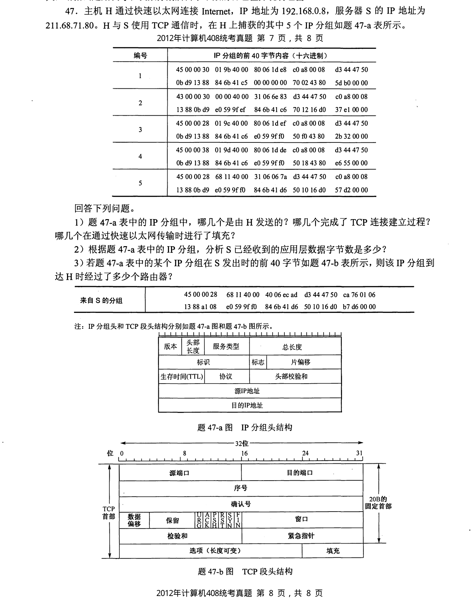
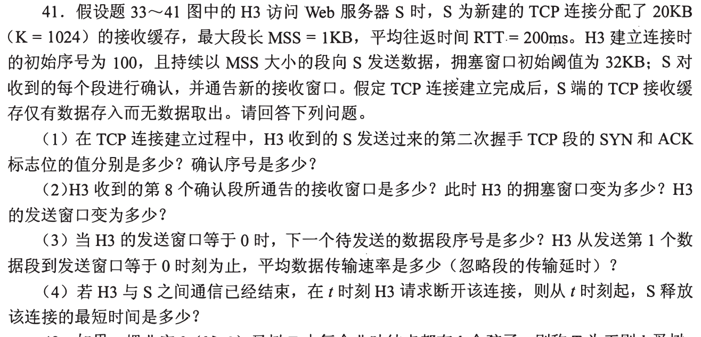
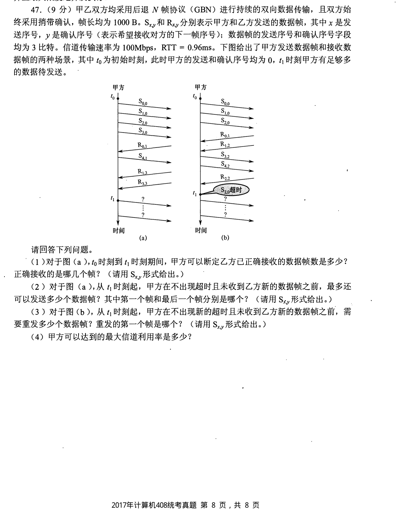
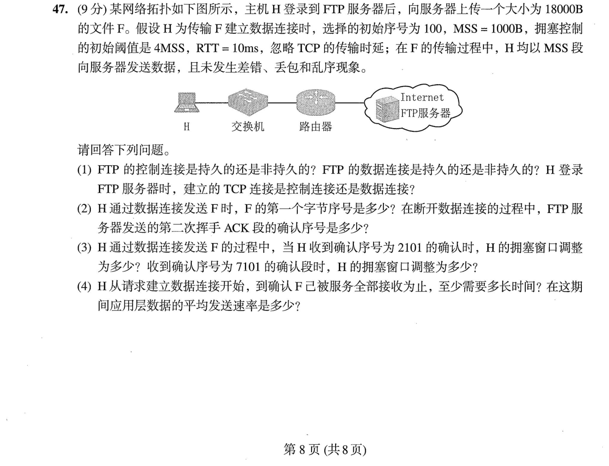

[← 0929](0929.md) · [总索引](README.md) · [1001 →](1001.md)

# 0930｜传输窗口：序号空间、确认与超时共同推进

> 大题线 `W17-transport-window` · 第 17/19 个节点 · 5 道完整真题引用
>
> 选择题前置线：`35-link-reliability`、`39-tcp`

## 归类依据

TCP 与 GBN 都以窗口限制在途数据。必须同时追踪发送边界、累计确认、超时重传和链路时延，才能判断吞吐、等待时间以及下一次允许发送的范围。

这一节点以完整作答为单位。公共题干、全部小问、代码或计算过程必须在同一次作答中收口；再次出现的接口题只检查它与当前机制的连接，不重复抄题。

## 题单

### 01 · 2012-47

### 02 · 2016-41

### 03 · 2017-47

### 04 · 2023-47

### 05 · 2025-47

[← 0929](0929.md) · [总索引](README.md) · [1001 →](1001.md)
