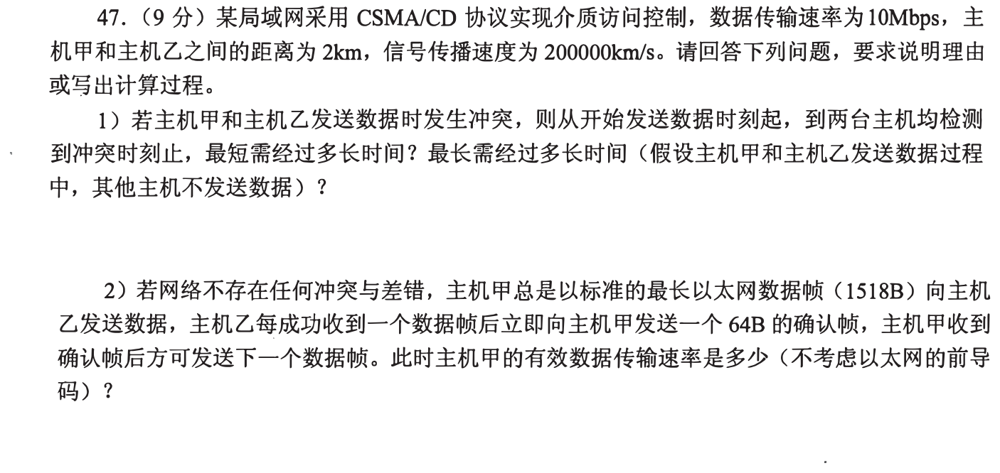
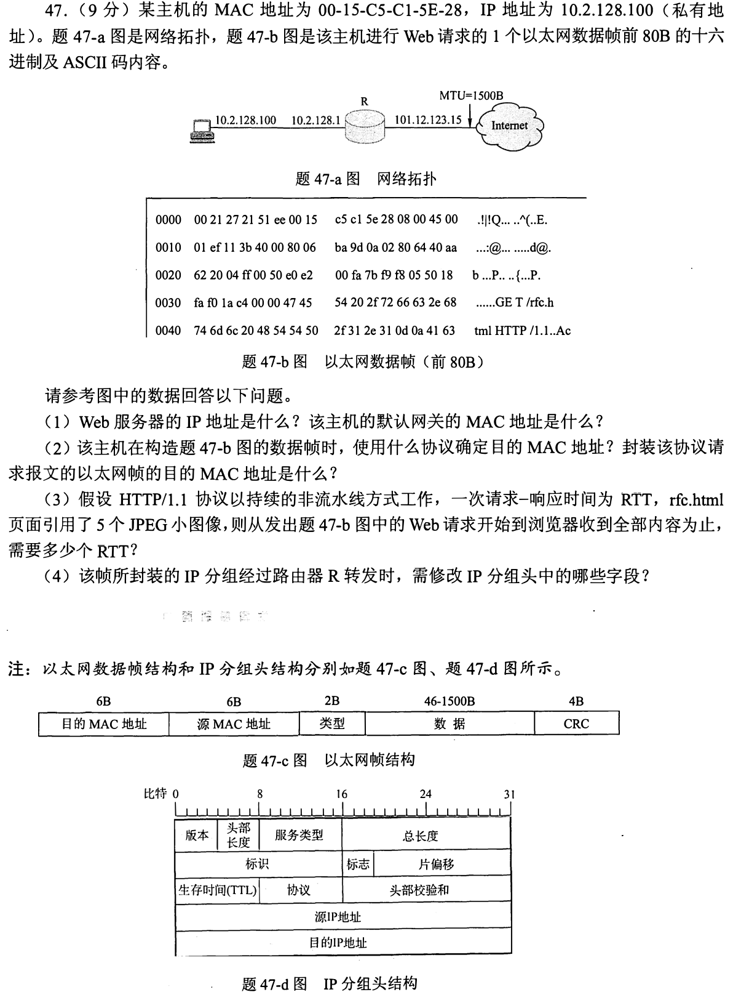
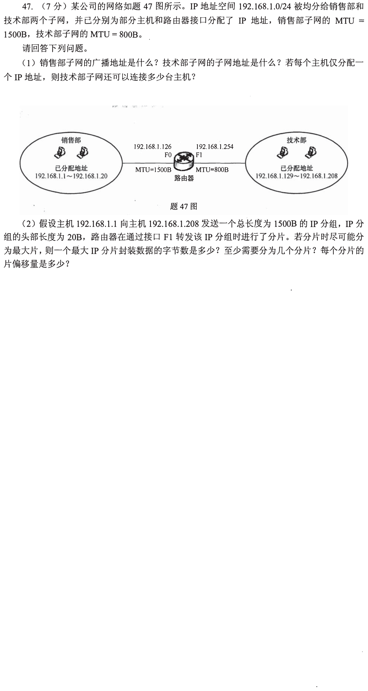
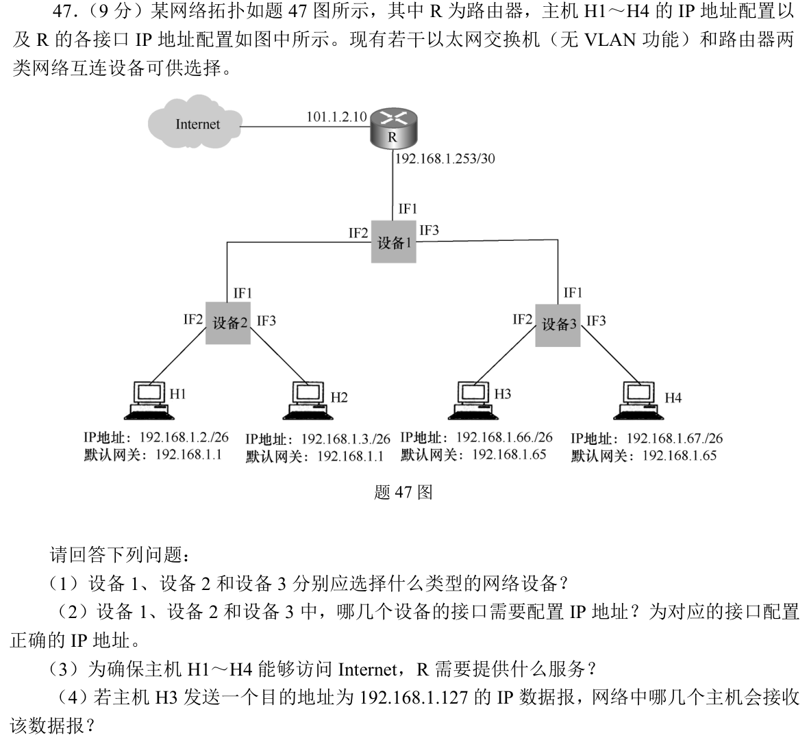

[« 0930-answer](0930-answer.md)　　[1002-answer »](1002-answer.md)

# 1001 Answer｜帧只走这一跳，IP 分组再决定下一跳

> [原题 4 道](1001.md) · [0930 的发送时延](0930-answer.md) · [能力账本](answer-quality/learning-ledger.md)
>
从介质传播、以太网封装、IP 分片到跨子网转发，层层问“这一跳究竟承载什么”。读懂尚非限时独立。

<strong>考场入口</strong>

| 题 | 先抓什么 | 结果锚点 |
| --- | --- | --- |
| 01 | 2km单程10μs、往返20μs | 最短10μs/最长20μs；有效约9.33Mbps |
| 02 | 帧前6B是下一跳 MAC，IP 目的藏在 IP 首部 | 服务器64.170.98.32；网关MAC00-21-27-21-51-EE |
| 03 | 800B MTU 留20B首部，非末片按8B对齐 | 776B/片，2片，偏移0/97 |
| 04 | /26、/26、/30 三个网段 | 设备1路由器；设备2/3交换机；H3广播到H4 |

## 01｜2010-47：碰撞必须在一帧发完前被发送者发现

两主机相距2km，传播速度200000km/s，单程传播 **`2/200000s=10μs`**。**（1）** 同时开始发送，信号在中间相遇、又各自返回可观察冲突，两端在起发后约**10μs**检测到，这是最短情形；一端恰在第一端信号抵达之前起发，碰撞信息最迟传回第一端，起发后约**20μs=2τ**，这是最坏情形。CSMA/CD 的最短帧发送时长必须覆盖这个最坏往返传播时间。

**（2）停等效率。** 标准最长以太网帧1518B含14B MAC头、4B FCS，承载**1500B有效数据**；确认帧64B。10Mbps 下分别发送 `1518×8/10⁷=1.2144ms`、`64×8/10⁷=0.0512ms`，加数据和确认各一程传播共 `0.0200ms`，一轮 `1.2856ms`。甲每轮送1500B，速率 **`1500×8/1.2856ms≈9.33Mbps`**。题没给 IP/TCP 首部，不能凭空从1500B再减40B；题明说忽略以太网前导码。

10μs与20μs各在回答哪一个问题
10μs是最有利同时起发时双方发现冲突的时间；20μs是对最迟冲突可检测的保障。第二小问停等还需把数据/ACK两次单程传播合成20μs。

## 02｜2011-47：目的 IP 是服务器，目的 MAC 却是网关

按帧的前14B切：目的 MAC 为 **00-21-27-21-51-EE**，源 MAC 为主机的 **00-15-C5-C1-5E-28**，类型0800表示 IPv4。IP 源地址是 `0A 02 80 64`=10.2.128.100，目的地址 `40 AA 62 20`=**64.170.98.32**；它不在本地私网，所以下一跳是默认网关R，前述目的 MAC 正是**网关接口的 MAC**。

**（2）解析 MAC。** 主机通过 **ARP** 查询默认网关IP `10.2.128.1` 的 MAC；封装 ARP 请求的以太网帧目的 MAC 为 **FF-FF-FF-FF-FF-FF**（广播），待回复后才用网关的单播 MAC 封装 Web 请求。

**（3）网页时间。** HTTP/1.1 持续连接、非流水，已从发 Web 请求开始计：基本页一问一答需1 RTT；其引用的5张图顺次请求，每张另1 RTT，共 **6 RTT**。不能当成流水并行的1轮。**（4）路由器转发。** R 将 IP TTL 减1并重算 IP 首部校验和；题设私网主机经R访问 Internet，R还需做源地址 NAT（必要时源端口转换），相应更新 **源IP地址、IP首部校验和**。此分组总长 `01EFH=495B` 小于外口MTU1500B，不需分片；以太网帧的源/目的 MAC 另按下一跳重写，它们不是 IP 首部字段。

抓包的两个目的地
IP 目的64.170.98.32贯穿端到端；以太网帧只需要到同一局域网的网关，下一跳MAC是00-21-27-21-51-EE。ARP广播又是一帧独立请求，目的MAC全F，不能把它混作Web请求帧。

## 03｜2018-47：小 MTU 下，数据块先按8B取整

**（1）地址。** 192.168.1.0/24均分为两个/25：销售网 `192.168.1.0/25`，广播地址 **192.168.1.127**；技术网 `192.168.1.128/25`，网络地址 **192.168.1.128**。技术网有126个可用主机IP，其中路由口 `.254` 已占1、题图主机 `.129—.208` 已占80，若每台仅一IP还能添 **45台**。

**（2）分片。** 原 IP 分组总长1500B、首部20B，数据 **1480B**；技术网 MTU800B，每片最多 `800−20=780B` 数据，但非末片的数据必须8B对齐，取 **776B**。第一片数据776B、总长796B、片偏移 **0**、MF=1；第二片余 `1480−776=704B`、总长724B、片偏移 **776/8=97**、MF=0。共 **2片**。偏移的单位是8B数据，不是以太网帧字节。

为何不用780B
若第一片放780B，下一片起点780/8=97.5无法放进整数片偏移字段；必须把第一片缩到776B。最后一片不需继续分8B边界，但本题余量704B恰好也是8的倍数。

## 04｜2019-47：交换机无 VLAN，三段 IP 网由路由器相接

**（1）设备。** H1/H2 在 `192.168.1.0/26`，H3/H4 在 `192.168.1.64/26`；R 下联 `192.168.1.252/30`。设备1需在三段网络间转发，选**路由器**；设备2和3各在一个局域网内接两主机，选**以太网交换机**。无 VLAN 的交换机单独不能提供不同网段所需的三层网关。

**（2）接口 IP。** 设备1 IF1 与 R 的 `192.168.1.253/30` 相连，另一可用IP是 **192.168.1.254/30**；设备1 IF2 是 H1/H2 的网关 **192.168.1.1/26**，IF3 是 H3/H4 的网关 **192.168.1.65/26**。设备2/3转发数据帧的端口**无需配置IP**（管理IP另论）。

**（3）访问 Internet。** R 公网侧是 `101.1.2.10`，私网192.168.1.x无法直接在公网回程路由，需要 R 提供 **NAT 地址转换**；还需让 R 知道两个下联/26经设备1（或汇总192.168.1.0/25）返回。**（4）广播。** H3 的目标 `192.168.1.127` 是其 `192.168.1.64/26` 的定向广播地址，H4在同网会收到；设备1不会把该广播转发给另一/26的H1/H2。H3是发送者，不另计作“从网络接收”的主机。

## 复做顺序

遮住答案，先重新算01的τ和停等周期、02抓包前14B/后20B、03非末片对齐，再独立指出04三处网关。限时独立仍待验证。

[« 0930-answer](0930-answer.md)　　[1002-answer »](1002-answer.md)
