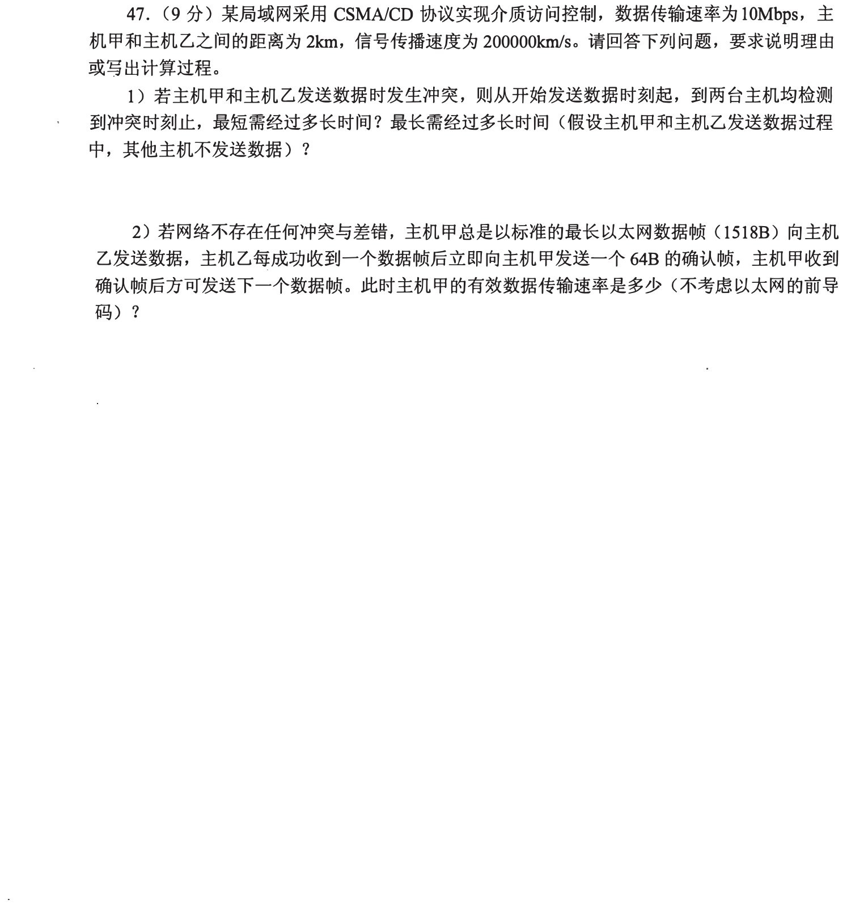
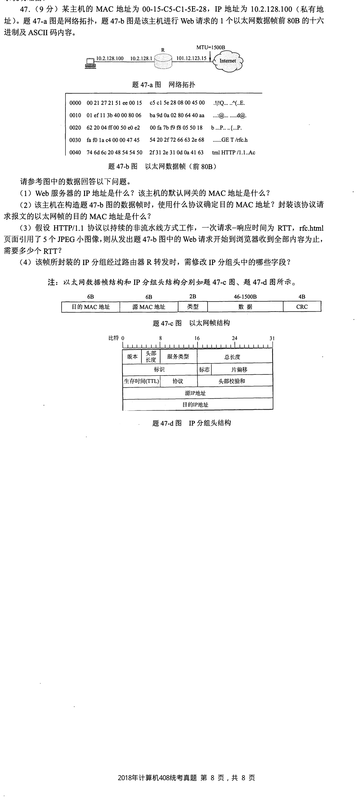
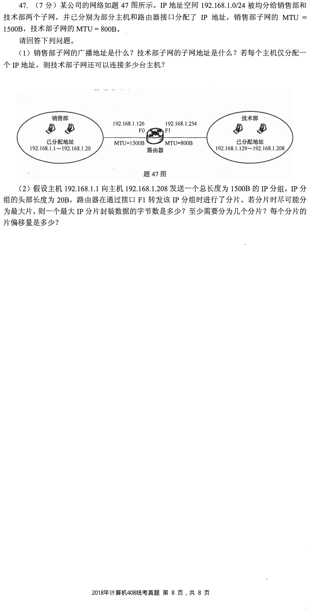
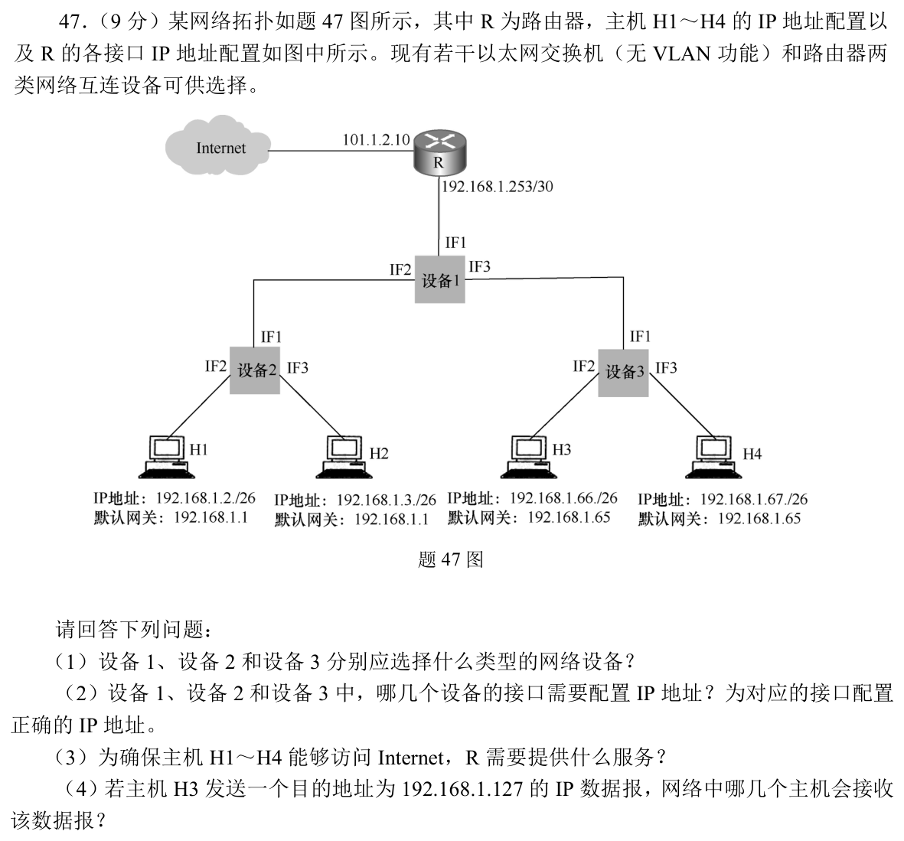

[← 0930](0930.md) · [总索引](README.md) · [1002 →](1002.md)

# 1001｜链路与局域网：竞争、封装、交换和跨网转发

> 大题线 `W18-link-lan` · 第 18/19 个节点 · 4 道完整真题引用
>
> 选择题前置线：`33-network-path`、`35-link-reliability`、`36-lan`

## 归类依据

从 CSMA/CD、以太网帧到 VLAN 与 MTU，核心是逐跳判断当前链路能承载什么、交换设备看到什么，以及帧头和分片在经过不同网络时怎样变化。

这一节点以完整作答为单位。公共题干、全部小问、代码或计算过程必须在同一次作答中收口；再次出现的接口题只检查它与当前机制的连接，不重复抄题。

## 题单

### 01 · 2010-47

### 02 · 2011-47

### 03 · 2018-47

### 04 · 2019-47

[← 0930](0930.md) · [总索引](README.md) · [1002 →](1002.md)
