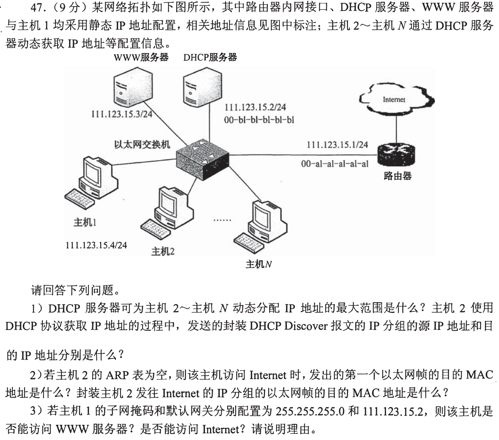
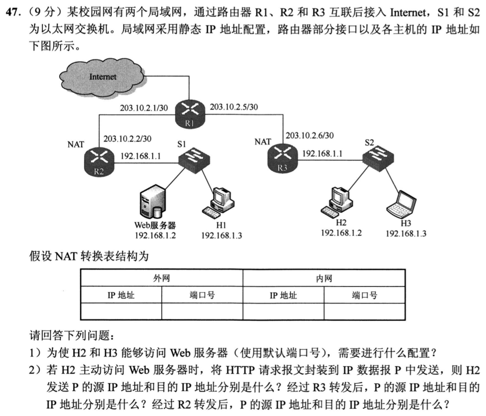
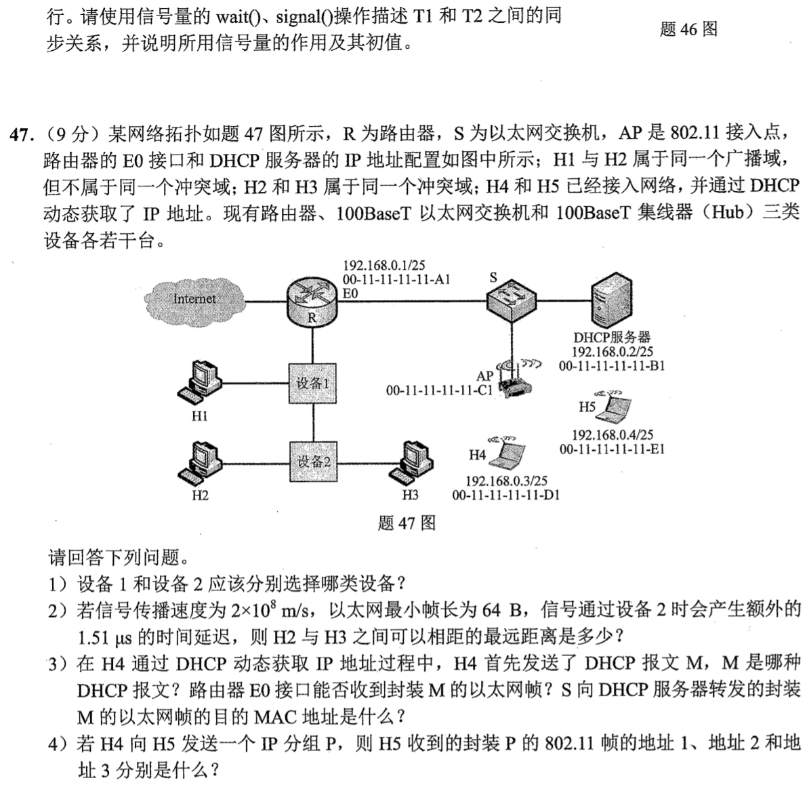

# 1002 Answer｜服务入口变了，逐跳把地址写清

> [原题 4 道](1002.md) · [1001 的网关、ARP 与帧](1001-answer.md) · [能力账本](answer-quality/learning-ledger.md)
>
本页每题先给可用的判断和全部小问答案，再折叠关键推理。理解这些答案不等于已通过限时独立复做。

<strong>考场入口：先写哪个量</strong>

| 题 | 最先圈出的条件 | 结果锚点 |
| --- | --- | --- |
| 01 | /24里 .1—.4 静态占用；网关是路由器 .1 | 动态 .5—.254；Discover 0.0.0.0→255.255.255.255；先ARP广播 |
| 02 | 两边私网重复，访问左侧服务器要用左侧公网入口 | R2映射203.10.2.2:80→192.168.1.2:80；IP地址三段变化 |
| 03 | 同网DNS先解析域名，随后找异网Web的网关 | S学 bb→1、aa→2、cc→4；H2收两次ARP广播 |
| 04 | H1/H2广播相通而不碰撞；H2/H3会碰撞 | 设备1交换机、设备2Hub；最大210m；802.11地址 C1/D1/E1 |

## 01｜2015-47：先得到配置，再决定这一跳给谁

**（1）地址池与 Discover。** `111.123.15.0/24` 可用主机地址是 `.1—.254`。路由器 `.1`、DHCP `.2`、WWW `.3`、主机1 `.4` 静态占用，故可给主机2—N的最大动态范围是 **`111.123.15.5—111.123.15.254`，共250个地址**。主机2还没有自己的地址，Discover 的 **IP源 `0.0.0.0`、IP目的 `255.255.255.255`**。

**（2）先ARP，后发数据。** 假定主机2已经从DHCP取得地址、掩码和正确网关，要访问异网 Internet，先得知道网关 `111.123.15.1` 的 MAC。ARP表为空时**第一个以太网帧是ARP请求，目的 MAC `FF-FF-FF-FF-FF-FF`**；收到ARP回复后，承载 Internet IP 分组的数据帧目的 MAC 是**路由器内网接口 `00-a1-a1-a1-a1-a1`**。第一个帧与数据帧不是同一帧；异网目标的 IP 不会变成该帧的目的 MAC。

**（3）错网关分两路判断。** 主机1的 `255.255.255.0` 掩码是正确的，所以到同网 WWW `111.123.15.3` 可以直接ARP并访问；把默认网关错填成DHCP服务器 `111.123.15.2`，**不能正常访问 Internet**，因为该服务器不是题图的转发路由器。判断同网访问时不必先查默认网关。

可迁移：地址范围、IP广播与MAC广播为何分开

`/24` 共256个地址，网络地址 `.0` 与广播 `.255` 不能分给主机，另扣四个已配置地址才是250。Discover 说的是IP层地址；ARP请求说的是以太网目的MAC。两种广播都出现，但发生在不同问题和不同报文中。碰到“第一帧”先问当前是否已有目标下一跳MAC。

## 02｜2020-47：同一个192.168.1.2在两侧是两台不同机器

**（1）给左侧Web一个可访问的公网入口。** 在 **R2** 配置静态NAPT（端口映射）：**外网 `203.10.2.2:80` ↔ 内网 `192.168.1.2:80`**，协议TCP；H2/H3把访问目标写成 **`203.10.2.2:80`**，右侧主机默认网关指向 R3 的内口 `192.168.1.1`。R3负责右侧出站 NAT（必要时按源端口区分会话）；两路公网/30由R1连通，并保证回包沿对应映射返回。右侧 H2 本身也叫 `192.168.1.2`，若用私网 `192.168.1.2` 当目的，只会定位到右侧本地，根本去不了左侧Web。

**（2）只追IP层的源/目的。**

| 报文P所在处 | 源IP | 目的IP | 改动者 |
| --- | --- | --- | --- |
| H2刚发出 | `192.168.1.2` | `203.10.2.2` | H2访问公网入口 |
| 经R3转发 | `203.10.2.6` | `203.10.2.2` | R3改源地址 |
| 经R2转发 | `203.10.2.6` | `192.168.1.2` | R2按:80映射改目的地址 |

为何不把R3的192.168.1.2直接送给R2

两个局域网独立复用了同一私网地址。R3的源 NAT 将右侧 H2 映到自己外口 `203.10.2.6`，R2的目的映射才把外部请求交给左侧Web `192.168.1.2`。完整 TCP 会话还依赖端口与转换表，使多个内网客户端的返回报文各归其主；本小问只问IP地址，所以无需臆造客户端临时端口。

## 03｜2021-47：从DNS到Web，两次ARP广播给了旁观者

**（1）HTTP之前的应用协议是 DNS。** H1先通过本地 DNS 把 `www.abc.com` 解析成Web服务器IP，然后才发HTTP。应用层报文逐层加 **UDP首部、IP首部、以太网帧首部与尾部**，经S送往同子网 DNS `192.168.1.126/25`。DNS通常用UDP；若题设特殊响应/传输条件可用TCP，但本题按通常查询作答。随后给异网Web发HTTP所依赖的TCP连接，通信时由TCP、IP、以太网依次封装；不要把 DNS 查询写成 HTTP 的一部分。

**（2）t₁的S交换表**（题设无无关通信、此前表空）：

| 源MAC | 学到的入端口 | 触发帧 |
| --- | --- | --- |
| `00-11-22-33-44-cc`（H1） | 4 | H1的ARP请求/后续帧 |
| `00-11-22-33-44-bb`（DNS） | 1 | DNS的ARP回复/响应 |
| `00-11-22-33-44-aa`（R） | 2 | 网关的ARP回复 |

H2没有发送帧，**不能因为它接到广播就把其MAC加入交换表**；端口3无表项。交换机依据进入帧的**源MAC**学习，目的MAC只用于查表转发。

**（3）H2至少收到2帧**：H1为取得同网 DNS 的MAC而广播的ARP请求，以及取得默认网关R的MAC而广播的ARP请求。两帧的目的MAC都是 **`FF-FF-FF-FF-FF-FF`**。DNS的ARP回复与R的ARP回复均单播到已学到的H1端口4；其他后续通信也不必洪泛到H2。注意 `/25` 下 `.1`、`.2`、`.3`、`.126` 同网，而Internet Web在异网。

把整条会话压成一条可重放的链

ARP找DNS → DNS问域名并收到地址 → ARP找默认网关 → 与远端Web完成TCP连接并发HTTP。S在这条链上分别从H1、DNS、R发出的帧学习4、1、2；H2只因两次广播而被动接收。题目给H2地址和MAC是为了测试“收到帧”是否会被误认为“发出了帧”。

## 04｜2022-47：广播、碰撞、无线地址是三个不同判断

**（1）设备1为100BaseT以太网交换机，设备2为100BaseT集线器Hub。** H1、H2仍在同一广播域，说明这里无需再添路由器隔开；H1/H2不在同一冲突域，设备1须隔离端口冲突；H2/H3在同一冲突域，连着它们的设备2应为共享介质Hub。设备1连接R与设备2的口也各隔离冲突域。

**（2）H2—H3最大间距 `210m`。** 100Mbps以太网最短帧64B，发送时间 `64×8/10⁸=5.12μs`。最迟碰撞须在这一时槽内传回H2；信号从H2到H3、碰撞再从H3回H2，**两次通过设备2**，各多 `1.51μs`。因此往返纯传播最多 `5.12−2×1.51=2.10μs`，单程 `1.05μs`，距离 **`2×10⁸m/s×1.05μs=210m`**。不能只扣一次Hub时延或把往返时间当单程。

**（3）H4的第一份DHCP报文为 DHCP Discover。** 因H4与R的E0和DHCP服务器在同一广播域，**R的E0能收到**承载M的广播以太网帧。S向DHCP服务器转发的此帧目的MAC **`FF-FF-FF-FF-FF-FF`**；既不填服务器的 `...-B1`，也不填R的 `...-A1`，因为主机此时还没获得配置，Discover是广播。

**（4）H4→H5的802.11帧**为上行至AP（To DS=1、From DS=0）：地址1是无线接收者/AP **`00-11-11-11-11-C1`**，地址2是无线发送者/H4 **`00-11-11-11-11-D1`**，地址3是最终目的主机/H5 **`00-11-11-11-11-E1`**。IP目的 `192.168.0.4` 与H4 `192.168.0.3/25` 同网，不用把地址3误写成网关；AP转有线侧时再按以太网封装。

保底排除：拿不准设备或三地址时

先用“广播能否跨过”排除路由器，再用“冲突能否跨过”在交换机与Hub之间选；这比根据设备画得像什么猜更稳。无线帧先画一跳H4→AP：地址1是这一跳的接收者，地址2是这一跳的发送者，地址3才是有线分布系统中的目的地。DHCP广播也不会因图中列了服务器MAC就自动变单播。

## 复做与加速

遮住答案，按 **01地址池/首帧/错网关 → 02逐跳三行地址 → 03两次ARP及三条学习表 → 04设备/时槽/Discover/三个无线地址** 独立写一遍。第一次容许画完整流向，第二次只保留上述触发条件和结果；若某一步写不出，再展开该题的推理。这里完成的是讲解覆盖，限时一两分钟的反应速度和105分目标仍须用独立计时真题检验。

[← 1002](1002.md) · [总索引](README.md)
