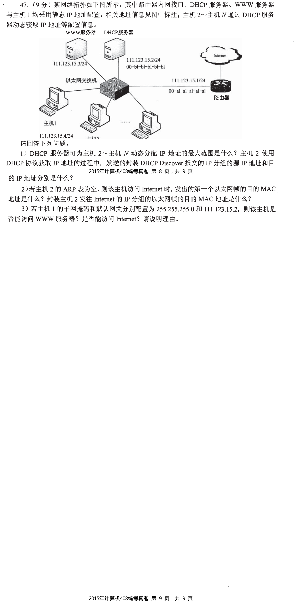
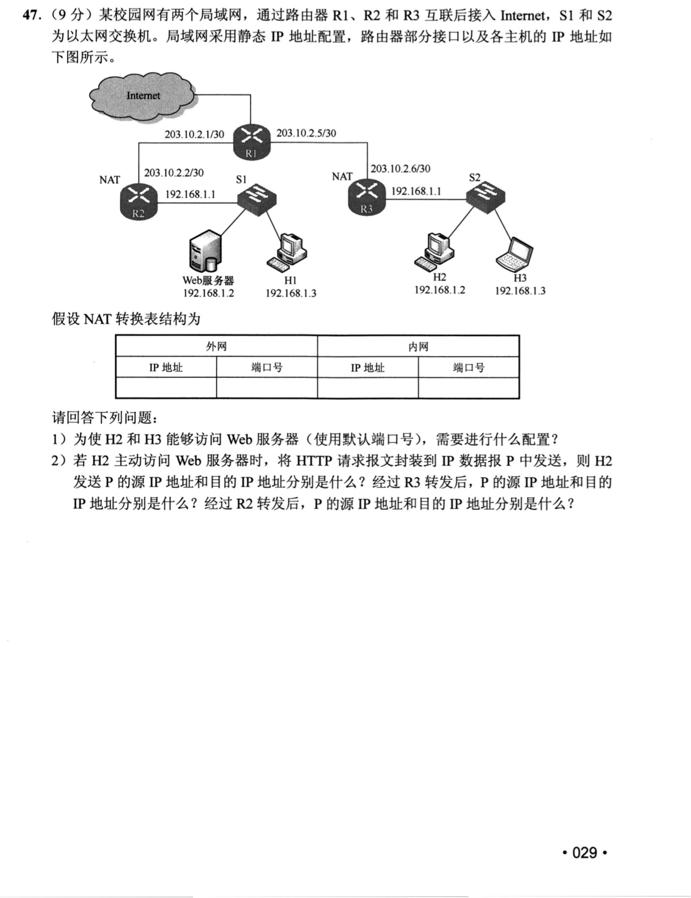
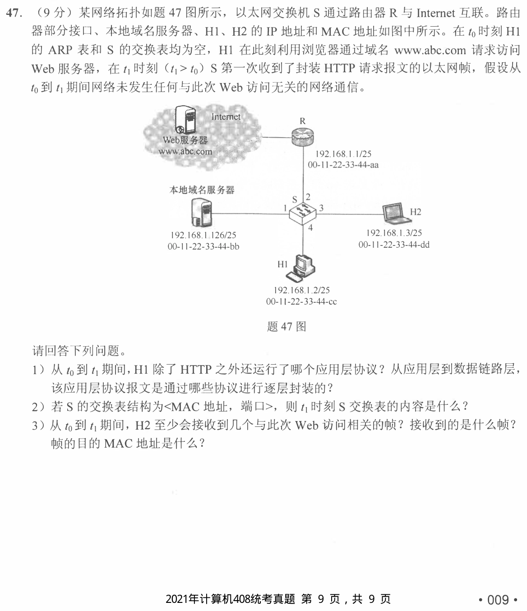
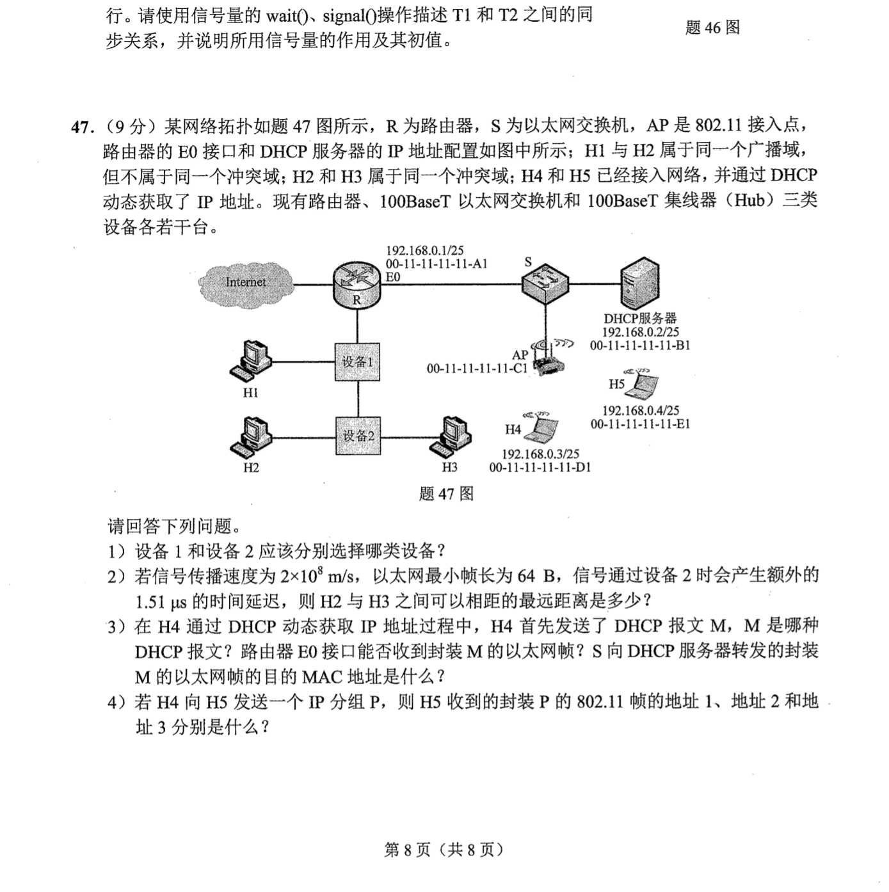

[← 1001](1001.md) · [总索引](README.md)

# 1002｜网络服务：配置、地址转换与应用会话

> 大题线 `W19-network-services` · 第 19/19 个节点 · 4 道完整真题引用
>
> 选择题前置线：`33-network-path`、`37-ip-address`、`40-application`

## 归类依据

DHCP、NAT、HTTP、ARP 与无线接入常被放在同一拓扑里考查。作答要沿一次真实通信说明配置从哪里获得、地址何时变化、需要哪些解析，以及应用层会话依赖哪些下层连接。

这一节点以完整作答为单位。公共题干、全部小问、代码或计算过程必须在同一次作答中收口；再次出现的接口题只检查它与当前机制的连接，不重复抄题。

## 题单

### 01 · 2015-47

### 02 · 2020-47

### 03 · 2021-47

### 04 · 2022-47

[← 1001](1001.md) · [总索引](README.md)
